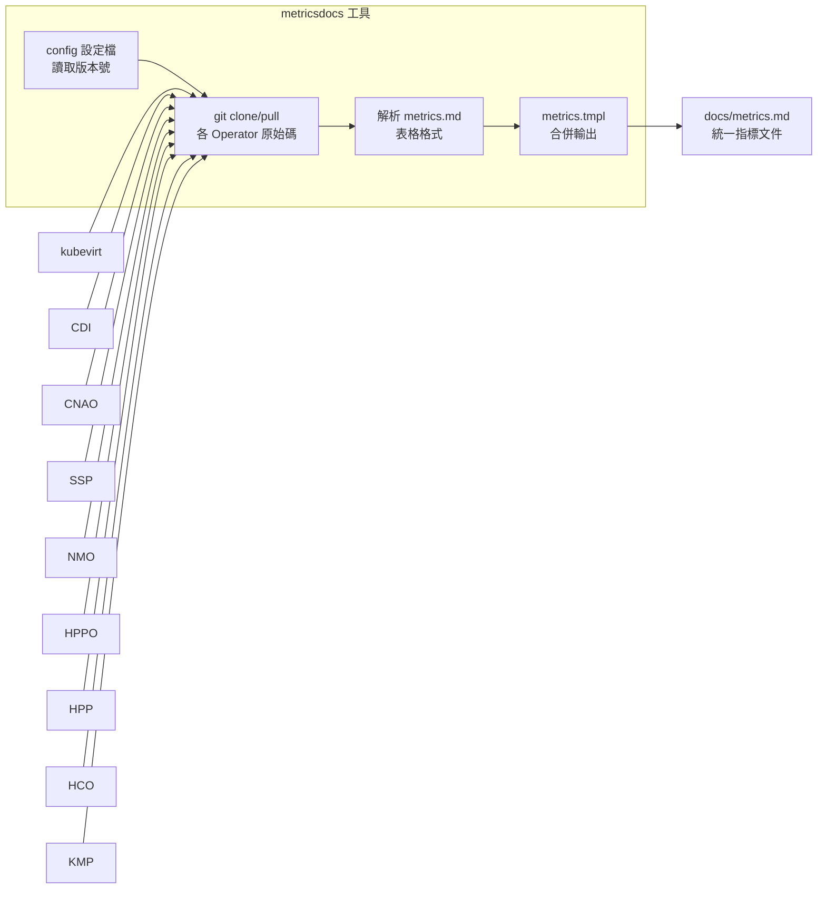
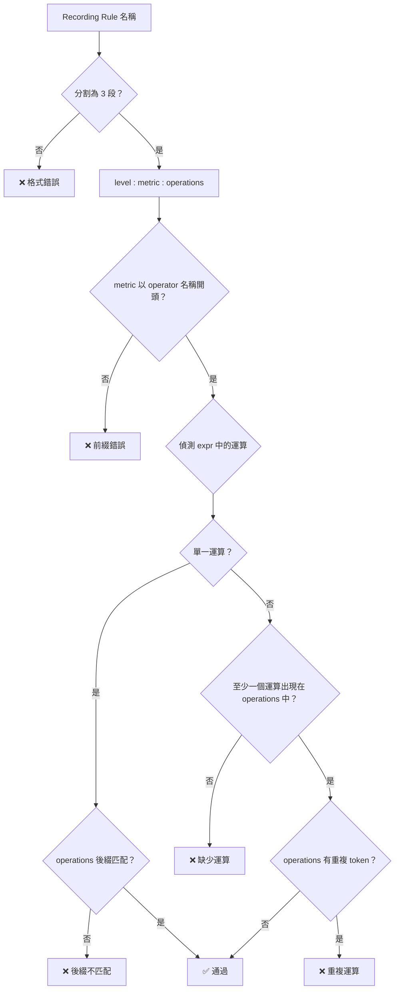
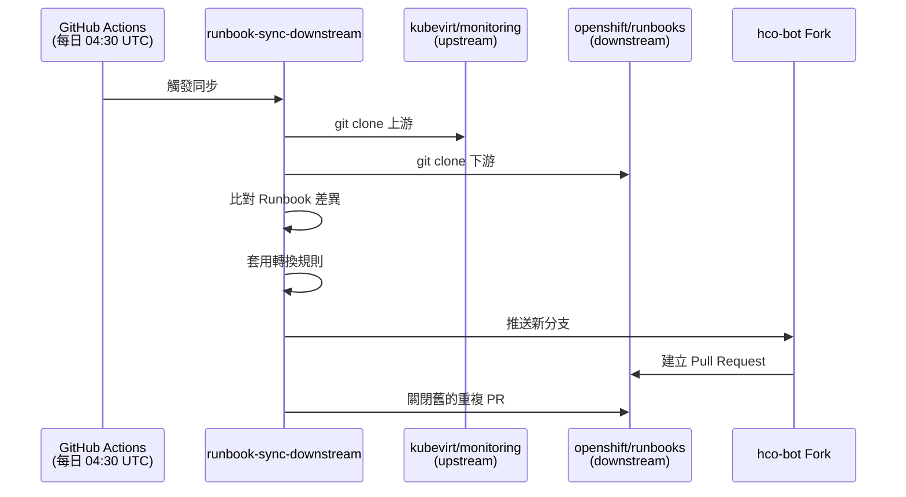
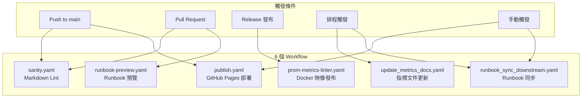
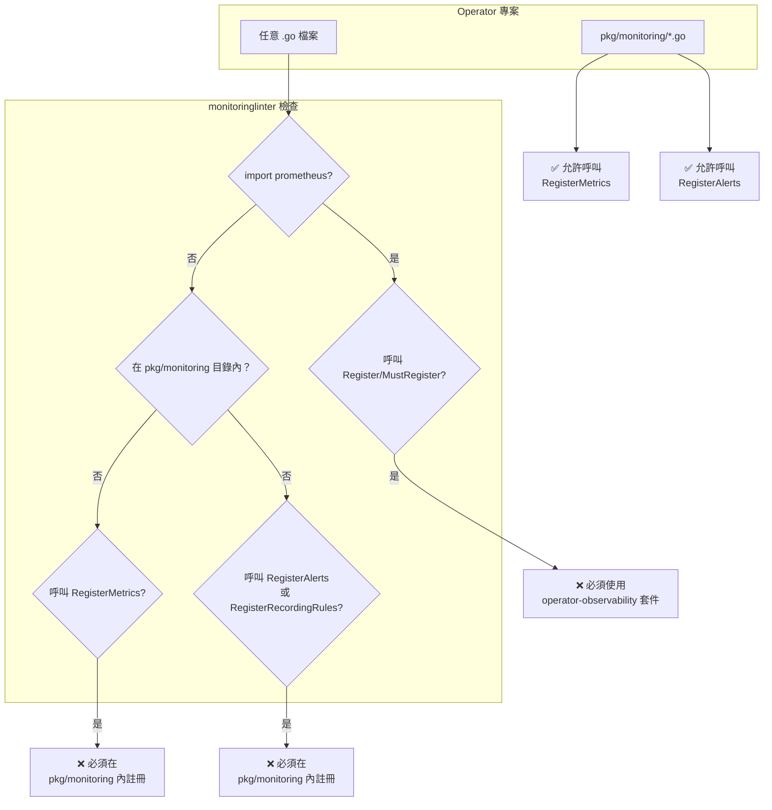

# Monitoring — 外部整合

本文件深入分析 [kubevirt/monitoring](https://github.com/kubevirt/monitoring) 專案如何與 KubeVirt 生態系中的多個 Operator、Prometheus、Grafana、OpenShift 以及 GitHub Actions CI/CD 進行整合，並探討 `operator-observability` 框架的運作機制。

::: info 相關章節
- 專案整體架構請參閱 [系統架構](./architecture)
- 各工具的核心功能請參閱 [核心功能分析](./core-features)
- 工具的實作細節請參閱 [指標與告警規則](./metrics-alerts)
:::

## KubeVirt 生態系整合

monitoring 專案是 KubeVirt 生態系的**集中式監控基礎設施**，負責彙整來自 9 個 Operator 的指標文件與告警規則。

### 涵蓋的 Operator 清單

在 `tools/metricsdocs/types.go` 中定義了所有受監控的 Operator：

```go
// tools/metricsdocs/types.go

var projectsInfo = []*projectInfo{
    {"KUBEVIRT", "kubevirt", defaultOrg, "docs/observability/metrics.md"},
    {"CDI", "containerized-data-importer", defaultOrg, "doc/metrics.md"},
    {"NETWORK_ADDONS", "cluster-network-addons-operator", defaultOrg, "docs/metrics.md"},
    {"SSP", "ssp-operator", defaultOrg, "docs/metrics.md"},
    {"NMO", "node-maintenance-operator", defaultOrg, "docs/metrics.md"},
    {"HPPO", "hostpath-provisioner-operator", defaultOrg, "docs/metrics.md"},
    {"HPP", "hostpath-provisioner", defaultOrg, "docs/metrics.md"},
    {"HCO", "hyperconverged-cluster-operator", defaultOrg, "docs/metrics.md"},
    {"KMP", "kubemacpool", "k8snetworkplumbingwg", "doc/metrics.md"},
}
```

每個 Operator 的版本透過 `tools/metricsdocs/config` 設定檔管理：

```bash
# tools/metricsdocs/config
KUBEVIRT_VERSION="main"
CDI_VERSION="main"
NETWORK_ADDONS_VERSION="main"
SSP_VERSION="main"
NMO_VERSION="master"
HPPO_VERSION="main"
HPP_VERSION="main"
HCO_VERSION="main"
KMP_VERSION="main"
```

::: info 設計重點
`defaultOrg` 預設為 `"kubevirt"`，但 `kubemacpool` 屬於 `k8snetworkplumbingwg` 組織。`NMO` 預設分支為 `master`，其餘皆為 `main`。
:::

### Operator 整合總覽

| 縮寫 | 完整名稱 | GitHub 組織 | 指標文件路徑 |
|------|----------|-------------|-------------|
| KUBEVIRT | kubevirt | kubevirt | `docs/observability/metrics.md` |
| CDI | containerized-data-importer | kubevirt | `doc/metrics.md` |
| NETWORK_ADDONS | cluster-network-addons-operator | kubevirt | `docs/metrics.md` |
| SSP | ssp-operator | kubevirt | `docs/metrics.md` |
| NMO | node-maintenance-operator | kubevirt | `docs/metrics.md` |
| HPPO | hostpath-provisioner-operator | kubevirt | `docs/metrics.md` |
| HPP | hostpath-provisioner | kubevirt | `docs/metrics.md` |
| HCO | hyperconverged-cluster-operator | kubevirt | `docs/metrics.md` |
| KMP | kubemacpool | k8snetworkplumbingwg | `doc/metrics.md` |

### 指標收集流程



`metricsdocs` 的運作方式是：先讀取 `config` 中每個 Operator 的版本號，透過 `git clone` 取得原始碼，切換至指定分支，然後解析各 Operator 的指標文件表格，最後用 Go template 合併產出統一的 `docs/metrics.md`。

### 各 Operator Allowlist 指標

`test/metrics/prom-metrics-linter/allowlist.json` 定義了每個子 Operator 中允許豁免標準命名檢查的指標：

| 子 Operator | 指標數量 | 代表性指標 |
|-------------|---------|-----------|
| kubevirt | 22 | `kubevirt_virt_api_up`, `kubevirt_vmi_phase_count`, `kubevirt_number_of_vms` |
| hco | 3 | `kubevirt_hyperconverged_operator_health_status`, `cluster:vmi_request_cpu_cores:sum` |
| cdi | 4 | `kubevirt_cdi_operator_up`, `kubevirt_cdi_import_pods_high_restart` |
| cnao | 4 | `kubevirt_cnao_operator_up`, `kubevirt_cnao_kubemacpool_manager_up` |
| hpp | 1 | `kubevirt_hpp_operator_up` |
| ssp | 6 | `kubevirt_ssp_operator_up`, `cnv:vmi_status_running:count` |

::: tip Recording Rules 格式
`hco` 和 `ssp` 的 allowlist 中包含 Recording Rule 格式的指標（使用冒號分隔，如 `cluster:vmi_request_cpu_cores:sum`），這些規則遵循 Prometheus 的 `level:metric:operations` 命名規範，由專屬驗證邏輯處理。
:::

## Prometheus 整合

### 依賴套件

monitoring 專案透過兩個層級與 Prometheus 整合：

**根模組** (`go.mod`)：
```
module github.com/kubevirt/monitoring
go 1.23.6

require golang.org/x/tools v0.30.0
```

**prom-metrics-linter** 子模組使用 Prometheus 客戶端程式庫：
```go
// test/metrics/prom-metrics-linter/metric_name_linter.go

import (
    "github.com/prometheus/client_golang/prometheus/testutil/promlint"
    dto "github.com/prometheus/client_model/go"
)
```

**monitoringlinter** 則是檢查以下 import path 的使用：
```go
// monitoringlinter/analyzer.go

const (
    prometheusImportPath      = `"github.com/prometheus/client_golang/prometheus"`
    operatorMetricsImportPath = `"github.com/machadovilaca/operator-observability/pkg/operatormetrics"`
    operatorRulesImportPath   = `"github.com/machadovilaca/operator-observability/pkg/operatorrules"`
)
```

### 指標類型支援

monitoring 專案統一管理的指標涵蓋所有 Prometheus 標準類型：

| 類型 | 說明 | 範例指標 |
|------|------|---------|
| **Counter** | 只增不減的累計值 | `kubevirt_vm_created_total` |
| **Gauge** | 可增可減的即時數值 | `kubevirt_vmi_phase_count`, `kubevirt_number_of_vms` |
| **Histogram** | 觀測值的分佈統計 | `kubevirt_vmi_phase_transition_time_from_creation_seconds_bucket` |
| **Summary** | 類似 Histogram 但由客戶端計算百分位數 | 各 Operator 依需求使用 |

### 指標命名規範

`prom-metrics-linter` 工具使用 `promlint` 套件加上自定義規則驗證指標命名：

```go
// test/metrics/prom-metrics-linter/custom_linter_rules.go

func CustomMetricsValidation(problems []promlint.Problem, mf *dto.MetricFamily,
    operatorName, subOperatorName string) []promlint.Problem {
    // 規則 1：指標必須以 operator 名稱為前綴
    if !(strings.HasPrefix(*mf.Name, operatorName+"_") || *mf.Name == operatorName) {
        problems = append(problems, promlint.Problem{
            Metric: *mf.Name,
            Text:   fmt.Sprintf(`name need to start with %s`, operatorName),
        })
    // 規則 2：若有子 Operator，必須包含子 Operator 前綴
    } else if operatorName != subOperatorName {
        fullPrefix := operatorName + "_" + subOperatorName
        if !(strings.HasPrefix(*mf.Name, fullPrefix+"_") || *mf.Name == fullPrefix) {
            // ...
        }
    }
    return newProblems
}
```

### Recording Rule 驗證

Recording Rule 有專屬的驗證邏輯，確保名稱符合 `level:metric:operations` 結構：



支援偵測的運算包含：
- **聚合運算**：`sum`, `avg`, `min`, `max`, `count`, `quantile`, `stddev`, `topk`, `bottomk` 等
- **時間函數**：`rate`, `irate`, `increase`, `delta`, `avg_over_time`, `sum_over_time` 等

## Grafana 整合

### 儀表板結構

專案包含兩個 Grafana 儀表板，分別位於不同目錄以對應不同的部署環境：

| 儀表板 | 路徑 | 用途 |
|--------|------|------|
| KubeVirt Control Plane | `dashboards/grafana/kubevirt-control-plane.json` | 社群版 Grafana |
| Top Consumers | `dashboards/openshift/kubevirt-top-consumers.json` | OpenShift Console |

### Control Plane 儀表板

**基本資訊**：
- **標題**：`KubeVirt / Control Plane`
- **UID**：`V1Qq_IBM_za0`
- **Schema Version**：26
- **自動刷新**：1 分鐘
- **標籤**：`kubevirt`, `kubevirt-control-plane`, `sig-scale`

**面板類型**：

| 面板類型 | 用途 | 數量 |
|---------|------|------|
| `graph` | 時序圖表（主要視覺化） | 多數面板 |
| `table` | 資料表格 | 少量 |
| `row` | 可收合的區段容器 | 7 個區段 |

**七大區段內容**：

1. **Virtual Machines** — VMI 生命週期轉換、建立時間、啟動速率
2. **KubeVirt API Access** — API Server 讀寫請求速率與延遲
3. **KubeVirt Work Queue** — 工作佇列深度、新增速率、延遲
4. **K8s API Access** — Kubernetes API 各資源的存取指標
5. **Resource Usage** — 記憶體、CPU、網路、File Descriptor、GC
6. **Storage Operations** — 儲存操作速率與錯誤率
7. **etcd** — etcd RPC 速率、請求時間、WAL fsync、DB 大小

**範例面板 PromQL 查詢**（VMI 建立時間）：
```promql
histogram_quantile(0.95,
  sum(rate(
    kubevirt_vmi_phase_transition_time_from_creation_seconds_bucket
      {instance=~"$instance"}[5m]
  )) by (phase, le)
)
```

### Top Consumers 儀表板

**基本資訊**：
- **標題**：`KubeVirt / Infrastructure Resources / Top Consumers`
- **UID**：`Ml7SPcyMkk`
- **標籤**：`kubevirt-mixin`

**面板架構**：兩大類各 7 個面板

| 類別 | 面板類型 | 涵蓋維度 |
|------|---------|---------|
| 即時 Top 5 | `table` (instant query) | Memory、CPU、Storage Traffic/IOPS、Network、vCPU Wait、Memory Swap |
| 趨勢圖 | `graph` (time series) | 相同維度的時序趨勢 |

**範例查詢**（Top 5 記憶體消費者）：
```promql
sort_desc(topk(5,
  sum(
    avg_over_time(kubevirt_vmi_memory_available_bytes[$__range])
    - avg_over_time(kubevirt_vmi_memory_usable_bytes[$__range])
  ) by(name, namespace)
)) > 0
```

### 資料來源設定

兩個儀表板均使用 Prometheus 作為資料來源，透過 VitePress 變數選擇器實現動態切換：

```json
{
  "templating": {
    "list": [
      {
        "type": "datasource",
        "name": "datasource",
        "query": "prometheus",
        "current": {
          "text": "Cluster Prometheus",
          "value": "Cluster Prometheus"
        }
      }
    ]
  }
}
```

::: info 模板變數
Control Plane 儀表板額外提供 `$cluster` 和 `$instance` 變數，允許使用者篩選特定叢集和實例。Top Consumers 儀表板僅使用 `$datasource` 變數。
:::

## OpenShift 整合

### Runbook 下游同步機制

`tools/runbook-sync-downstream/` 工具負責將上游 `kubevirt/monitoring` 的 Runbook 自動同步至下游 `openshift/runbooks` 儲存庫。



### hco-bot 設定

```go
// tools/runbook-sync-downstream/main.go

const (
    githubUsername = "hco-bot"
    githubEmail    = "71450783+hco-bot@users.noreply.github.com"

    upstreamRepositoryURL = "github.com/kubevirt/monitoring"
    upstreamRunbooksDir   = "docs/runbooks"

    downstreamMainBranch      = "master"
    downstreamRepositoryOwner = "openshift"
    downstreamRepositoryFork  = "hco-bot"
    downstreamRepositoryName  = "runbooks"
    downstreamRunbooksDir     = "alerts/openshift-virtualization-operator"
)

var prReviewersUsernames = []string{"machadovilaca", "sradco", "avlitman", "jherrman"}
```

### 轉換規則

`pkg/transform/transform.go` 中的 `ReplaceContents` 函數定義了 11 項轉換規則：

| # | 轉換規則 | 上游範例 | 下游結果 |
|---|---------|---------|---------|
| 1 | `kubectl` → `oc` | `kubectl get pods` | `oc get pods` |
| 2 | 命名空間替換 | `-n kubevirt` | `-n openshift-cnv` |
| 3 | 移除上游專屬段落 | `<!--USstart-->...<!--USend-->` | *（移除）* |
| 4 | 啟用下游註解 | `<!--DS: 額外說明-->` | `額外說明` |
| 5 | 品牌名稱替換 | `KubeVirt` | `OpenShift Virtualization` |
| 6 | 平台名稱替換 | `Kubernetes` | `OpenShift Container Platform` |
| 7 | AsciiDoc 連結轉 Markdown | `link:URL[text]` | `[text](URL)` |
| 8 | 合併多餘空行 | `\n\n\n` | `\n\n` |
| 9 | 行寬限制 80 字元 | 長行 | 自動換行 |
| 10 | 移除行末空格 | `text   \n` | `text\n` |
| 11 | 移除尾端空行 | `text\n\n` | `text` |

::: warning 轉換限制
規則 5 和 6 的文字替換會**跳過**程式碼區塊（`` ` `` 和 `` ``` ``）以及標題行（`#` 開頭），避免破壞技術內容。命名空間正則表達式僅匹配 `kubevirt` 和 `kubevirt-hyperconverged` 兩種形式。
:::

命名空間匹配使用的正則表達式：
```go
// pkg/transform/transform.go
namespaceRegex = regexp.MustCompile(
    `(namespace:|-n|--namespace) (kubevirt(?:-hyperconverged)?)`,
)
```

### PR 建立流程

同步工具會為每個需要更新的 Runbook 建立獨立的 PR：

1. **分支命名**：`cnv-runbook-sync-{timestamp}/{runbook_name}`
2. **檢查重複**：避免為同一 Runbook 建立重複 PR
3. **提交訊息**：`Sync CNV runbook {name} (Updated at {timestamp})`
4. **PR 內文**：包含自動化聲明、上游更新時間、以及 `/cc` reviewer 標記
5. **清理舊 PR**：自動關閉同一 Runbook 的舊 PR

對於已在上游刪除的 Runbook，工具會使用 `templates/deprecated_runbook.tmpl` 模板建立棄用 PR。

## GitHub Actions CI/CD

### 工作流程總覽



### 詳細 Workflow 說明

#### 1. Sanity Checks (`sanity.yaml`)

| 屬性 | 值 |
|------|---|
| **觸發** | Push 到 `main` / PR 到 `main` / 手動觸發 |
| **Job** | `Sanity Checks` |
| **步驟** | Checkout → markdownlint-cli2 檢查 `docs/*runbooks/*.md` |

```yaml
# .github/workflows/sanity.yaml
- uses: DavidAnson/markdownlint-cli2-action@v16
  with:
    globs: 'docs/*runbooks/*.md'
```

#### 2. GitHub Pages 部署 (`publish.yaml`)

| 屬性 | 值 |
|------|---|
| **觸發** | Push 到 `main` / 手動觸發 |
| **Job** | `Build and Push` |
| **步驟** | Checkout → Python 3.8 環境 → 執行 ghpages 工具 → 推送至 `ghpages` 分支 |

使用 Python 工具讀取 `docs/ghpages.json` 設定檔，產生靜態頁面後推送至 `ghpages` 分支。

#### 3. prom-metrics-linter 映像發布 (`prom-metrics-linter.yaml`)

| 屬性 | 值 |
|------|---|
| **觸發** | Release 發布事件 |
| **Job** | `Upload prom-metrics-linter` |
| **映像** | `quay.io/kubevirt/prom-metrics-linter:{version}` |
| **平台** | `linux/amd64`, `linux/arm64`, `linux/s390x` |

```yaml
# .github/workflows/prom-metrics-linter.yaml
- uses: docker/build-push-action@v5.3.0
  with:
    context: test/metrics/prom-metrics-linter
    push: true
    tags: ${{ env.IMAGE_NAME }}:${{ github.ref_name }}
    platforms: ${{ env.BUILD_PLATFORMS }}
```

::: tip 多架構建置
使用 Docker Buildx 建置三種架構的映像，確保在 ARM 和 s390x 平台上也能執行 Linter。
:::

#### 4. 指標文件自動更新 (`update_metrics_docs.yaml`)

| 屬性 | 值 |
|------|---|
| **觸發** | 每日 05:00 UTC（排程） |
| **Job** | `Auto-Update Metrics Documentation` |
| **條件** | 僅在 `kubevirt/monitoring` 儲存庫執行 |
| **步驟** | Checkout → Go 1.17 → 執行 `make metricsdocs` → 建立 PR |

```yaml
# .github/workflows/update_metrics_docs.yaml
- name: Generate new metrics documentation
  run: CONFIG_FILE=./tools/metricsdocs/config make metricsdocs

- uses: peter-evans/create-pull-request@v3
  with:
    title: Update metrics documentation
    branch: gh_actions/update_metrics_docs
    delete-branch: true
    assignees: sradco
    reviewers: sradco
```

#### 5. Runbook 下游同步 (`runbook_sync_downstream.yaml`)

| 屬性 | 值 |
|------|---|
| **觸發** | 每日 04:30 UTC（排程）/ 手動觸發 |
| **Job** | `Run runbook-sync-downstream` |
| **條件** | 僅在 `kubevirt/monitoring` 儲存庫執行 |
| **Secret** | `HCO_BOT_TOKEN`（hco-bot 的 GitHub Token） |

```yaml
# .github/workflows/runbook_sync_downstream.yaml
- name: Run runbook-sync-downstream
  run: DRY_RUN=false GITHUB_TOKEN=${{ secrets.HCO_BOT_TOKEN }} make runbook-sync-downstream
```

#### 6. Runbook 下游預覽 (`runbook-preview.yaml`)

| 屬性 | 值 |
|------|---|
| **觸發** | PR 修改 `docs/runbooks/**.md` 時 |
| **Job** | `Generate downstream preview` |
| **權限** | `contents: read` |
| **步驟** | Checkout (full history) → Go 1.22 → 建置預覽工具 → 輸出轉換後的內容 |

此 Workflow 讓開發者在 PR 階段即可看到 Runbook 轉換為 OpenShift 格式後的效果。

### 排程時序

```mermaid
gantt
    title 每日自動化排程 (UTC)
    dateFormat HH:mm
    axisFormat %H:%M

    section Runbook
    Runbook 同步 (04:30)        :04:30, 30min

    section 指標文件
    指標文件更新 (05:00)        :05:00, 30min
```

## operator-observability 框架

### 架構概述

monitoring 專案提供了 `monitoringlinter`——一個基於 `go/analysis` 框架的 Go 靜態分析工具，強制所有 Kubernetes Operator 專案使用 `operator-observability` 套件集中管理監控元件。



### 三條核心規則

Linter 監控三個 import 路徑並執行對應的檢查規則：

**規則 1：禁止直接使用 Prometheus 註冊**

```go
// monitoringlinter/analyzer.go
func checkPrometheusMethodCall(methodName string, pass *analysis.Pass, node ast.Node) {
    if methodName == "Register" || methodName == "MustRegister" {
        pass.Reportf(node.Pos(),
            "monitoring-linter: metrics should be registered only within "+
            "pkg/monitoring directory, using operator-observability packages.")
    }
}
```

::: danger 嚴格禁止
無論在任何目錄，直接呼叫 `prometheus.Register()` 或 `prometheus.MustRegister()` 都會觸發錯誤。必須改用 `operator-observability` 套件封裝。
:::

**規則 2：operatormetrics 僅限 pkg/monitoring 使用**

```go
func checkOperatorMetricsMethodCall(methodName string, pass *analysis.Pass, node ast.Node) {
    if methodName == "RegisterMetrics" {
        pass.Reportf(node.Pos(),
            "monitoring-linter: metrics should be registered only within "+
            "pkg/monitoring directory.")
    }
}
```

**規則 3：operatorrules 僅限 pkg/monitoring 使用**

```go
func checkOperatorRulesMethodCall(methodName string, pass *analysis.Pass, node ast.Node) {
    if methodName == "RegisterAlerts" || methodName == "RegisterRecordingRules" {
        pass.Reportf(node.Pos(),
            "monitoring-linter: alerts and recording rules should be registered "+
            "only within pkg/monitoring directory.")
    }
}
```

### 規則摘要

| 規則 | 監控的套件 | 攔截的方法 | 作用範圍 |
|------|-----------|-----------|---------|
| 禁止 Prometheus 直接註冊 | `prometheus` | `Register`, `MustRegister` | **所有目錄** |
| operatormetrics 位置限制 | `operatormetrics` | `RegisterMetrics` | `pkg/monitoring` 以外 |
| operatorrules 位置限制 | `operatorrules` | `RegisterAlerts`, `RegisterRecordingRules` | `pkg/monitoring` 以外 |

### Import 別名處理

Linter 能正確處理各種 import 形式，避免繞過檢查：

```go
// monitoringlinter/analyzer.go
func getPackageLocalName(file *ast.File, importPath string) (string, bool) {
    for _, imp := range file.Imports {
        if imp.Path.Value == importPath {
            if name := imp.Name.String(); name != "<nil>" {
                return name, true  // 明確別名：import prom "..."
            }
            pathWithoutQuotes := strings.Trim(importPath, `"`)
            return path.Base(pathWithoutQuotes), true  // 預設名稱
        }
    }
    return "", false
}
```

這表示無論使用以下何種方式引入，都會被正確偵測：

```go
import "github.com/prometheus/client_golang/prometheus"       // → "prometheus"
import prom "github.com/prometheus/client_golang/prometheus"   // → "prom"
import p "github.com/prometheus/client_golang/prometheus"      // → "p"
```

### 目錄判斷

判斷是否在 `pkg/monitoring` 目錄內的邏輯極為簡潔：

```go
func isMonitoringDir(filePath string) bool {
    return strings.Contains(filePath, "pkg/monitoring")
}
```

::: info 設計哲學
這個框架的核心理念是**集中化管理**：所有指標、告警和 Recording Rule 的註冊都必須收斂到 `pkg/monitoring` 目錄中，使用統一的 `operator-observability` 套件。這確保了跨 Operator 的監控實踐一致性，也讓審查與維護更加容易。
:::
