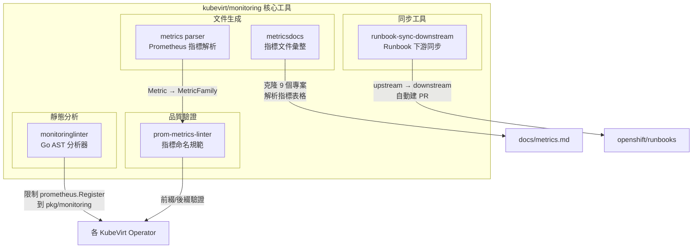
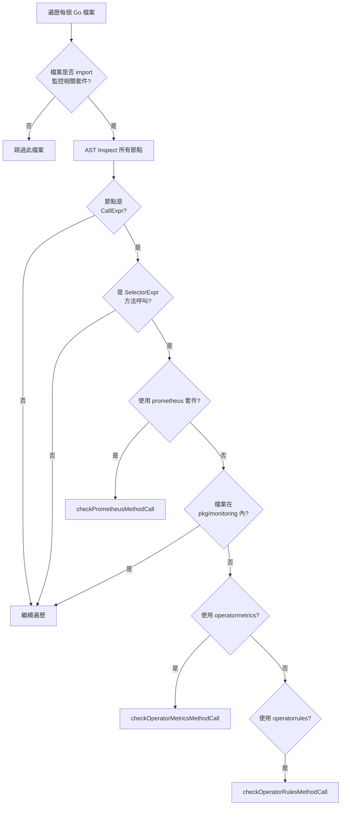
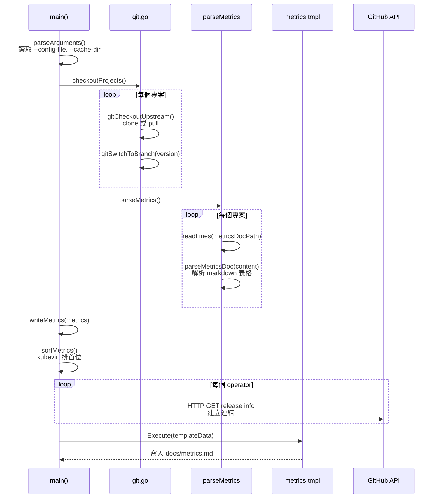
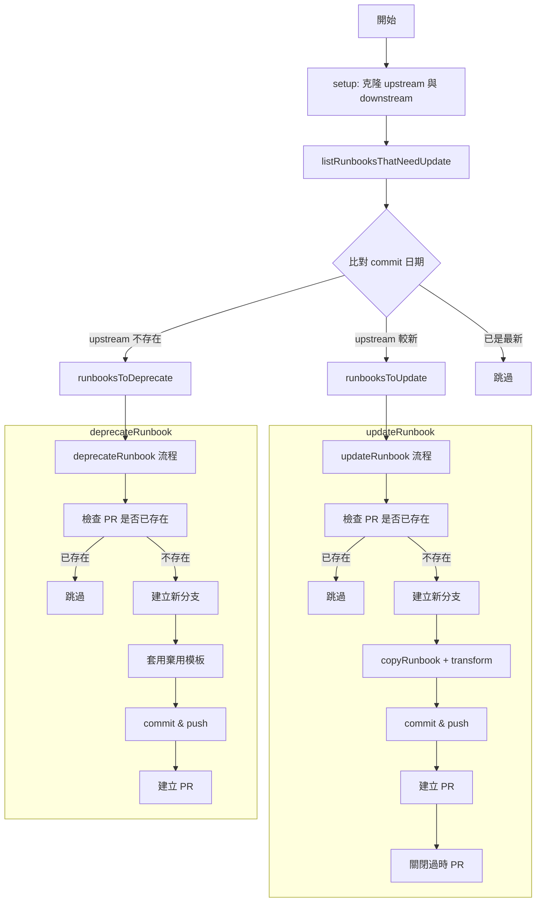
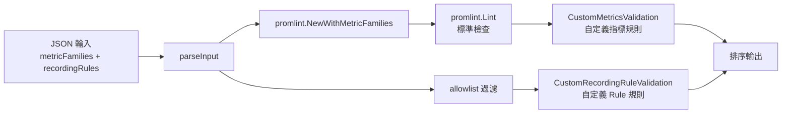

# Monitoring — 指標與告警規則

本文深入分析 kubevirt/monitoring 倉庫中各核心工具的實作，包括靜態分析器、指標文件生成器、Runbook 同步工具、指標解析器，以及 Prometheus 指標命名 Linter。所有程式碼參考均來自實際原始碼。

::: info 相關章節
- 專案整體架構請參閱 [系統架構](./architecture)
- 各工具的功能概述請參閱 [核心功能分析](./core-features)
- 與 Prometheus/Grafana/OpenShift 的整合請參閱 [外部整合](./integration)
:::

## 工具總覽



## monitoringlinter 分析器

### 概述

`monitoringlinter` 是基於 `golang.org/x/tools/go/analysis` 框架的靜態分析器，確保 Kubernetes Operator 專案中的監控相關程式碼只出現在 `pkg/monitoring` 目錄下，且使用 `operator-observability` 套件進行註冊。

**原始碼位置**: `monitoringlinter/analyzer.go`

### Analyzer 建構

分析器透過 `NewAnalyzer()` 函式建構，回傳標準的 `analysis.Analyzer` 結構：

```go
// monitoringlinter/analyzer.go (第 37-44 行)
func NewAnalyzer() *analysis.Analyzer {
    return &analysis.Analyzer{
        Name: "monitoringlinter",
        Doc: "Ensures that in Kubernetes operators projects, monitoring related practices are implemented " +
            "within pkg/monitoring directory, using operator-observability packages.",
        Run: run,
    }
}
```

### 監控套件偵測

分析器追蹤三個關鍵 import 路徑：

```go
// monitoringlinter/analyzer.go (第 30-34 行)
const (
    prometheusImportPath      = `"github.com/prometheus/client_golang/prometheus"`
    operatorMetricsImportPath = `"github.com/machadovilaca/operator-observability/pkg/operatormetrics"`
    operatorRulesImportPath   = `"github.com/machadovilaca/operator-observability/pkg/operatorrules"`
)
```

| 套件 | Import 路徑 | 用途 |
|------|-------------|------|
| Prometheus Client | `github.com/prometheus/client_golang/prometheus` | 原生指標註冊 |
| Operator Metrics | `github.com/machadovilaca/operator-observability/pkg/operatormetrics` | 統一指標管理 |
| Operator Rules | `github.com/machadovilaca/operator-observability/pkg/operatorrules` | Alert/Recording Rule 管理 |

### 分析流程



### 規則檢查

分析器使用 `getPackageLocalName()` 解析套件別名（支援 `import prom "..."` 格式），然後對每種套件實施不同檢查：

**1. Prometheus 直接呼叫 — 全域禁止**

```go
// monitoringlinter/analyzer.go (第 102-107 行)
func checkPrometheusMethodCall(methodName string, pass *analysis.Pass, node ast.Node) {
    if methodName == "Register" || methodName == "MustRegister" {
        pass.Reportf(node.Pos(), "monitoring-linter: metrics should be registered only within pkg/monitoring directory, "+
            "using operator-observability packages.")
    }
}
```

**2. Operator Metrics — 僅允許在 `pkg/monitoring` 內**

```go
// monitoringlinter/analyzer.go (第 110-114 行)
func checkOperatorMetricsMethodCall(methodName string, pass *analysis.Pass, node ast.Node) {
    if methodName == "RegisterMetrics" {
        pass.Reportf(node.Pos(), "monitoring-linter: metrics should be registered only within pkg/monitoring directory.")
    }
}
```

**3. Operator Rules — 僅允許在 `pkg/monitoring` 內**

```go
// monitoringlinter/analyzer.go (第 117-121 行)
func checkOperatorRulesMethodCall(methodName string, pass *analysis.Pass, node ast.Node) {
    if methodName == "RegisterAlerts" || methodName == "RegisterRecordingRules" {
        pass.Reportf(node.Pos(), "monitoring-linter: alerts and recording rules should be registered only within pkg/monitoring directory.")
    }
}
```

### 規則彙整表

| 被禁止的呼叫 | 適用範圍 | 錯誤訊息 |
|--------------|---------|----------|
| `prometheus.Register()` | **所有目錄** | metrics should be registered only within pkg/monitoring directory, using operator-observability packages |
| `prometheus.MustRegister()` | **所有目錄** | 同上 |
| `operatormetrics.RegisterMetrics()` | `pkg/monitoring` 外 | metrics should be registered only within pkg/monitoring directory |
| `operatorrules.RegisterAlerts()` | `pkg/monitoring` 外 | alerts and recording rules should be registered only within pkg/monitoring directory |
| `operatorrules.RegisterRecordingRules()` | `pkg/monitoring` 外 | 同上 |

::: tip 設計意圖
`prometheus.Register/MustRegister` 在**任何位置**都被禁止，因為專案要求全面使用 `operator-observability` 套件取代原生 Prometheus 註冊。而 `operatormetrics` 和 `operatorrules` 的註冊呼叫只要位於 `pkg/monitoring` 目錄內就合法。`isMonitoringDir()` 函式透過 `strings.Contains(filePath, "pkg/monitoring")` 來判斷。
:::

## metricsdocs 生成器

### 概述

`metricsdocs` 是一個指標文件彙整工具，它克隆 KubeVirt 生態系中 9 個專案的 Git 倉庫，解析各自的指標文件，最終生成統一的 `docs/metrics.md`。

**原始碼位置**: `tools/metricsdocs/`

### 核心型別

```go
// tools/metricsdocs/types.go (第 40-56 行)
type projectInfo struct {
    short          string   // 環境變數前綴，如 "KUBEVIRT"
    name           string   // 倉庫名稱，如 "kubevirt"
    org            string   // GitHub 組織，如 "kubevirt"
    metricsDocPath string   // 指標文件路徑
}

type project struct {
    short   string
    name    string
    org     string
    version string    // 來自設定檔的版本

    repoDir        string   // 本地快取路徑
    repoUrl        string   // GitHub clone URL
    metricsDocPath string   // 指標文件相對路徑
}

type Metric struct {
    Operator    string   // 所屬 operator 名稱
    Name        string   // 指標名稱
    Kind        string   // Metric 或 Recording rule
    Type        string   // Gauge, Counter, Histogram...
    Description string   // 指標描述
}
```

### 專案清單

`types.go` 中硬編碼了 9 個 KubeVirt 生態系專案：

```go
// tools/metricsdocs/types.go (第 28-38 行)
var projectsInfo = []*projectInfo{
    {"KUBEVIRT", "kubevirt", defaultOrg, "docs/observability/metrics.md"},
    {"CDI", "containerized-data-importer", defaultOrg, "doc/metrics.md"},
    {"NETWORK_ADDONS", "cluster-network-addons-operator", defaultOrg, "docs/metrics.md"},
    {"SSP", "ssp-operator", defaultOrg, "docs/metrics.md"},
    {"NMO", "node-maintenance-operator", defaultOrg, "docs/metrics.md"},
    {"HPPO", "hostpath-provisioner-operator", defaultOrg, "docs/metrics.md"},
    {"HPP", "hostpath-provisioner", defaultOrg, "docs/metrics.md"},
    {"HCO", "hyperconverged-cluster-operator", defaultOrg, "docs/metrics.md"},
    {"KMP", "kubemacpool", "k8snetworkplumbingwg", "doc/metrics.md"},
}
```

| 縮寫 | 倉庫名稱 | 組織 | 指標文件路徑 |
|------|---------|------|-------------|
| KUBEVIRT | kubevirt | kubevirt | `docs/observability/metrics.md` |
| CDI | containerized-data-importer | kubevirt | `doc/metrics.md` |
| NETWORK_ADDONS | cluster-network-addons-operator | kubevirt | `docs/metrics.md` |
| SSP | ssp-operator | kubevirt | `docs/metrics.md` |
| NMO | node-maintenance-operator | kubevirt | `docs/metrics.md` |
| HPPO | hostpath-provisioner-operator | kubevirt | `docs/metrics.md` |
| HPP | hostpath-provisioner | kubevirt | `docs/metrics.md` |
| HCO | hyperconverged-cluster-operator | kubevirt | `docs/metrics.md` |
| KMP | kubemacpool | k8snetworkplumbingwg | `doc/metrics.md` |

### 設定檔格式

工具使用 `godotenv` 格式的設定檔指定各專案版本：

```bash
# tools/metricsdocs/config (範例)
KUBEVIRT_VERSION="main"
CDI_VERSION="main"
NETWORK_ADDONS_VERSION="main"
SSP_VERSION="main"
NMO_VERSION="master"
HPPO_VERSION="main"
HPP_VERSION="main"
HCO_VERSION="main"
KMP_VERSION="main"
```

程式透過 `{short}_VERSION` 的格式對應各專案版本：

```go
// tools/metricsdocs/metricsdocs.go (第 91-95 行)
version, ok := config[info.short+"_VERSION"]
if !ok {
    log.Fatalf("ERROR: config doesn't contain '%s_VERSION' for %s", info.short, info.name)
}
```

### 生成流程



### 指標解析邏輯

工具從各專案的 markdown 表格中解析指標。表格格式為 `| Name | Kind | Type | Description |`：

```go
// tools/metricsdocs/metricsdocs.go (第 277-294 行)
func (p *project) parseTableRow(line string, operatorName string) *Metric {
    parts := strings.Split(line, "|")
    if len(parts) < 5 {
        return nil
    }

    name := strings.TrimSpace(parts[1])
    kind := strings.TrimSpace(parts[2])
    metricType := strings.TrimSpace(parts[3])
    description := strings.TrimSpace(parts[4])

    if name == "" || name == "Name" {
        return nil
    }

    return &Metric{
        Operator:    operatorName,
        Name:        name,
        Kind:        kind,
        Type:        metricType,
        Description: description,
    }
}
```

### Markdown 模板

生成的文件使用 `metrics.tmpl` 模板，帶有三個自定義 template 函式：

```go
// tools/metricsdocs/metricsdocs.go (第 47-60 行)
metricsTmpl, err = template.New("metrics").Funcs(template.FuncMap{
    "escapePipe": func(s string) string {
        return strings.ReplaceAll(s, "|", "\\|")
    },
    "normalizeDescription": func(s string) string {
        s = strings.ReplaceAll(s, "|", "\\|")
        s = strings.ReplaceAll(s, "\n", " ")
        return strings.TrimSpace(s)
    },
    "codeSpan": func(s string) string {
        s = strings.ReplaceAll(s, "`", "\\`")
        s = strings.ReplaceAll(s, "|", "\\|")
        return "`" + s + "`"
    },
}).Parse(metricsTemplate)
```

模板輸出格式（`tools/metricsdocs/metrics.tmpl`）：

```text
# KubeVirt components metrics
...
## Operator Repositories
| Operator Name |
|---------------|
{{range .Operators}}| {{.Link}} |
{{end}}

## Metrics
| Operator Name | Name | Kind | Type | Description |
|----------|------|------|------|-------------|
{{range .Metrics}}| {{.Operator | escapePipe}} | {{.Name | codeSpan}} | ... |
{{end}}
```

### 排序規則

指標輸出時有嚴格的排序規則，`kubevirt` 專案永遠排在最前面：

```go
// tools/metricsdocs/metricsdocs.go (第 182-192 行)
func sortMetrics(metrics []Metric) {
    sort.SliceStable(metrics, func(i, j int) bool {
        mi, mj := metrics[i], metrics[j]
        if mi.Operator != mj.Operator {
            return mi.Operator == "kubevirt" || (mj.Operator != "kubevirt" && mi.Operator < mj.Operator)
        }
        if mi.Kind != mj.Kind {
            return mi.Kind == "Metric"
        }
        return mi.Name < mj.Name
    })
}
```

排序優先順序：
1. **Operator**：`kubevirt` 永遠排首位，其餘按字母排序
2. **Kind**：`Metric` 排在 `Recording rule` 前面
3. **Name**：相同類別內按名稱字母排序

## runbook-sync-downstream

### 概述

`runbook-sync-downstream` 是一個自動化工具，將 `kubevirt/monitoring` 倉庫中的 Runbook 同步到 `openshift/runbooks` 下游倉庫，並在同步過程中進行內容轉換（例如將 `kubectl` 替換為 `oc`）。

**原始碼位置**: `tools/runbook-sync-downstream/`

### 檔案結構

| 檔案 | 職責 |
|------|------|
| `main.go` | 入口點、PR 建立與管理邏輯 |
| `runbook.go` | Runbook 比對、複製與轉換 |
| `setup.go` | 倉庫克隆與 remote 設定 |
| `worktree.go` | Git worktree 操作 |
| `commitdate.go` | 提交日期查詢 |
| `pkg/transform/transform.go` | 內容轉換規則 |
| `templates/deprecated_runbook.tmpl` | 棄用模板 |

### 同步架構



### 倉庫設定

```go
// tools/runbook-sync-downstream/main.go (第 38-55 行)
const (
    githubUsername = "hco-bot"
    githubEmail    = "71450783+hco-bot@users.noreply.github.com"

    upstreamRepositoryURL = "github.com/kubevirt/monitoring"
    upstreamRunbooksDir   = "docs/runbooks"

    downstreamMainBranch      = "master"
    downstreamRepositoryOwner = "openshift"
    downstreamRepositoryFork  = "hco-bot"
    downstreamRepositoryName  = "runbooks"
    downstreamRunbooksDir     = "alerts/openshift-virtualization-operator"
)
```

| 方向 | 倉庫 | 分支 | Runbook 目錄 |
|------|------|------|-------------|
| Upstream | `kubevirt/monitoring` | HEAD | `docs/runbooks` |
| Downstream | `openshift/runbooks` | `master` | `alerts/openshift-virtualization-operator` |
| Fork (推送用) | `hco-bot/runbooks` | 動態建立 | 同 downstream |

### Runbook 更新偵測

`runbook.go` 中的比對邏輯基於 Git commit 日期：

```go
// tools/runbook-sync-downstream/runbook.go (第 82-103 行)
func checkWhichRunbooksNeedUpdate(localRunbooks, upstreamRunbooks map[string]time.Time) []runbook {
    var runbooksToUpdate []runbook
    for name, lastUpstreamUpdate := range upstreamRunbooks {
        lastLocalUpdate, ok := localRunbooks[name]
        if !ok {
            lastLocalUpdate = time.UnixMilli(0) // 新 runbook
        }
        if lastLocalUpdate.Before(lastUpstreamUpdate) {
            runbooksToUpdate = append(runbooksToUpdate, runbook{
                name:                name,
                lastLocalUpdate:     lastLocalUpdate,
                upstreamLastUpdated: lastUpstreamUpdate,
            })
        }
    }
    return runbooksToUpdate
}
```

棄用偵測（存在於 downstream 但不在 upstream）：

```go
// tools/runbook-sync-downstream/runbook.go (第 105-120 行)
func checkWhichRunbooksNeedDeprecation(localRunbooks, upstreamRunbooks map[string]time.Time) []runbook {
    var runbooksToDeprecate []runbook
    for name, lastLocalUpdate := range localRunbooks {
        _, ok := upstreamRunbooks[name]
        if !ok {
            runbooksToDeprecate = append(runbooksToDeprecate, runbook{
                name:            name,
                lastLocalUpdate: lastLocalUpdate,
            })
        }
    }
    return runbooksToDeprecate
}
```

### 內容轉換規則

`pkg/transform/transform.go` 中的 `ReplaceContents()` 函式對 upstream runbook 進行一系列下游適配轉換：

```go
// tools/runbook-sync-downstream/pkg/transform/transform.go (第 36-60 行)
func ReplaceContents(content string) string {
    content = strings.ReplaceAll(content, "kubectl", "oc")
    content = namespaceRegex.ReplaceAllString(content, "$1 openshift-cnv")
    content = removeTextBetweenTags(content, "<!--USstart-->", "<!--USend-->")
    content = downstreamCommentsRegex.ReplaceAllString(content, "$1")
    content = replaceOnlyInText(content, "KubeVirt", "OpenShift Virtualization")
    content = replaceOnlyInText(content, "Kubernetes", "OpenShift Container Platform")
    content = asciiDocLinksRegex.ReplaceAllString(content, "[$2]($1)")
    content = multipleNewLinesRegex.ReplaceAllString(content, "\n\n")
    content = wrapLines(content, 80)
    content = trailingSpaceAtEndOfLineRegex.ReplaceAllString(content, "\n")
    content = strings.TrimRight(content, "\n")
    return content
}
```

| 轉換規則 | 正則/方法 | 說明 |
|---------|----------|------|
| CLI 工具替換 | `strings.ReplaceAll("kubectl", "oc")` | 將 kubectl 替換為 oc |
| Namespace 替換 | `(namespace:\|-n\|--namespace) kubevirt` → `$1 openshift-cnv` | 替換 namespace 參考 |
| 移除 upstream-only 內容 | `<!--USstart-->...<!--USend-->` | 刪除上游專屬區段 |
| 展開下游註解 | `<!--DS: (content)-->` → `content` | 展開下游專屬標記 |
| 品牌名替換（文字區） | `KubeVirt` → `OpenShift Virtualization` | 僅替換非標題、非程式碼區域 |
| 品牌名替換（文字區） | `Kubernetes` → `OpenShift Container Platform` | 僅替換非標題、非程式碼區域 |
| AsciiDoc 連結轉換 | `link:URL[text]` → `[text](URL)` | 轉為 Markdown 格式 |
| 自動換行 | 80 字元上限 | 不切割 code block 或 inline code |
| 清理 | 移除多餘空行與行尾空格 | 統一格式 |

::: warning replaceOnlyInText 的智慧替換
品牌名替換函式 `replaceOnlyInText()` 會跳過以下區域：
- **標題行**（`#` 開頭）
- **程式碼區塊**（```` ``` ```` 包圍）
- **行內程式碼**（`` ` `` 包圍）

這確保了程式碼範例和標題中的技術名詞不被意外修改。
:::

### 棄用模板

當 runbook 在 upstream 被移除時，會套用棄用模板：

```text
# {{ .RunbookName }} [Deprecated]

This alert is deprecated. You can safely ignore or silence it.

{{ .OriginalContent }}
```

### PR 管理

工具透過 GitHub API 管理 PR，包含去重與清理邏輯：

- **分支命名**：`cnv-runbook-sync-{date}/{runbookName}`（更新）、`cnv-runbook-deprecate-{runbookName}`（棄用）
- **PR 去重**：透過 `prForBranchPreviouslyCreated()` 查詢 `state=all` 的 PR，避免重複建立
- **過時 PR 關閉**：`closeOutdatedRunbookPRs()` 自動關閉同一 runbook 的舊 PR，並在 body 中附上新 PR 連結
- **DRY_RUN 模式**：預設 `true`，不執行 push 和 PR 建立

## 指標解析器

### 概述

`pkg/metrics/parser` 提供了 Prometheus 指標型別轉換功能，將自定義的 `Metric` 結構體轉換為 Prometheus 的 `MetricFamily` protobuf 訊息。

**原始碼位置**: `pkg/metrics/parser/metrics_parser.go`

### Metric 結構體

```go
// pkg/metrics/parser/metrics_parser.go (第 27-31 行)
type Metric struct {
    Name string `json:"name,omitempty"`
    Help string `json:"help,omitempty"`
    Type string `json:"type,omitempty"`
}
```

### 型別轉換

`CreateMetricFamily()` 函式將字串形式的指標類型映射為 Prometheus 的 `dto.MetricType` 列舉值：

```go
// pkg/metrics/parser/metrics_parser.go (第 34-53 行)
func CreateMetricFamily(m Metric) *dto.MetricFamily {
    metricType := dto.MetricType_UNTYPED

    switch m.Type {
    case "Counter", "CounterVec":
        metricType = dto.MetricType_COUNTER
    case "Gauge", "GaugeVec":
        metricType = dto.MetricType_GAUGE
    case "Histogram", "HistogramVec":
        metricType = dto.MetricType_HISTOGRAM
    case "Summary", "SummaryVec":
        metricType = dto.MetricType_SUMMARY
    }

    return &dto.MetricFamily{
        Name: &m.Name,
        Help: &m.Help,
        Type: &metricType,
    }
}
```

### 型別映射表

| Go 型別字串 | Prometheus MetricType | 說明 |
|-------------|----------------------|------|
| `Counter` / `CounterVec` | `COUNTER` | 單調遞增計數器 |
| `Gauge` / `GaugeVec` | `GAUGE` | 可增可減的量規 |
| `Histogram` / `HistogramVec` | `HISTOGRAM` | 分佈直方圖 |
| `Summary` / `SummaryVec` | `SUMMARY` | 摘要統計 |
| 其他 | `UNTYPED` | 未知型別 |

::: info 設計說明
此解析器同時支援基本型別（如 `Counter`）和向量型別（如 `CounterVec`）。向量型別帶有 label 維度，但在 `MetricFamily` 層級的 type 與基本型別相同。回傳的 `dto.MetricFamily` 使用指標傳遞（`&m.Name`），符合 protobuf 慣例。
:::

## prom-metrics-linter

### 概述

`prom-metrics-linter` 是一個自定義的 Prometheus 指標命名規範檢查工具，在 `promlint` 的基礎上加入了 KubeVirt 專案特有的命名規則，適用於指標和 Recording Rule。

**原始碼位置**: `test/metrics/prom-metrics-linter/`

### 架構



### 命令列介面

```bash
prom-metrics-linter \
  --metric-families='{"metricFamilies":[...],"recordingRules":[...]}' \
  --operator-name=kubevirt \
  --sub-operator-name=virt
```

| 參數 | 說明 | 必填 |
|------|------|------|
| `--metric-families` | JSON 格式的指標與 Recording Rule 資料 | ✅ |
| `--operator-name` | Operator 名稱前綴（如 `kubevirt`） | ✅ |
| `--sub-operator-name` | 子 Operator 名稱（如 `virt`） | ✅ |

### 輸入 JSON 格式

```go
// test/metrics/prom-metrics-linter/metric_name_linter.go (第 117-120 行)
type inputJSON struct {
    MetricFamilies []*dto.MetricFamily `json:"metricFamilies"`
    RecordingRules []recordingRule     `json:"recordingRules"`
}

type recordingRule struct {
    Record string `json:"record"`
    Expr   string `json:"expr"`
    Type   string `json:"type,omitempty"`
}
```

### 自定義指標驗證規則

`custom_linter_rules.go` 中的 `CustomMetricsValidation()` 實施兩項額外檢查：

**1. 前綴驗證**

```go
// test/metrics/prom-metrics-linter/custom_linter_rules.go (第 31-46 行)
func CustomMetricsValidation(problems []promlint.Problem, mf *dto.MetricFamily,
    operatorName, subOperatorName string) []promlint.Problem {
    // 規則 1: 指標名稱必須以 operatorName 為前綴
    if !(strings.HasPrefix(*mf.Name, operatorName+"_") || *mf.Name == operatorName) {
        problems = append(problems, promlint.Problem{
            Metric: *mf.Name,
            Text:   fmt.Sprintf(`name need to start with %s`, operatorName),
        })
    } else if operatorName != subOperatorName {
        // 規則 2: 若有子 operator，需以 operatorName_subOperatorName 為前綴
        fullPrefix := operatorName + "_" + subOperatorName
        if !(strings.HasPrefix(*mf.Name, fullPrefix+"_") || *mf.Name == fullPrefix) {
            problems = append(problems, promlint.Problem{
                Metric: *mf.Name,
                Text:   fmt.Sprintf(`name need to start with "%s_%s"`, operatorName, subOperatorName),
            })
        }
    }
    ...
}
```

**2. Counter 後綴放寬**

```go
// test/metrics/prom-metrics-linter/custom_linter_rules.go (第 49-61 行)
// 如果 promlint 報告缺少 _total 後綴，但指標有 _timestamp_seconds 後綴，則不報錯
var newProblems []promlint.Problem
for _, problem := range problems {
    if strings.Contains(problem.Text, "counter metrics should have \"_total\" suffix") {
        if !strings.HasSuffix(problem.Metric, "_timestamp_seconds") {
            problem.Text = "counter metrics should have \"_total\" or \"_timestamp_seconds\" suffix"
            newProblems = append(newProblems, problem)
        }
    } else {
        newProblems = append(newProblems, problem)
    }
}
```

### 自定義 Recording Rule 驗證

`CustomRecordingRuleValidation()` 對 Recording Rule 名稱實施結構化檢查：

| 驗證步驟 | 函式 | 規則 |
|---------|------|------|
| 名稱結構 | `validateRecordingRuleNameStructure` | 必須為 `level:metric:operations` 三段式 |
| 指標前綴 | `validateRecordingRuleMetricPrefix` | metric 段必須以 `operatorName_subOperatorName` 開頭 |
| 操作後綴 | `validateRecordingRuleOpsSuffix` | operations 段須反映 expr 中使用的聚合/時間函式 |
| 重複偵測 | `validateRecordingRuleNoDuplicateOps` | operations 段不允許重複 token（如 `min_min`） |

**Recording Rule 名稱結構要求**：


**操作偵測**：工具用正則從 PromQL 表達式中偵測聚合與時間操作：

```go
// test/metrics/prom-metrics-linter/custom_linter_rules.go (第 189-205 行)
var promAggOps = []string{
    "sum", "avg", "min", "max", "count", "quantile", "stddev", "stdvar",
    "group", "count_values", "limitk", "limit_ratio",
    "topk", "bottomk",
}
var promTimeOps = []string{
    "rate", "irate", "increase", "delta", "idelta", "deriv",
    "avg_over_time", "min_over_time", "max_over_time", "sum_over_time",
    "count_over_time", "quantile_over_time", "stddev_over_time", "stdvar_over_time",
}
```

### Allowlist 機制

工具內嵌一個 `allowlist.json`，允許指定 operator 的某些指標/規則跳過檢查：

```json
{
  "operators": {
    "kubevirt": [
      "kubevirt_allocatable_nodes",
      "kubevirt_api_request_deprecated_total",
      "kubevirt_memory_delta_from_requested_bytes",
      ...
    ],
    "hco": [
      "cnv_abnormal",
      "kubevirt_hyperconverged_operator_health_status",
      "cluster:vmi_request_cpu_cores:sum"
    ],
    "cdi": ["kubevirt_cdi_clone_pods_high_restart", ...],
    "cnao": ["kubevirt_cnao_cr_kubemacpool_aggregated", ...],
    "hpp": ["kubevirt_hpp_operator_up"],
    "ssp": ["cnv:vmi_status_running:count", ...]
  }
}
```

Allowlist 載入邏輯：

```go
// test/metrics/prom-metrics-linter/metric_name_linter.go (第 89-98 行)
allow := map[string]struct{}{}
if len(embeddedAllowlist) > 0 {
    var cfg allowlistConfig
    if err := json.Unmarshal(embeddedAllowlist, &cfg); err != nil {
        panic("failed to read the allow list; " + err.Error())
    }
    for _, n := range cfg.Operators[subOperatorName] {
        allow[n] = struct{}{}
    }
}
```

::: tip Allowlist 適用範圍
Allowlist 僅作用於 **Recording Rule** 驗證，不影響指標驗證。在 `main()` 中，只有 `CustomRecordingRuleValidation` 之前會檢查 allowlist，而 `CustomMetricsValidation` 對所有指標無差別執行。
:::

### 驗證規則總覽

| 類別 | 規則 | 錯誤訊息範例 |
|------|------|-------------|
| 指標前綴 | 必須以 `{operator}_` 開頭 | `name need to start with kubevirt` |
| 指標子前綴 | 若 operator ≠ sub-operator，需以 `{operator}_{sub}_` 開頭 | `name need to start with "kubevirt_virt"` |
| Counter 後綴 | 必須以 `_total` 或 `_timestamp_seconds` 結尾 | `counter metrics should have "_total" or "_timestamp_seconds" suffix` |
| Rule 名稱結構 | 必須為 `level:metric:operations` | `recording rule name must be level:metric:operations` |
| Rule 指標前綴 | metric 段需符合 operator 前綴規則 | `metric ... need to start with "kubevirt"` |
| Rule 操作後綴 | 單一操作須在 operations 段末尾出現 | `single aggregation detected in expr: operations ... should end with "sum"` |
| Rule 重複操作 | 不允許重複 token | `operations ... contains duplicate tokens; merge duplicates` |
