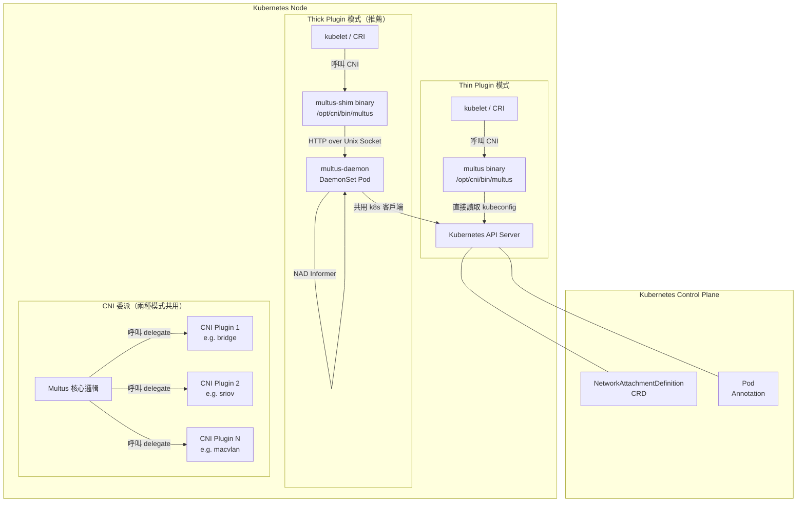

# Multus CNI — 系統架構

本文基於 Multus CNI 原始碼進行架構分析，所有內容皆引用真實檔案路徑。

::: info 原始碼位置
本文分析的原始碼位於 `multus-cni/`，模組名稱為 `gopkg.in/k8snetworkplumbingwg/multus-cni.v4`。
:::

::: info 相關章節
- CNI 委派流程與 NetworkAttachmentDefinition 請參閱 [核心功能分析](./core-features)
- Thick Plugin 伺服器架構請參閱 [Thick Plugin 深入剖析](./thick-plugin)
- 所有設定參數的完整說明請參閱 [設定參考](./configuration)
:::

## 專案概述

| 項目 | 說明 |
|------|------|
| **模組名稱** | `gopkg.in/k8snetworkplumbingwg/multus-cni.v4`（`go.mod`） |
| **Go 版本** | 1.25（`go.mod`） |
| **授權條款** | Apache License 2.0 |
| **所屬組織** | Kubernetes Network Plumbing Working Group |
| **核心功能** | 為 Kubernetes Pod 附加多張網路介面 |
| **部署方式** | DaemonSet（每個節點皆部署） |

## 系統架構圖



::: tip 架構要點
Multus 採用**元外掛（Meta-Plugin）**模式，自身不負責建立任何網路介面，而是根據 Pod Annotation 讀取 `NetworkAttachmentDefinition` 設定，依序呼叫各個下游 CNI 外掛（delegate）。
:::

## 8 個 Binary / 容器映像

Multus CNI 在 `cmd/` 目錄下定義了 8 個二進位執行檔：

| Binary | 原始碼路徑 | 角色 | 執行方式 |
|--------|-----------|------|---------|
| **multus** | `cmd/multus/` | Thin Plugin 主程式，直接呼叫 `multus.CmdAdd/Del/Check` | CNI Binary |
| **multus-daemon** | `cmd/multus-daemon/` | Thick Plugin 的伺服器端，長駐 DaemonSet Pod，監聽 Unix Socket | DaemonSet |
| **multus-shim** | `cmd/multus-shim/` | Thick Plugin 的 CNI Binary，轉發請求至 multus-daemon | CNI Binary |
| **cert-approver** | `cmd/cert-approver/` | 自動核准每節點 TLS 憑證請求（搭配 perNodeCertificate 功能） | DaemonSet 內 Init Container |
| **install_multus** | `cmd/install_multus/` | 安裝腳本輔助工具，將 multus binary 複製至宿主機 `/opt/cni/bin/` | Init Container |
| **kubeconfig_generator** | `cmd/kubeconfig_generator/` | 產生各節點專屬的 kubeconfig 檔案 | Init Container |
| **passthru-cni** | `cmd/passthru-cni/` | 直通 CNI 外掛，用於測試與開發 | CNI Binary |
| **thin_entrypoint** | `cmd/thin_entrypoint/` | Thin Plugin DaemonSet 的入口點 | Init Container |

::: info Thin vs Thick Plugin
- **Thin Plugin**：`multus` binary 在每次 CNI 呼叫時直接向 Kubernetes API Server 查詢，簡單但資源消耗較高。
- **Thick Plugin**：`multus-shim` 轉發至 `multus-daemon`，daemon 透過 Informer 快取 Pod 和 NAD 資料，效能更好並支援額外功能（Prometheus 指標）。
:::

## 核心套件結構（`pkg/`）

```
pkg/
├── multus/             # 核心 CNI 邏輯（CmdAdd、CmdDel、CmdCheck、CmdGC、CmdStatus）
├── server/             # Thick Plugin 伺服器（HTTP over Unix Socket）
│   ├── api/            # 客戶端 API 及 Shim 通訊協定
│   └── config/         # 設定管理器（自動產生 multus CNI 設定）
├── types/              # 型別定義（NetConf、DelegateNetConf、NetworkSelectionElement）
├── k8sclient/          # Kubernetes 客戶端（Pod/NAD 查詢）
├── checkpoint/         # kubelet 裝置分配 checkpoint 讀取（SR-IOV）
├── cmdutils/           # 命令列工具函式
├── kubeletclient/      # kubelet Pod Resource API 客戶端
├── logging/            # 結構化日誌
├── netutils/           # 網路工具函式
├── signals/            # OS 訊號處理
└── testing/            # 測試工具（Mock CNI exec）
```

### pkg/multus/ — 核心 CNI 邏輯

`pkg/multus/multus.go`（約 1,100 行）是 Multus 最核心的套件，實作了完整的 CNI 介面：

| 函式 | 說明 |
|------|------|
| `CmdAdd(args, exec, kubeClient)` | 建立 Pod 的所有網路介面，委派至各個 CNI 外掛 |
| `CmdDel(args, exec, kubeClient)` | 刪除 Pod 的所有網路介面，從 scratch 目錄讀取快取設定 |
| `CmdCheck(args, exec, kubeClient)` | 驗證 Pod 網路介面是否正常 |
| `CmdGC(args, exec, kubeClient)` | 垃圾回收，清理殘餘的網路配置快取 |
| `CmdStatus(args, exec, kubeClient)` | 查詢所有委派外掛的狀態（CNI 1.1+ 支援） |
| `DelegateAdd(exec, id, netconf, rt, binDirs)` | 對單一委派外掛執行 ADD |
| `DelegateDel(exec, id, netconf, rt, binDirs)` | 對單一委派外掛執行 DEL |
| `DelegateCheck(exec, id, netconf, rt, binDirs)` | 對單一委派外掛執行 CHECK |

### pkg/server/ — Thick Plugin 伺服器

`pkg/server/server.go`（約 700 行）實作 Thick Plugin 的 HTTP 伺服器：

| 元件 | 說明 |
|------|------|
| `Server` | HTTP 伺服器結構，監聽 Unix Socket `/run/multus/multus.sock` |
| `HandleCNIRequest()` | 處理來自 multus-shim 的 CNI 請求（ADD/DEL/CHECK/GC/STATUS） |
| `HandleDelegateRequest()` | 處理 Delegate 請求（支援熱插拔網路介面） |
| `NewCNIServer()` | 建立伺服器，初始化 Pod 和 NAD Informer |
| Pod Informer | 以節點名稱過濾，只快取本節點的 Pod 資料 |
| NAD Informer | 快取所有命名空間的 NetworkAttachmentDefinition |

### pkg/types/ — 型別定義

`pkg/types/types.go` 和 `pkg/types/conf.go` 定義了所有核心資料結構：

| 型別 | 說明 |
|------|------|
| `NetConf` | Multus 主設定（繼承 CNI `types.NetConf`） |
| `DelegateNetConf` | 單一委派外掛的設定（含 IfnameRequest、IPRequest、MacRequest 等） |
| `NetworkSelectionElement` | Pod Annotation 中的單一網路附加定義 |
| `K8sArgs` | CNI_ARGS 中的 Kubernetes 特有參數（Pod 名稱、命名空間、UID） |
| `RuntimeConfig` | CNI Runtime Config（PortMaps、Bandwidth、InfinibandGUID 等） |
| `ResourceInfo` | 來自 kubelet checkpoint 的 SR-IOV 裝置分配資訊 |

### pkg/k8sclient/ — Kubernetes 客戶端

`pkg/k8sclient/k8sclient.go`（約 700 行）提供：

| 功能 | 說明 |
|------|------|
| `GetK8sArgs()` | 從 CNI_ARGS 解析 K8s Pod 資訊 |
| `GetPod()` | 向 API Server 或 Informer 快取查詢 Pod 物件 |
| `GetNetworkAttachmentDef()` | 查詢指定命名空間的 NetworkAttachmentDefinition |
| `GetPodNetwork()` | 解析 Pod Annotation 中的網路附加清單 |
| `GetDefaultNetworks()` | 取得叢集預設網路設定 |
| `GetDelegatesFromAnnotations()` | 將 NAD 轉換為 DelegateNetConf 清單 |
| `InClusterK8sClient()` | 建立叢集內 k8s 客戶端（使用 ServiceAccount） |
| `PerNodeK8sClient()` | 建立節點專屬 k8s 客戶端（使用 perNodeCertificate） |

## 部署架構

### Thin Plugin DaemonSet

```yaml
# deployments/multus-daemonset.yml
initContainers:
- name: install-multus-binary   # 複製 multus binary 至宿主機
  image: ghcr.io/k8snetworkplumbingwg/multus-cni:latest
  command: ["/install_multus"]
  volumeMounts:
  - name: cnibin
    mountPath: /host/opt/cni/bin
```

Thin Plugin 只有一個 init container，負責將 multus binary 安裝到宿主機的 CNI binary 目錄（`/opt/cni/bin/`）。

### Thick Plugin DaemonSet

```yaml
# deployments/multus-daemonset-thick.yml
initContainers:
- name: install-multus-binary   # 複製 multus-shim 至宿主機
containers:
- name: kube-multus             # 長駐 multus-daemon 伺服器
  command: ["/usr/src/multus-cni/bin/multus-daemon"]
  volumeMounts:
  - name: multus-run             # /run/multus/ Socket 目錄
  - name: cni-conf               # /etc/cni/net.d/ 設定目錄
  - name: cnibin                 # /opt/cni/bin/ Binary 目錄
```

## 建置系統

| 指令 | 說明 |
|------|------|
| `make build` | 建置所有 Go Binary |
| `make image` | 建置容器映像 |
| `make test` | 執行單元測試 |
| `make lint` | 執行程式碼靜態分析 |
| `make generate` | 重新產生生成的程式碼 |
