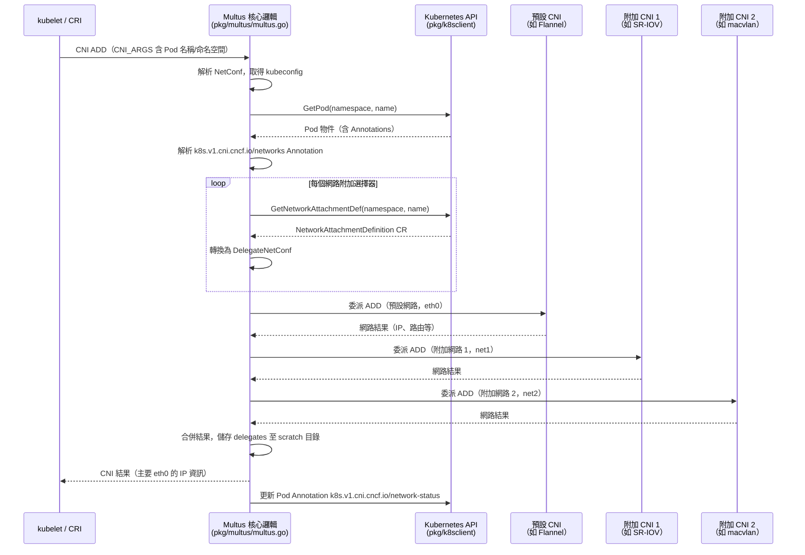
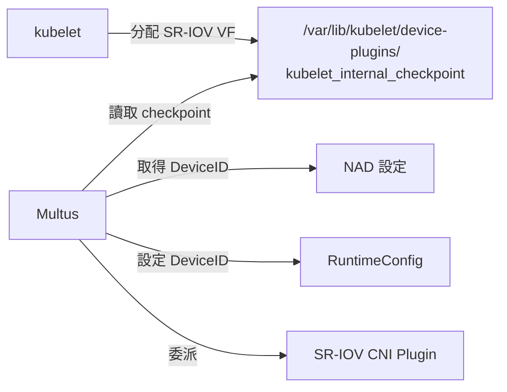

# Multus CNI — 核心功能分析

本文深入分析 Multus CNI 的核心運作機制，所有內容皆引用真實原始碼路徑。

::: info 原始碼位置
核心邏輯位於 `pkg/multus/multus.go`、`pkg/k8sclient/k8sclient.go`、`pkg/types/conf.go`。
:::

::: info 相關章節
- 系統架構與套件概覽請參閱 [系統架構](./architecture)
- Thick Plugin 伺服器實作請參閱 [Thick Plugin 深入剖析](./thick-plugin)
- 所有設定欄位說明請參閱 [設定參考](./configuration)
:::

## CNI 委派流程（ADD 操作）

當 kubelet 為 Pod 建立網路時，完整的處理流程如下：



### 關鍵程式碼路徑（`pkg/multus/multus.go`）


## NetworkAttachmentDefinition（NAD）

`NetworkAttachmentDefinition` 是由 Multus 引入的 CRD，定義附加網路的 CNI 設定：

### NAD 範例

```yaml
apiVersion: k8s.cni.cncf.io/v1
kind: NetworkAttachmentDefinition
metadata:
  name: macvlan-conf
  namespace: default
spec:
  config: |
    {
      "cniVersion": "0.3.1",
      "type": "macvlan",
      "master": "eth0",
      "mode": "bridge",
      "ipam": {
        "type": "host-local",
        "subnet": "192.168.1.0/24"
      }
    }
```

### 兩種 NAD 設定方式

| 方式 | 說明 | 適用場景 |
|------|------|---------|
| **spec.config 內嵌** | CNI JSON 直接寫在 NAD 的 `spec.config` 欄位 | 大多數情況 |
| **檔案參考** | NAD `spec.config` 為空，Multus 從 `confDir` 目錄讀取同名的 `.conf` 或 `.conflist` | 複雜設定 |

NAD 客戶端由外部套件 `github.com/k8snetworkplumbingwg/network-attachment-definition-client` 提供，其 CRD 型別為 `netdefv1.NetworkAttachmentDefinition`。

## Pod Annotation 解析

### 網路選擇 Annotation

Pod 透過以下 Annotation 指定附加網路（`pkg/types/types.go`）：

```yaml
# 簡單格式（使用 NAD 名稱）
annotations:
  k8s.v1.cni.cncf.io/networks: macvlan-conf

# 多個網路，逗號分隔
annotations:
  k8s.v1.cni.cncf.io/networks: macvlan-conf,sriov-net

# JSON 陣列格式（支援進階選項）
annotations:
  k8s.v1.cni.cncf.io/networks: |
    [
      {
        "name": "macvlan-conf",
        "interface": "net1",
        "ips": ["192.168.1.100/24"],
        "mac": "c2:b0:57:49:47:f1",
        "default-route": ["192.168.1.1"]
      },
      {
        "name": "sriov-net",
        "namespace": "kube-system",
        "deviceID": "0000:00:1f.6"
      }
    ]
```

### NetworkSelectionElement 欄位（`pkg/types/types.go`）

| 欄位 | JSON 鍵 | 說明 |
|------|---------|------|
| `Name` | `name` | NetworkAttachmentDefinition 名稱（必填） |
| `Namespace` | `namespace` | NAD 所在的命名空間（預設為 Pod 的命名空間） |
| `IPRequest` | `ips` | 要求的 IP 位址清單 |
| `MacRequest` | `mac` | 要求的 MAC 位址 |
| `InfinibandGUIDRequest` | `infiniband-guid` | 要求的 InfiniBand GUID |
| `InterfaceRequest` | `interface` | 介面名稱（預設自動產生，如 `net1`、`net2`） |
| `PortMappingsRequest` | `portMappings` | 連接埠對映設定 |
| `BandwidthRequest` | `bandwidth` | 頻寬限制設定 |
| `DeviceID` | `deviceID` | 要求的裝置 ID（用於 SR-IOV） |
| `GatewayRequest` | `default-route` | 預設閘道 IP 清單 |
| `CNIArgs` | `cni-args` | 額外的 CNI 參數（傳遞給委派外掛） |

## 介面命名規則

介面名稱由 `getIfname()` 函式決定（`pkg/multus/multus.go`）：

| 優先順序 | 條件 | 介面名稱 |
|---------|------|---------|
| 1 | `DelegateNetConf.IfnameRequest != ""` | 使用 Pod Annotation 指定的名稱 |
| 2 | `DelegateNetConf.MasterPlugin == true` | 使用 CNI 提供的名稱（通常為 `eth0`） |
| 3 | 其他情況 | `net{idx}`（`net1`、`net2`、...） |

## DEL 流程與 Scratch 快取

Multus 的 DEL 操作依賴 **scratch 快取**機制（`pkg/multus/multus.go`）：

```mermaid
flowchart LR
    A[CmdAdd 執行完成] -->|saveDelegates()| B["/var/lib/cni/multus/{containerID}\n儲存所有 DelegateNetConf JSON"]
    C[CmdDel 呼叫] --> D{快取存在？}
    D -->|是| E[consumeScratchNetConf()\n讀取快取，並刪除檔案]
    E --> F[對每個 DelegateNetConf\n呼叫委派 DEL]
    D -->|否| G[記錄警告，\n嘗試從設定重建]
```

::: warning 為何需要快取
DEL 呼叫時，Pod 可能已被清理，Kubernetes API 可能無法回傳 Pod 資訊（包含 Annotations）。因此 Multus 在 ADD 時主動儲存所有委派外掛的設定，確保 DEL 時能正確清理所有網路介面。
:::

## GC 垃圾回收（CNI 1.1+ 功能）

`CmdGC()` 函式（`pkg/multus/multus.go`）實作 CNI 垃圾回收功能：

1. 從 scratch 目錄讀取所有快取的附加記錄（`gatherValidAttachmentsFromCache()`）
2. 與傳入的「有效附加清單」對比
3. 對不在有效清單中的殘留快取，觸發委派外掛的 DEL 操作
4. 清理對應的快取檔案

## 命名空間隔離（Namespace Isolation）

當 `namespaceIsolation: true` 時，Pod 只能引用**相同命名空間**的 NAD，除非 NAD 所在命名空間被列入 `globalNamespaces`：

```json
{
  "namespaceIsolation": true,
  "globalNamespaces": "kube-system,default"
}
```

此功能由 `pkg/k8sclient/k8sclient.go` 的命名空間驗證邏輯實作，防止 Pod 跨命名空間使用未授權的網路設定。

## 系統命名空間排除

`systemNamespaces` 設定（預設 `["kube-system"]`）可排除特定命名空間的 Pod 自動附加預設網路：

```json
{
  "systemNamespaces": ["kube-system", "cert-manager"],
  "defaultNetworks": ["flannel-conf"]
}
```

系統命名空間的 Pod 不會被套用 `defaultNetworks` 中定義的附加網路，避免系統元件意外獲得不必要的網路介面。

## 就緒指示檔（Readiness Indicator File）

Multus 支援等待預設 CNI 外掛就緒後才處理 CNI 請求：

```json
{
  "readinessindicatorfile": "/run/flannel/subnet.env"
}
```

`GetReadinessIndicatorFile()` 函式（`pkg/types/conf.go`）會持續輪詢該檔案，直到檔案存在才繼續。這確保預設網路外掛（如 Flannel）完成初始化後，Multus 才開始委派網路建立。

## SR-IOV 裝置分配整合

Multus 透過 `pkg/checkpoint/` 與 `pkg/kubeletclient/` 與 kubelet 的裝置管理整合：



`pkg/checkpoint/checkpoint.go` 讀取 kubelet 的裝置分配 checkpoint 檔案，取得 Pod 已分配的 SR-IOV Virtual Function（VF）裝置 ID，再透過 RuntimeConfig 傳遞給 SR-IOV CNI 外掛。

此外，`pkg/kubeletclient/` 透過 kubelet 的 gRPC Pod Resource API（`k8s.io/kubelet/pkg/apis/podresources`）取得更精確的裝置分配資訊，是 checkpoint 方式的現代替代方案。
