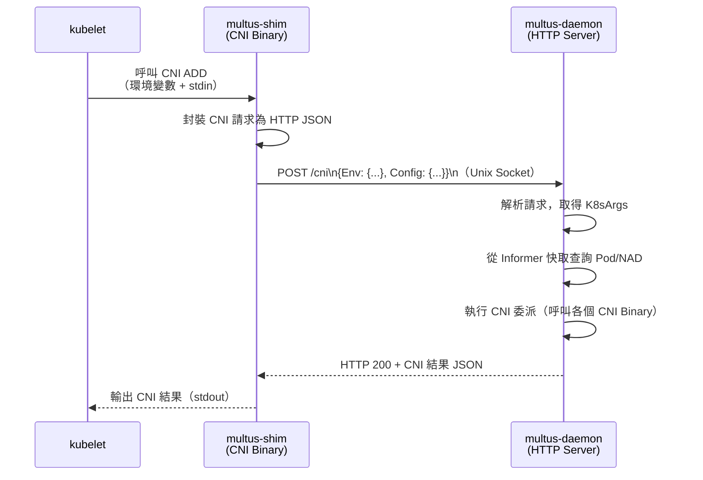

# Multus CNI — Thick Plugin 深入剖析

本文深入分析 Multus CNI v4.0 引入的 Thick Plugin 架構，所有內容皆引用真實原始碼路徑。

::: info 原始碼位置
Thick Plugin 相關程式碼位於 `cmd/multus-daemon/`、`cmd/multus-shim/`、`pkg/server/`、`pkg/server/api/`、`pkg/server/config/`。
:::

::: info 相關章節
- CNI 委派流程與 NAD 機制請參閱 [核心功能分析](./core-features)
- 系統架構總覽請參閱 [系統架構](./architecture)
- Thick Plugin 設定參數請參閱 [設定參考](./configuration)
:::

## Thick Plugin 簡介

Thick Plugin 於 Multus v4.0 引入，採用**Client/Server 架構**：

| 元件 | Binary | 說明 |
|------|--------|------|
| **multus-daemon** | `cmd/multus-daemon/main.go` | 伺服器端，長駐 DaemonSet Pod，持有 k8s 客戶端與 Informer 快取 |
| **multus-shim** | `cmd/multus-shim/main.go` | 客戶端（CNI Binary），接收 kubelet CNI 呼叫後轉發至 daemon |

### Thin vs Thick 比較

| 特性 | Thin Plugin | Thick Plugin |
|------|------------|-------------|
| 架構 | 單一 Binary | Client + Server |
| Kubernetes API 呼叫 | 每次 CNI 呼叫都建立連線 | 使用共用客戶端 + Informer 快取 |
| Prometheus 指標 | ❌ 不支援 | ✅ 支援 |
| 資源消耗 | 較低 | 較高（長駐 daemon） |
| 熱插拔介面（Delegate API） | ❌ 不支援 | ✅ 支援 |
| 每節點 TLS 憑證 | ❌ 不支援 | ✅ 支援（perNodeCertificate） |
| 推薦程度 | 資源受限環境 | **大多數環境（推薦）** |

## multus-daemon 啟動流程

`cmd/multus-daemon/main.go` 的 `main()` 函式執行以下步驟：

```mermaid
flowchart TD
    A[啟動 multus-daemon] --> B[讀取 daemon-config.json\ncniServerConfig()]
    B --> C[解析 multus CNI 設定\nconfig.ParseMultusConfig()]
    C --> D{ReadinessIndicatorFile\n是否設定？}
    D -->|是| E[等待就緒指示檔存在]
    D -->|否| F{MultusConfigFile\n== auto？}
    E --> F
    F -->|是| G[建立 config.Manager\n自動產生 multus CNI 設定]
    F -->|否| H[複製使用者提供的\nmultus 設定至 cniConfigDir]
    G --> I[startMultusDaemon()]
    H --> I
    I --> J[srv.FilesystemPreRequirements()\n建立 /run/multus/ 目錄]
    J --> K[srv.NewCNIServer()\n建立 HTTP Server + Informers]
    K --> L{MetricsPort\n是否設定？}
    L -->|是| M[啟動 Prometheus\nMetrics HTTP Server]
    L -->|否| N[srv.GetListener()\n監聽 Unix Socket]
    M --> N
    N --> O[server.Start()\n開始接受請求]
    O --> P[api.WaitUntilAPIReady()\n等待 Socket 就緒]
    P --> Q[等待 SIGINT/SIGTERM 訊號]
```

## HTTP Server 架構（`pkg/server/server.go`）

`Server` 結構（`pkg/server/types.go`）是 Thick Plugin 伺服器的核心：

```go
type Server struct {
    http.Server
    rundir                string         // Unix Socket 目錄
    kubeclient            *k8sclient.ClientInfo  // 共用 k8s 客戶端
    exec                  invoke.Exec    // CNI Binary 執行器
    serverConfig          []byte         // multus CNI 設定 JSON
    metrics               *Metrics       // Prometheus 指標
    informerFactory       internalinterfaces.SharedInformerFactory  // Pod Informer
    podInformer           cache.SharedIndexInformer
    netdefInformerFactory netdefinformer.SharedInformerFactory      // NAD Informer
    netdefInformer        cache.SharedIndexInformer
    ignoreReadinessIndicator bool
}
```

### API 端點

| 端點 | 常數 | 說明 |
|------|------|------|
| `POST /cni` | `api.MultusCNIAPIEndpoint` | 處理標準 CNI 請求（ADD/DEL/CHECK/GC/STATUS） |
| `POST /delegate` | `api.MultusDelegateAPIEndpoint` | 處理 Delegate 請求（熱插拔網路介面） |
| `GET /healthz` | `api.MultusHealthAPIEndpoint` | 健康檢查端點，供 multus-shim 探測就緒狀態 |
| `GET /metrics` | `/metrics` | Prometheus 指標端點（獨立 HTTP 伺服器） |

### Unix Socket 路徑

Unix Socket 位置由 `SocketDir` 設定決定，預設為 `/run/multus/`，實際 socket 檔案為：

```
/run/multus/multus.sock
```

Socket 路徑由 `pkg/server/api/socket.go` 的 `SocketPath()` 函式組合：

```go
const defaultMultusRunDir = "/run/multus/"

func SocketPath(rundir string) string {
    return filepath.Join(rundir, "multus.sock")
}
```

## Informer 快取設計

Thick Plugin 的核心優勢在於使用 **Informer 快取**避免每次 CNI 呼叫都向 API Server 發送請求：

### Pod Informer（`pkg/server/server.go`）

```go
func newPodInformer(kubeClient kubernetes.Interface, nodeName string) (...) {
    // 只監控本節點的 Pod（節省記憶體與頻寬）
    tweakFunc = func(opts *metav1.ListOptions) {
        opts.FieldSelector = fields.OneTermEqualSelector("spec.nodeName", nodeName).String()
    }
    const resyncInterval = 1 * time.Second
    // 使用 informerObjectTrim 移除不必要的欄位以節省記憶體
    informerFactory = informerfactory.NewSharedInformerFactoryWithOptions(
        kubeClient, resyncInterval,
        informerfactory.WithTransform(informerObjectTrim))
    ...
}
```

`informerObjectTrim()` 函式在快取 Pod 物件時，會移除以下欄位以節省記憶體：
- `ManagedFields`
- `Spec.Volumes`
- `Spec.Containers[*].Command`、`Args`、`Env`、`VolumeMounts`

### NAD Informer（`pkg/server/server.go`）

```go
func newNetDefInformer(netdefClient netdefclient.Interface) (...) {
    const resyncInterval = 1 * time.Second
    // 監控所有命名空間的 NetworkAttachmentDefinition
    informerFactory = netdefinformer.NewSharedInformerFactoryWithOptions(
        netdefClient, resyncInterval)
    netdefInformer = netdefinformerv1.NewNetworkAttachmentDefinitionInformer(
        client, kapi.NamespaceAll, resyncPeriod,
        cache.Indexers{cache.NamespaceIndex: cache.MetaNamespaceIndexFunc})
    ...
}
```

## multus-shim 設計（`cmd/multus-shim/main.go`）

multus-shim 是一個輕量的 CNI Binary，只有約 50 行程式碼，主要功能是將 kubelet 的 CNI 呼叫轉發至 multus-daemon：

```go
skel.PluginMainFuncs(
    skel.CNIFuncs{
        Add:    func(args *skel.CmdArgs) error { return api.CmdAdd(args) },
        Check:  func(args *skel.CmdArgs) error { return api.CmdCheck(args) },
        Del:    func(args *skel.CmdArgs) error { return api.CmdDel(args) },
        GC:     func(args *skel.CmdArgs) error { return api.CmdGC(args) },
        Status: func(args *skel.CmdArgs) error { return api.CmdStatus(args) },
    },
    cniversion.All, "meta-plugin that delegates to other CNI plugins")
```

### Shim 通訊流程（`pkg/server/api/shim.go`）



### HTTP 通訊協定（`pkg/server/api/api.go`）

multus-shim 與 multus-daemon 之間使用 **JSON over Unix Socket HTTP** 通訊：

```go
// 請求格式（pkg/server/api/api.go）
type Request struct {
    Env                 map[string]string            // CNI 環境變數
    Config              []byte                       // CNI 設定 JSON（stdin）
    InterfaceAttributes *DelegateInterfaceAttributes // Delegate 請求的額外屬性
}

// DoCNI 函式 — 傳送 CNI 請求至 daemon
func DoCNI(url string, req interface{}, socketPath string) ([]byte, error) {
    client := &http.Client{
        Transport: &http.Transport{
            Dial: func(_, _ string) (net.Conn, error) {
                return net.Dial("unix", socketPath)
            },
        },
    }
    resp, err := client.Post(url, "application/json", bytes.NewReader(data))
    ...
}
```

## Prometheus 指標

multus-daemon 內建 Prometheus 指標支援（`pkg/server/server.go`）：

| 指標名稱 | 類型 | 說明 |
|---------|------|------|
| `multus_server_request_total` | Counter | HTTP 請求總數，標籤：`handler`、`code`、`method` |

指標端點在獨立 HTTP 伺服器上提供，由 `MetricsPort` 設定決定埠號：

```json
{
  "metricsPort": 9091
}
```

啟動後可透過 `http://<node-ip>:9091/metrics` 取得 Prometheus 格式指標。

## 每節點 TLS 憑證（perNodeCertificate）

Thick Plugin 支援自動為每個節點產生獨立的 TLS 憑證，用於向 Kubernetes API Server 認證：

```json
{
  "perNodeCertificate": {
    "enabled": true,
    "bootstrapKubeconfig": "/etc/kubernetes/bootstrap.kubeconfig",
    "certDir": "/var/lib/multus/certs/",
    "certDuration": "10m"
  }
}
```

實作位於 `pkg/k8sclient/k8sclient.go` 的 `PerNodeK8sClient()` 函式，透過 `cmd/cert-approver` 輔助 Binary 自動核准 CSR（Certificate Signing Request）。

預設憑證有效期限為 **10 分鐘**（`DefaultCertDuration = 10 * time.Minute`，`pkg/server/types.go`），daemon 會在憑證過期前自動更新。

## Chroot 執行模式

當 `chrootDir` 設定不為空時，multus-daemon 會在呼叫委派 CNI Binary 前先 chroot 至指定目錄：

```go
// pkg/server/server.go
if daemonConfig.ChrootDir != "" {
    chrootExec := &ChrootExec{
        Stderr:    os.Stderr,
        chrootDir: daemonConfig.ChrootDir,
    }
    exec = chrootExec
}
```

`ChrootExec`（`pkg/server/exec_chroot.go`）確保委派 CNI Binary 的執行環境在宿主機的檔案系統中，而非 daemon 容器的檔案系統。這對於 CNI Binary 安裝於宿主機 `/opt/cni/bin/` 的情況特別重要。

## 熱插拔（Delegate API）

Thick Plugin 的 `/delegate` API 端點支援在 Pod 執行期間動態附加或移除網路介面：

```
POST /delegate
{
    "Env": {
        "CNI_COMMAND": "ADD",
        "CNI_CONTAINERID": "...",
        "CNI_NETNS": "/proc/...",
        "CNI_IFNAME": "net2",
        "CNI_ARGS": "K8S_POD_NAMESPACE=default;K8S_POD_NAME=my-pod;K8S_POD_UID=..."
    },
    "Config": {...},
    "InterfaceAttributes": {
        "MacRequest": "02:00:00:00:00:01",
        "IPRequest": ["10.0.0.100/24"]
    }
}
```

此功能由 `HandleDelegateRequest()` 處理，`api.CreateDelegateRequest()` 協助建立請求格式（`pkg/server/api/api.go`）。

## 設定自動管理（config.Manager）

當 `MultusConfigFile: "auto"` 時，`config.Manager`（`pkg/server/config/`）會自動從現有的 CNI 設定產生 Multus CNI 設定：

1. 監控 `/etc/cni/net.d/` 目錄中的 `.conf` / `.conflist` 檔案
2. 選取優先順序最高的 CNI 設定作為預設網路
3. 自動產生 Multus 的 CNI 設定（以 `00-multus.conf` 命名確保最高優先順序）
4. 使用 `fsnotify` 監控設定目錄，當設定變更時自動重新產生
