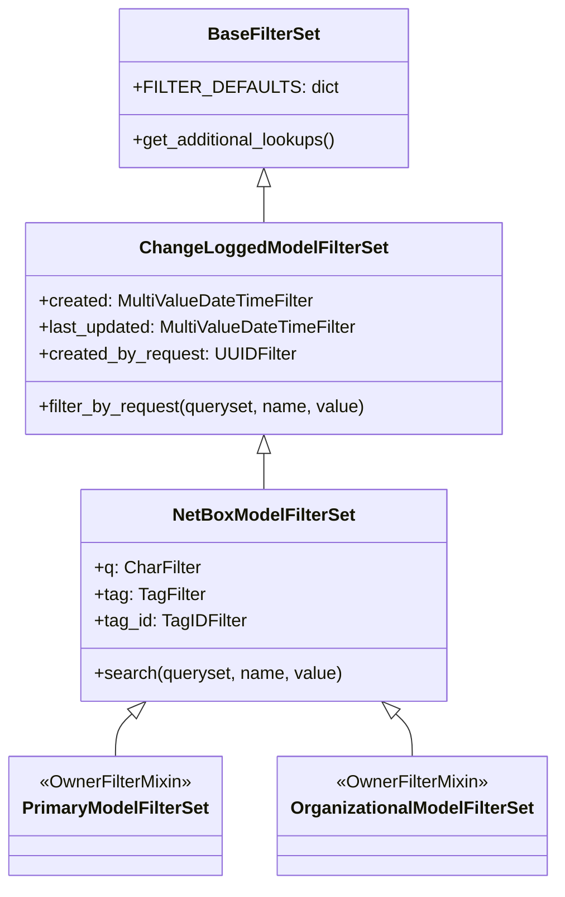
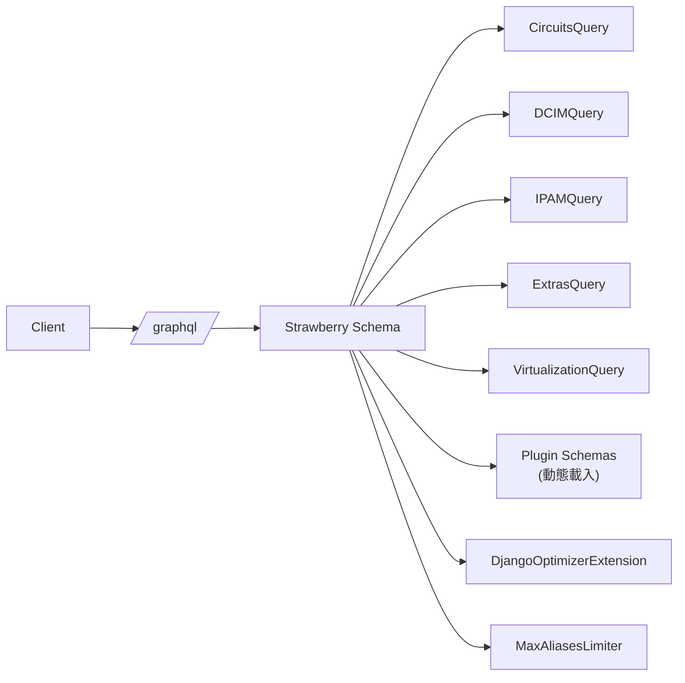
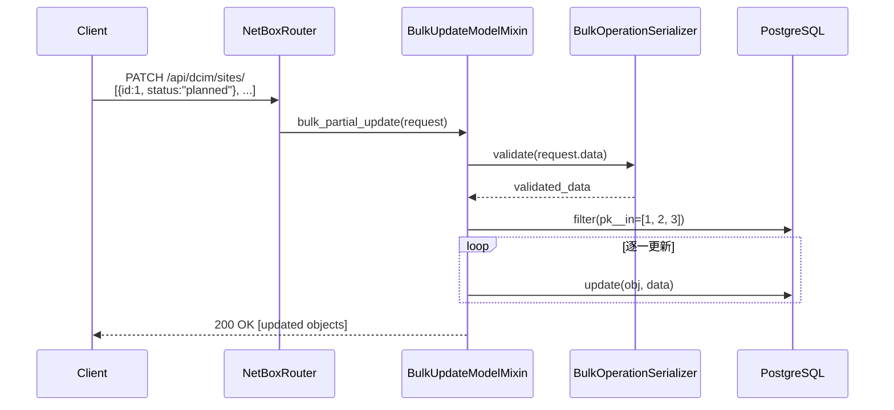
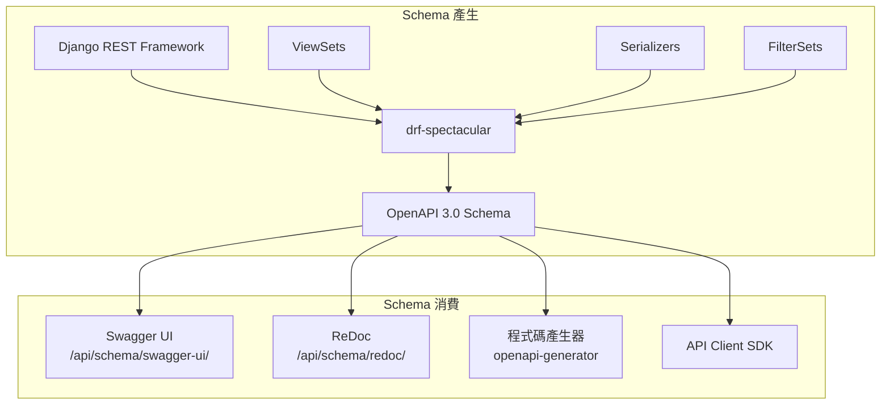

# NetBox — API 參考與分析

::: info 相關章節
- [系統架構](./architecture) — Django 應用結構與元件關係
- [核心功能分析](./core-features) — IPAM、DCIM 等模組深入解析
- [資料模型](./data-models) — 115 個模型的完整定義與關聯
- [整合與擴展](./integration) — Plugin 系統、Webhook、Event Rules
:::

## 1. REST API 架構

NetBox 基於 **Django REST Framework (DRF) 3.16.1** 構建完整的 RESTful API，提供所有資料模型的 CRUD 操作。API 進入點為 `/api/`，採用自訂的 `NetBoxRouter` 統一管理路由。

### 1.1 NetBoxRouter — 自訂路由器

NetBox 擴展了 DRF 的 `DefaultRouter`，增加 Bulk Operations 支援與字母排序：

```python
# 檔案: netbox/netbox/api/routers.py
from rest_framework.routers import DefaultRouter

class NetBoxRouter(DefaultRouter):
    """
    Extend DRF's built-in DefaultRouter to:
    1. Support bulk operations
    2. Alphabetically order endpoints under the root view
    """
    def __init__(self, *args, **kwargs):
        super().__init__(*args, **kwargs)

        # 擴展 list view 的 HTTP method mapping，支援 bulk 操作
        self.routes[0].mapping.update({
            'put': 'bulk_update',
            'patch': 'bulk_partial_update',
            'delete': 'bulk_destroy',
        })

    def get_api_root_view(self, api_urls=None):
        """
        回傳依字母排序的 endpoint 列表
        """
        api_root_dict = {}
        list_name = self.routes[0].name
        for prefix, viewset, basename in sorted(self.registry, key=lambda x: x[0]):
            api_root_dict[prefix] = list_name.format(basename=basename)
        return self.APIRootView.as_view(api_root_dict=api_root_dict)
```

### 1.2 URL 註冊模式

所有 API URL 在 `netbox/netbox/urls.py` 統一註冊，每個 Django App 獨立維護自身的 API 路由：

```python
# 檔案: netbox/netbox/urls.py
urlpatterns = [
    # REST API — 各模組路由
    path('api/', APIRootView.as_view(), name='api-root'),
    path('api/circuits/', include('circuits.api.urls')),
    path('api/core/', include('core.api.urls')),
    path('api/dcim/', include('dcim.api.urls')),
    path('api/extras/', include('extras.api.urls')),
    path('api/ipam/', include('ipam.api.urls')),
    path('api/tenancy/', include('tenancy.api.urls')),
    path('api/users/', include('users.api.urls')),
    path('api/virtualization/', include('virtualization.api.urls')),
    path('api/vpn/', include('vpn.api.urls')),
    path('api/wireless/', include('wireless.api.urls')),

    # 狀態與認證檢查
    path('api/status/', StatusView.as_view(), name='api-status'),
    path('api/authentication-check/', AuthenticationCheckView.as_view(), name='api-authentication-check'),

    # OpenAPI Schema 文件
    path('api/schema/', SpectacularAPIView.as_view(), name='schema'),
    path('api/schema/swagger-ui/', SpectacularSwaggerView.as_view(url_name='schema'), name='api_docs'),
    path('api/schema/redoc/', SpectacularRedocView.as_view(url_name='schema'), name='api_redocs'),

    # GraphQL
    path('graphql/', NetBoxGraphQLView.as_view(schema=schema), name='graphql'),
]
```

### 1.3 API 請求流程


## 2. API Endpoint 清單

NetBox 提供 **131 個 REST API Endpoints**，橫跨 10 個 Django App：

| App | Endpoint 數量 | 主要 Endpoints |
|-----|:---:|------|
| **dcim** | 44 | `devices`, `interfaces`, `cables`, `racks`, `sites`, `regions`, `device-types`, `manufacturers`, `platforms`, `power-panels`, `console-ports` |
| **ipam** | 16 | `prefixes`, `ip-addresses`, `vlans`, `vrfs`, `asns`, `aggregates`, `services`, `fhrp-groups`, `ip-ranges` |
| **extras** | 16 | `webhooks`, `event-rules`, `custom-fields`, `tags`, `bookmarks`, `config-contexts`, `scripts`, `journal-entries` |
| **core** | 12 | `jobs`, `data-sources`, `data-files`, `object-changes`, `background-tasks` |
| **circuits** | 11 | `circuits`, `providers`, `circuit-types`, `circuit-terminations`, `provider-accounts`, `virtual-circuits` |
| **vpn** | 10 | `tunnels`, `ike-policies`, `ike-proposals`, `ipsec-policies`, `ipsec-profiles`, `ipsec-proposals`, `l2vpns`, `l2vpn-terminations` |
| **virtualization** | 6 | `virtual-machines`, `clusters`, `cluster-types`, `cluster-groups`, `interfaces`, `virtual-disks` |
| **tenancy** | 6 | `tenants`, `tenant-groups`, `contacts`, `contact-roles`, `contact-groups`, `contact-assignments` |
| **users** | 5 | `users`, `groups`, `tokens`, `permissions`, `config` |
| **wireless** | 3 | `wireless-lans`, `wireless-lan-groups`, `wireless-links` |

每個 App 的路由採用統一模式，透過 `NetBoxRouter` 註冊 ViewSet：

```python
# 檔案: circuits/api/urls.py
from netbox.api.routers import NetBoxRouter
from . import views

router = NetBoxRouter()
router.APIRootView = views.CircuitsRootView

router.register('providers', views.ProviderViewSet)
router.register('circuits', views.CircuitViewSet)
router.register('circuit-terminations', views.CircuitTerminationViewSet)
router.register('circuit-types', views.CircuitTypeViewSet)
# ... 更多 endpoints

app_name = 'circuits-api'
urlpatterns = router.urls
```

## 3. ViewSet 架構

### 3.1 繼承鏈


### 3.2 BaseViewSet — 權限控制核心

`BaseViewSet` 是所有 API ViewSet 的基礎類別，負責 **Object-Level 權限控制**與**動態欄位選擇**：

```python
# 檔案: netbox/netbox/api/viewsets/__init__.py
HTTP_ACTIONS = {
    'GET': 'view',
    'OPTIONS': None,
    'HEAD': 'view',
    'POST': 'add',
    'PUT': 'change',
    'PATCH': 'change',
    'DELETE': 'delete',
}

class BaseViewSet(GenericViewSet):
    """
    所有 API ViewSet 的基礎類別，負責 object-based permissions 的執行。
    """
    brief = False

    def initial(self, request, *args, **kwargs):
        super().initial(request, *args, **kwargs)
        # 根據 HTTP method 對應的 action 限制 QuerySet
        if request.user.is_authenticated:
            if action := HTTP_ACTIONS[request.method]:
                self.queryset = self.queryset.restrict(request.user, action)

    @cached_property
    def field_kwargs(self):
        # 支援 ?fields=id,name 選擇特定欄位
        if requested_fields := self.request.query_params.get('fields'):
            return {'fields': requested_fields.split(',')}
        # 支援 ?omit=description 排除特定欄位
        if omit_fields := self.request.query_params.get('omit'):
            return {'omit': omit_fields.split(',')}
        # 支援 ?brief 簡潔模式
        if self.brief:
            serializer_class = self.get_serializer_class()
            if brief_fields := getattr(serializer_class.Meta, 'brief_fields', None):
                return {'fields': brief_fields}
        return {}
```

### 3.3 NetBoxModelViewSet — 完整 CRUD + Bulk

`NetBoxModelViewSet` 組合多個 Mixin 提供完整的 API 功能：

| Mixin | 功能 | 對應 HTTP Method |
|-------|------|:---:|
| `BulkUpdateModelMixin` | 批次更新多個物件 | `PUT` / `PATCH` on list |
| `BulkDestroyModelMixin` | 批次刪除多個物件 | `DELETE` on list |
| `ObjectValidationMixin` | 物件層級權限驗證 | 所有寫入操作 |
| `CustomFieldsMixin` | Custom Fields 上下文 | 所有操作 |
| `ExportTemplatesMixin` | 匯出模板支援 | `GET` with `?export=` |
| `SequentialBulkCreatesMixin` | 循序批次建立 | `POST` on list |

## 4. Serializer 模式

### 4.1 繼承體系


### 4.2 BaseModelSerializer — 動態欄位

支援三種欄位控制模式：

```python
# 檔案: netbox/netbox/api/serializers/base.py
class BaseModelSerializer(serializers.ModelSerializer):
    url = NetBoxAPIHyperlinkedIdentityField()
    display_url = NetBoxURLHyperlinkedIdentityField()
    display = serializers.SerializerMethodField(read_only=True)

    def __init__(self, *args, nested=False, fields=None, omit=None, **kwargs):
        self.nested = nested
        self._include_fields = fields or []
        self._omit_fields = omit or []

        # Nested 模式自動使用 brief_fields
        if self.nested and not fields and not omit:
            self._include_fields = getattr(self.Meta, 'brief_fields', None)

        super().__init__(*args, **kwargs)

    @cached_property
    def fields(self):
        fields = super().fields
        if self._include_fields:
            for field_name in set(fields) - set(self._include_fields):
                fields.pop(field_name, None)
        for field_name in set(self._omit_fields):
            fields.pop(field_name, None)
        return fields
```

**API 使用範例：**

```bash
# 檔案: examples/api-field-selection.sh

# 1. 選擇特定欄位
curl -s "https://netbox.example.com/api/dcim/devices/?fields=id,name,status" \
  -H "Authorization: Token $TOKEN"

# 2. 排除特定欄位
curl -s "https://netbox.example.com/api/dcim/devices/?omit=comments,config_context" \
  -H "Authorization: Token $TOKEN"

# 3. 簡潔模式 — 只回傳 brief_fields
curl -s "https://netbox.example.com/api/dcim/devices/?brief" \
  -H "Authorization: Token $TOKEN"
```

### 4.3 ValidatedModelSerializer — 模型驗證

DRF 預設不呼叫 Django Model 的 `full_clean()`，NetBox 透過 `ValidatedModelSerializer` 補上這個缺口：

```python
# 檔案: netbox/netbox/api/serializers/base.py
class ValidatedModelSerializer(BaseModelSerializer):
    def validate(self, data):
        if self.nested:
            return data

        attrs = data.copy()
        attrs.pop('custom_fields', None)

        # 分離 ManyToMany 欄位
        opts = self.Meta.model._meta
        m2m_values = {}
        for field in [*opts.local_many_to_many, *opts.related_objects]:
            if field.name in attrs:
                m2m_values[field.name] = attrs.pop(field.name)

        # 在模型實例上執行 full_clean()
        if self.instance is None:
            instance = self.Meta.model(**attrs)
        else:
            instance = self.instance
            for k, v in attrs.items():
                setattr(instance, k, v)
        instance._m2m_values = m2m_values
        instance.full_clean(validate_unique=False)
        return data
```

### 4.4 實際 Serializer 範例

以 `SiteSerializer` 為例，展示完整的 Serializer 定義模式：

```python
# 檔案: dcim/api/serializers_/sites.py
class SiteSerializer(PrimaryModelSerializer):
    status = ChoiceField(choices=SiteStatusChoices, required=False)
    region = RegionSerializer(nested=True, required=False, allow_null=True)
    group = SiteGroupSerializer(nested=True, required=False, allow_null=True)
    tenant = TenantSerializer(nested=True, required=False, allow_null=True)
    time_zone = TimeZoneSerializerField(required=False, allow_null=True)
    asns = SerializedPKRelatedField(
        queryset=ASN.objects.all(),
        serializer=ASNSerializer,
        nested=True,
        required=False,
        many=True
    )

    # Related object counts
    circuit_count = RelatedObjectCountField('circuit_terminations')
    device_count = RelatedObjectCountField('devices')
    prefix_count = RelatedObjectCountField('prefix_set')
    rack_count = RelatedObjectCountField('racks')

    class Meta:
        model = Site
        fields = [
            'id', 'url', 'display_url', 'display', 'name', 'slug', 'status',
            'region', 'group', 'tenant', 'facility', 'time_zone', 'description',
            'physical_address', 'shipping_address', 'latitude', 'longitude',
            'owner', 'comments', 'asns', 'tags', 'custom_fields', 'created',
            'last_updated', 'circuit_count', 'device_count', 'prefix_count',
            'rack_count',
        ]
        brief_fields = ('id', 'url', 'display', 'name', 'description', 'slug')
```

**關鍵設計模式：**

- `nested=True` — 關聯物件自動使用 `brief_fields` 呈現
- `RelatedObjectCountField` — 動態計算關聯物件數量（透過 annotation）
- `brief_fields` — 定義簡潔模式回傳的欄位子集
- `SerializedPKRelatedField` — 讀取時回傳序列化物件，寫入時接受 PK

## 5. Filter 系統

### 5.1 FilterSet 繼承鏈



### 5.2 BaseFilterSet — 自動 Filter 類型對應

NetBox 覆寫了 DRF 預設的 Filter 對應表，所有欄位預設支援 **多值查詢**：

```python
# 檔案: netbox/netbox/filtersets.py
class BaseFilterSet(django_filters.FilterSet):
    FILTER_DEFAULTS = deepcopy(django_filters.filterset.FILTER_FOR_DBFIELD_DEFAULTS)
    FILTER_DEFAULTS.update({
        models.AutoField:              {'filter_class': filters.MultiValueNumberFilter},
        models.CharField:              {'filter_class': filters.MultiValueCharFilter},
        models.DateField:              {'filter_class': filters.MultiValueDateFilter},
        models.DateTimeField:          {'filter_class': filters.MultiValueDateTimeFilter},
        models.DecimalField:           {'filter_class': filters.MultiValueDecimalFilter},
        models.EmailField:             {'filter_class': filters.MultiValueCharFilter},
        models.FloatField:             {'filter_class': filters.MultiValueNumberFilter},
        models.IntegerField:           {'filter_class': filters.MultiValueNumberFilter},
        models.PositiveIntegerField:   {'filter_class': filters.MultiValueNumberFilter},
        models.PositiveSmallIntegerField: {'filter_class': filters.MultiValueNumberFilter},
        models.SlugField:              {'filter_class': filters.MultiValueCharFilter},
        models.SmallIntegerField:      {'filter_class': filters.MultiValueNumberFilter},
        models.URLField:               {'filter_class': filters.MultiValueCharFilter},
        MACAddressField:               {'filter_class': filters.MultiValueMACAddressFilter},
    })
```

### 5.3 NetBoxModelFilterSet — 搜尋與標籤過濾

```python
# 檔案: netbox/netbox/filtersets.py
class NetBoxModelFilterSet(ChangeLoggedModelFilterSet):
    q = django_filters.CharFilter(
        method='search',
        label=_('Search'),
    )
    tag = TagFilter()
    tag_id = TagIDFilter()

    def __init__(self, *args, **kwargs):
        super().__init__(*args, **kwargs)
        # 動態載入 Custom Field 的 Filter
        custom_field_filters = {}
        for custom_field in CustomField.objects.get_for_model(self._meta.model):
            if custom_field.filter_logic == CustomFieldFilterLogicChoices.FILTER_DISABLED:
                continue
            if filter_instance := custom_field.to_filter():
                filter_name = f'cf_{custom_field.name}'
                custom_field_filters[filter_name] = filter_instance
        self.filters.update(custom_field_filters)
```

### 5.4 API 查詢範例

```bash
# 檔案: examples/api-filter-queries.sh

# 1. 基本過濾 — 查詢特定站點的活躍設備
curl -s "https://netbox.example.com/api/dcim/devices/?site=nyc&status=active" \
  -H "Authorization: Token $TOKEN"

# 2. 多值過濾 — 同時查詢多個站點
curl -s "https://netbox.example.com/api/dcim/devices/?site=nyc&site=lax&site=chi" \
  -H "Authorization: Token $TOKEN"

# 3. Lookup 表達式 — 名稱包含 "core"
curl -s "https://netbox.example.com/api/dcim/devices/?name__contains=core" \
  -H "Authorization: Token $TOKEN"

# 4. 全文搜尋
curl -s "https://netbox.example.com/api/dcim/devices/?q=router" \
  -H "Authorization: Token $TOKEN"

# 5. Tag 過濾
curl -s "https://netbox.example.com/api/dcim/devices/?tag=production" \
  -H "Authorization: Token $TOKEN"

# 6. Custom Field 過濾 — cf_ 前綴
curl -s "https://netbox.example.com/api/dcim/devices/?cf_deployment_date__gte=2024-01-01" \
  -H "Authorization: Token $TOKEN"
```

## 6. 認證與授權

### 6.1 Token Authentication

NetBox 實作自訂的 `TokenAuthentication`，支援兩種 Token 版本：

```python
# 檔案: netbox/netbox/api/authentication.py
V1_KEYWORD = 'Token'
V2_KEYWORD = 'Bearer'

class TokenAuthentication(BaseAuthentication):
    """
    支援 Token 過期時間與來源 IP 限制的自訂認證方案。
    """
    model = Token

    def authenticate(self, request):
        if not (auth := get_authorization_header(request).split()):
            return None
        if auth[0].lower() not in (V1_KEYWORD.lower().encode(), V2_KEYWORD.lower().encode()):
            return None

        auth_value = auth[1].decode()

        # 根據 prefix 判斷 Token 版本
        version = 2 if auth_value.startswith(TOKEN_PREFIX) else 1

        if version == 1:
            key, plaintext = None, auth_value
        else:
            auth_value = auth_value.removeprefix(TOKEN_PREFIX)
            key, plaintext = auth_value.split('.', 1)

        # 資料庫查詢驗證
        qs = Token.objects.prefetch_related('user')
        if version == 1:
            token = qs.get(version=version, plaintext=plaintext)
        else:
            token = qs.get(version=version, key=key)
            if not token.validate(plaintext):
                raise Token.DoesNotExist()

        # 來源 IP 限制檢查
        if token.allowed_ips:
            client_ip = get_client_ip(request)
            if not token.validate_client_ip(client_ip):
                raise exceptions.AuthenticationFailed(
                    f"Source IP {client_ip} is not permitted"
                )

        # Token 啟用與過期檢查
        if not token.enabled:
            raise exceptions.AuthenticationFailed('Token disabled')
        if token.is_expired:
            raise exceptions.AuthenticationFailed('Token expired')

        return token.user, token
```

### 6.2 Token 版本比較

| 特性 | v1 (Legacy) | v2 (推薦) |
|------|:---:|:---:|
| **Header 格式** | `Token <token>` | `Bearer <key>.<token>` |
| **儲存方式** | 明文 | Hash（不可逆） |
| **資料庫查詢** | 依 plaintext 比對 | 依 key 查詢 + validate |
| **安全性** | 低（資料庫洩漏即暴露） | 高（僅儲存 hash） |

### 6.3 HTTP Method → 權限 Action 對應

```python
# 檔案: netbox/netbox/api/authentication.py
class TokenPermissions(DjangoObjectPermissions):
    perms_map = {
        'GET':     ['%(app_label)s.view_%(model_name)s'],
        'OPTIONS': [],
        'HEAD':    ['%(app_label)s.view_%(model_name)s'],
        'POST':    ['%(app_label)s.add_%(model_name)s'],
        'PUT':     ['%(app_label)s.change_%(model_name)s'],
        'PATCH':   ['%(app_label)s.change_%(model_name)s'],
        'DELETE':  ['%(app_label)s.delete_%(model_name)s'],
    }
```

| HTTP Method | Django Permission | 說明 |
|:---:|---|---|
| `GET` / `HEAD` | `app.view_model` | 檢視物件 |
| `POST` | `app.add_model` | 建立新物件 |
| `PUT` / `PATCH` | `app.change_model` | 修改物件 |
| `DELETE` | `app.delete_model` | 刪除物件 |

### 6.4 Object-Level 權限控制

在 `BaseViewSet.initial()` 中，每次請求都會透過 `queryset.restrict()` 過濾使用者可存取的物件：

```python
# 檔案: netbox/netbox/api/viewsets/__init__.py
def initial(self, request, *args, **kwargs):
    super().initial(request, *args, **kwargs)
    if request.user.is_authenticated:
        if action := HTTP_ACTIONS[request.method]:
            # 依使用者權限限制可見的物件
            self.queryset = self.queryset.restrict(request.user, action)
```

### 6.5 HTTP 狀態碼

| Status Code | 說明 | 觸發情境 |
|:---:|------|------|
| `200` | 成功 | GET、PATCH、PUT 成功 |
| `201` | 建立成功 | POST 建立新物件 |
| `204` | 無內容 | DELETE 成功 |
| `400` | 請求格式錯誤 | 欄位驗證失敗、JSON 格式錯誤 |
| `401` | 未認證 | 缺少或無效的 Token |
| `403` | 權限不足 | Token 無寫入權限或 ObjectPermission 不允許 |
| `404` | 資源不存在 | ID 不存在或無檢視權限 |
| `409` | 資源衝突 | ProtectedError（受保護的物件無法刪除） |

## 7. GraphQL API

### 7.1 Strawberry GraphQL Schema

NetBox 使用 **Strawberry GraphQL** 提供 GraphQL API，入口點為 `/graphql/`：

```python
# 檔案: netbox/netbox/graphql/schema.py
import strawberry
from strawberry.extensions import MaxAliasesLimiter
from strawberry.schema.config import StrawberryConfig
from strawberry_django.optimizer import DjangoOptimizerExtension

from circuits.graphql.schema import CircuitsQuery
from core.graphql.schema import CoreQuery
from dcim.graphql.schema import DCIMQuery
from extras.graphql.schema import ExtrasQuery
from ipam.graphql.schema import IPAMQuery
from tenancy.graphql.schema import TenancyQuery
from users.graphql.schema import UsersQuery
from virtualization.graphql.schema import VirtualizationQuery
from vpn.graphql.schema import VPNQuery
from wireless.graphql.schema import WirelessQuery
from netbox.registry import registry

@strawberry.type
class Query(
    UsersQuery,
    CircuitsQuery,
    CoreQuery,
    DCIMQuery,
    ExtrasQuery,
    IPAMQuery,
    TenancyQuery,
    VirtualizationQuery,
    VPNQuery,
    WirelessQuery,
    *registry['plugins']['graphql_schemas'],  # 動態載入 Plugin schemas
):
    pass

schema = strawberry.Schema(
    query=Query,
    config=StrawberryConfig(
        auto_camel_case=False,          # 保持 snake_case 命名
        scalar_map={BigInt: BigIntScalar},
    ),
    extensions=[
        DjangoOptimizerExtension(prefetch_custom_queryset=True),
        MaxAliasesLimiter(max_alias_count=settings.GRAPHQL_MAX_ALIASES),
    ],
)
```

### 7.2 GraphQL 查詢範例

```graphql
# 檔案: examples/graphql-query.graphql

# 查詢設備及其介面與 IP 地址
{
  device_list(filters: {site: "nyc", status: "active"}) {
    id
    name
    status
    device_type {
      manufacturer {
        name
      }
      model
    }
    interfaces {
      name
      type
      ip_addresses {
        address
        status
      }
    }
  }
}
```

### 7.3 GraphQL vs REST API 比較

| 特性 | REST API | GraphQL |
|------|:---:|:---:|
| **端點** | `/api/<app>/<resource>/` | `/graphql/` |
| **資料粒度** | 固定（可用 `?fields=` 調整） | 完全自訂 |
| **關聯查詢** | 需多次請求或 nested 模式 | 單次查詢任意深度 |
| **批次操作** | ✅ Bulk CRUD | ❌ 僅查詢 |
| **Schema 文件** | OpenAPI / Swagger | GraphiQL 內建 |
| **寫入操作** | ✅ 完整 CRUD | ❌ 唯讀 |
| **效能優化** | Prefetch + Annotation | DjangoOptimizerExtension |

### 7.4 GraphQL 架構



## 8. Bulk Operations

NetBox API 的 list endpoint 同時支援 Bulk 操作，透過 `NetBoxRouter` 將 `PUT`/`PATCH`/`DELETE` on list 對應到 Bulk Mixin。

### 8.1 Bulk Update

```python
# 檔案: netbox/netbox/api/viewsets/mixins.py
class BulkUpdateModelMixin:
    """
    透過 list endpoint 批次更新物件。
    PATCH /api/dcim/sites/
    """
    def bulk_update(self, request, *args, **kwargs):
        partial = kwargs.pop('partial', False)
        serializer = BulkOperationSerializer(data=request.data, many=True)
        serializer.is_valid(raise_exception=True)
        qs = self.get_bulk_update_queryset().filter(
            pk__in=[o['id'] for o in serializer.data]
        )
        update_data = {obj.pop('id'): obj for obj in request.data}
        object_pks = self.perform_bulk_update(qs, update_data, partial=partial)
        qs = self.get_queryset().filter(pk__in=object_pks)
        serializer = self.get_serializer(qs, many=True)
        return Response(serializer.data, status=status.HTTP_200_OK)
```

### 8.2 Bulk Destroy

```python
# 檔案: netbox/netbox/api/viewsets/mixins.py
class BulkDestroyModelMixin:
    """
    透過 list endpoint 批次刪除物件。
    DELETE /api/dcim/sites/
    """
    def bulk_destroy(self, request, *args, **kwargs):
        serializer = BulkOperationSerializer(data=request.data, many=True)
        serializer.is_valid(raise_exception=True)
        qs = self.get_bulk_destroy_queryset().filter(
            pk__in=[o['id'] for o in serializer.validated_data]
        )
        self.perform_bulk_destroy(qs)
        return Response(status=status.HTTP_204_NO_CONTENT)
```

### 8.3 Bulk 操作範例

```bash
# 檔案: examples/api-bulk-operations.sh

# Bulk Update — 批次修改多個 Site 的狀態
curl -X PATCH "https://netbox.example.com/api/dcim/sites/" \
  -H "Authorization: Token $TOKEN" \
  -H "Content-Type: application/json" \
  -d '[
    {"id": 1, "status": "decommissioning"},
    {"id": 2, "status": "decommissioning"},
    {"id": 3, "status": "decommissioning"}
  ]'

# Bulk Delete — 批次刪除多個 Site
curl -X DELETE "https://netbox.example.com/api/dcim/sites/" \
  -H "Authorization: Token $TOKEN" \
  -H "Content-Type: application/json" \
  -d '[
    {"id": 10},
    {"id": 11},
    {"id": 12}
  ]'

# Bulk Create — 批次建立多個 Site
curl -X POST "https://netbox.example.com/api/dcim/sites/" \
  -H "Authorization: Token $TOKEN" \
  -H "Content-Type: application/json" \
  -d '[
    {"name": "Site A", "slug": "site-a", "status": "active"},
    {"name": "Site B", "slug": "site-b", "status": "planned"}
  ]'
```

### 8.4 Bulk 操作流程



## 9. OpenAPI Schema

### 9.1 DRF Spectacular 設定

NetBox 使用 **drf-spectacular** 自動產生 OpenAPI 3.0 Schema：

```python
# 檔案: netbox/netbox/settings.py
SPECTACULAR_SETTINGS = {
    'TITLE': 'NetBox REST API',
    'LICENSE': {'name': 'Apache v2 License'},
    'VERSION': RELEASE.full_version,
    'COMPONENT_SPLIT_REQUEST': True,     # 分離 request/response schema
    'SWAGGER_UI_DIST': 'SIDECAR',
    'SWAGGER_UI_FAVICON_HREF': 'SIDECAR',
    'REDOC_DIST': 'SIDECAR',
    'SERVERS': [{'url': '', 'description': 'NetBox'}],
    'POSTPROCESSING_HOOKS': [],
}
```

### 9.2 Schema 端點

| URL | 功能 | 說明 |
|-----|------|------|
| `/api/schema/` | OpenAPI JSON/YAML | 原始 Schema 下載，可用於程式碼產生 |
| `/api/schema/swagger-ui/` | Swagger UI | 互動式 API 文件，支援線上測試 |
| `/api/schema/redoc/` | ReDoc | 靜態 API 文件，適合閱讀 |

### 9.3 Schema 使用流程



**透過 Schema 產生 Client SDK：**

```bash
# 檔案: examples/openapi-codegen.sh

# 下載 OpenAPI Schema
curl -s "https://netbox.example.com/api/schema/?format=json" \
  -H "Authorization: Token $TOKEN" \
  -o netbox-schema.json

# 使用 openapi-generator 產生 Python Client
openapi-generator generate \
  -i netbox-schema.json \
  -g python \
  -o ./netbox-client \
  --additional-properties=packageName=netbox_client
```

## 小結

NetBox 的 API 層展現了高度成熟的設計：

1. **統一的路由架構** — `NetBoxRouter` 擴展 DRF Router，為所有 list endpoint 自動加入 Bulk 操作支援
2. **嚴謹的權限模型** — 從 `TokenAuthentication` 到 `queryset.restrict()`，實現 Object-Level RBAC
3. **靈活的序列化** — `?fields=`、`?omit=`、`?brief` 三種動態欄位模式，降低回應 payload
4. **強大的過濾系統** — 所有欄位預設支援多值查詢，自動產生 lookup 表達式，Custom Field 動態註冊
5. **雙 API 協定** — REST API 提供完整 CRUD + Bulk 操作，GraphQL 提供靈活的唯讀查詢
6. **完整的文件化** — drf-spectacular 自動產生 OpenAPI Schema，同時提供 Swagger UI 與 ReDoc

這套 API 架構不僅支撐 NetBox 自身的 Web UI，更是整合第三方系統（Ansible、Terraform、自訂腳本）的主要介面，是理解 NetBox 作為 **Network Source of Truth** 的關鍵。
