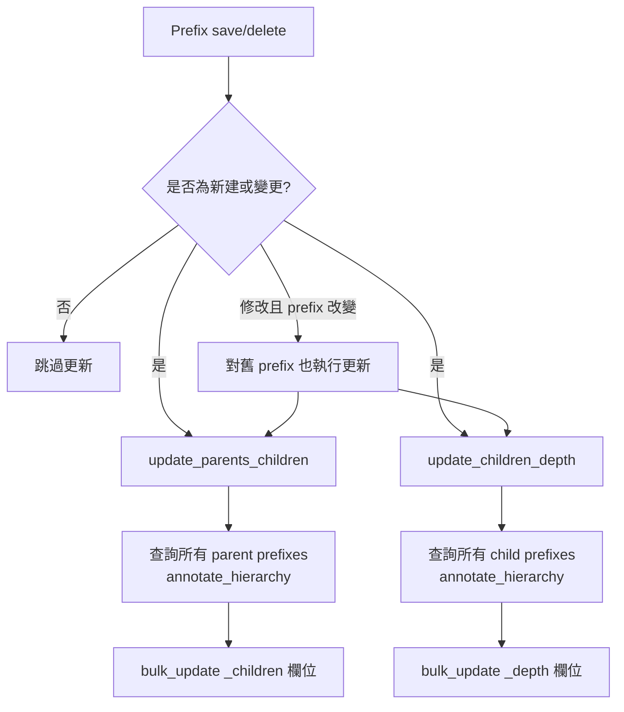
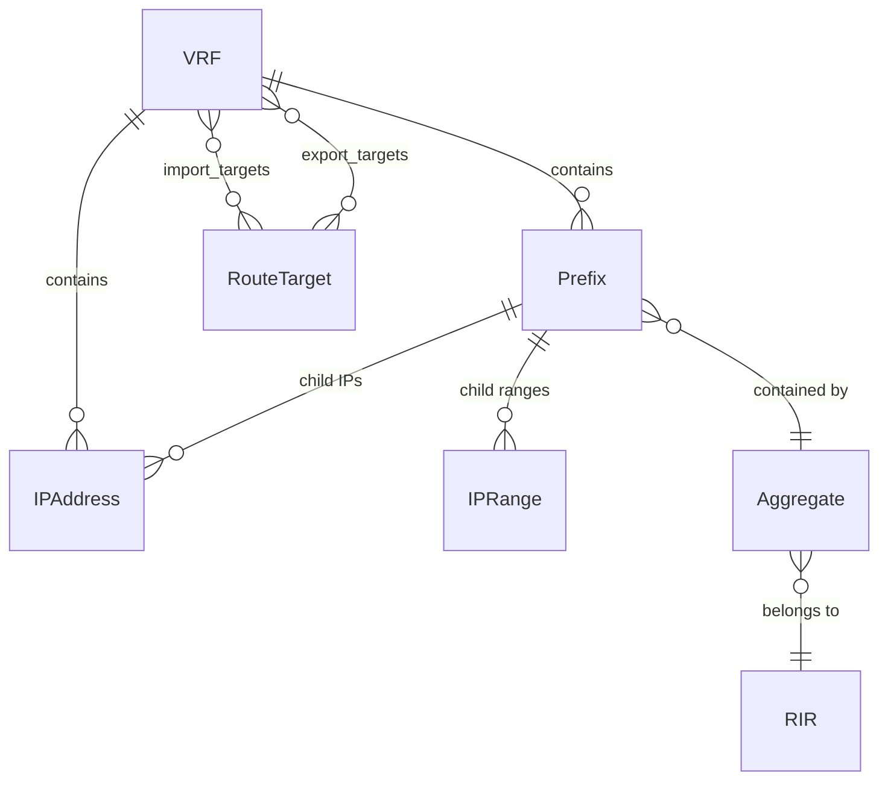
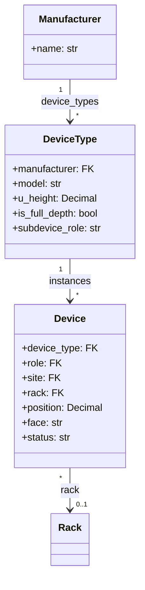
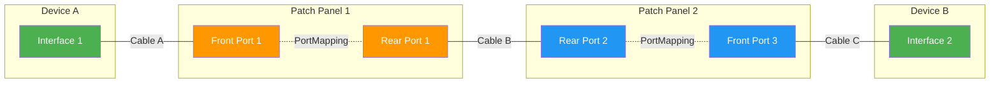
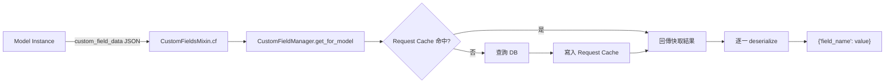
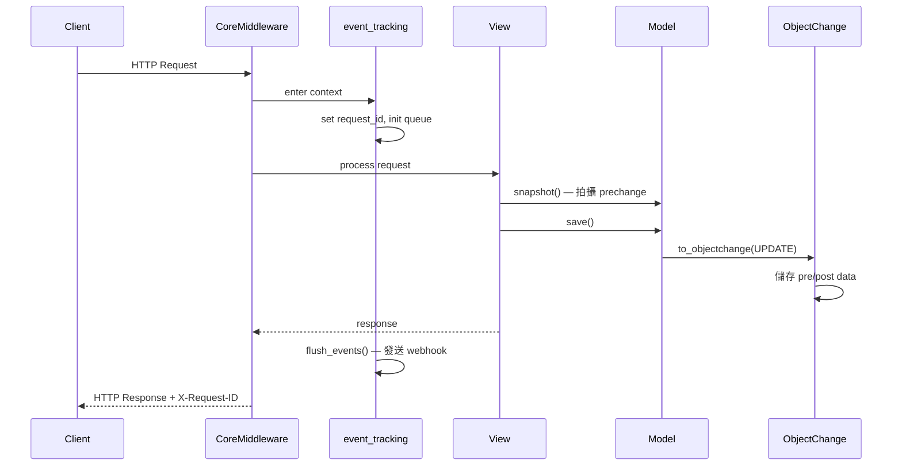
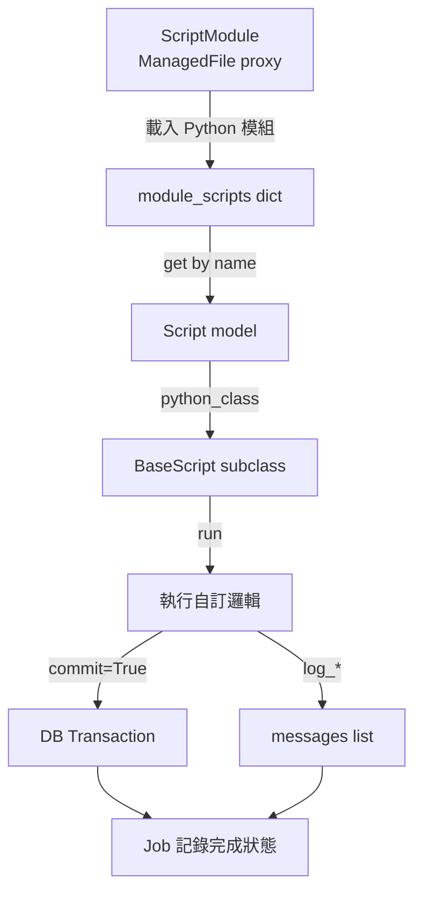
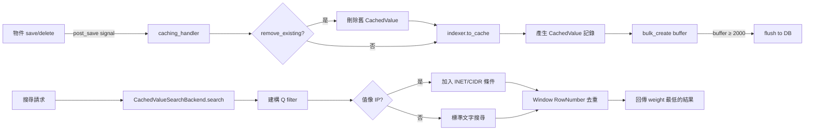
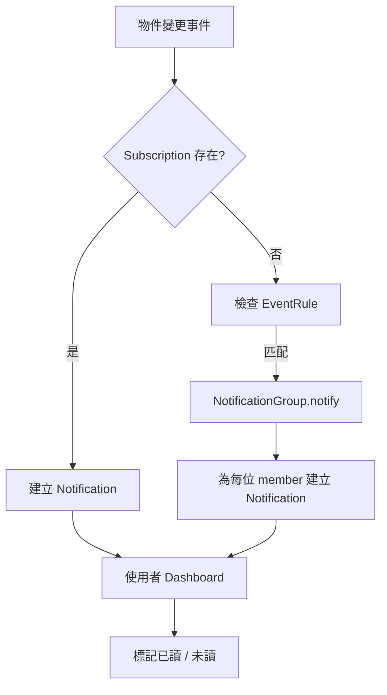

# NetBox — 核心功能分析

本文深入剖析 NetBox 的核心業務功能實作，涵蓋 IPAM、DCIM、Custom Fields、Change Logging、Scripts、Search 等子系統。所有程式碼片段皆來自實際原始碼，並附上演算法複雜度分析。

::: info 相關章節
- [架構總覽](./architecture) — 系統整體架構與模組分層
- [資料模型](./data-models) — Django ORM 模型設計與關聯
- [API 參考](./api-reference) — REST / GraphQL API 端點設計
- [整合指南](./integration) — 與外部系統整合的方式
:::

---

## 1. IPAM (IP Address Management)

IPAM 是 NetBox 最核心的功能模組，管理所有 IP 位址空間的階層結構、分配與使用率追蹤。

### 1.1 Prefix 階層結構

NetBox 的 Prefix 模型以 PostgreSQL 的 `inet`/`cidr` 類型儲存網段，並透過 `_depth` 與 `_children` 快取欄位維護樹狀結構：

```python
# 檔案: netbox/ipam/models/ip.py
class Prefix(ContactsMixin, GetAvailablePrefixesMixin, CachedScopeMixin, PrimaryModel):
    prefix = IPNetworkField(
        verbose_name=_('prefix'),
        help_text=_('IPv4 or IPv6 network with mask')
    )
    vrf = models.ForeignKey(
        to='ipam.VRF',
        on_delete=models.PROTECT,
        related_name='prefixes',
        blank=True,
        null=True,
        verbose_name=_('VRF')
    )
    status = models.CharField(
        max_length=50,
        choices=PrefixStatusChoices,
        default=PrefixStatusChoices.STATUS_ACTIVE,
    )
    is_pool = models.BooleanField(default=False)
    mark_utilized = models.BooleanField(default=False)

    # 快取的深度與子節點數量
    _depth = models.PositiveSmallIntegerField(default=0, editable=False)
    _children = models.PositiveBigIntegerField(default=0, editable=False)

    objects = PrefixQuerySet.as_manager()

    class Meta:
        ordering = (F('vrf').asc(nulls_first=True), 'prefix', 'pk')
        indexes = (
            GistIndex(fields=['prefix'], name='ipam_prefix_gist_idx', opclasses=['inet_ops']),
        )
```

Parent/Child 查詢利用 PostgreSQL 的 `net_contains` / `net_contained` 運算子：

```python
# 檔案: netbox/ipam/models/ip.py
def get_parents(self, include_self=False):
    lookup = 'net_contains_or_equals' if include_self else 'net_contains'
    return Prefix.objects.filter(**{
        'vrf': self.vrf,
        f'prefix__{lookup}': self.prefix
    })

def get_children(self, include_self=False):
    lookup = 'net_contained_or_equal' if include_self else 'net_contained'
    return Prefix.objects.filter(**{
        'vrf': self.vrf,
        f'prefix__{lookup}': self.prefix
    })
```

### 1.2 深度與子節點快取更新

當 Prefix 建立、修改或刪除時，Django signal 會觸發 `update_parents_children()` 和 `update_children_depth()` 來更新快取：

```python
# 檔案: netbox/ipam/signals.py
def update_parents_children(prefix):
    """Update depth on prefix & containing prefixes"""
    parents = prefix.get_parents(include_self=True).annotate_hierarchy()
    for parent in parents:
        parent._children = parent.hierarchy_children
    Prefix.objects.bulk_update(parents, ['_children'], batch_size=100)

def update_children_depth(prefix):
    """Update children count on prefix & contained prefixes"""
    children = prefix.get_children(include_self=True).annotate_hierarchy()
    for child in children:
        child._depth = child.hierarchy_depth
    Prefix.objects.bulk_update(children, ['_depth'], batch_size=100)

@receiver(post_save, sender=Prefix)
def handle_prefix_saved(instance, created, **kwargs):
    if created or instance.vrf_id != instance._vrf_id or instance.prefix != instance._prefix:
        update_parents_children(instance)
        update_children_depth(instance)
        # 若非新建，則清理舊 prefix 的 parent/children
        if not created:
            old_prefix = Prefix(vrf_id=instance._vrf_id, prefix=instance._prefix)
            update_parents_children(old_prefix)
            update_children_depth(old_prefix)
```



### 1.3 IP 分配演算法

`get_first_available_ip()` 透過 `netaddr.IPSet` 進行集合運算，排除已分配的 IP：

```python
# 檔案: netbox/ipam/models/ip.py
def get_available_ips(self):
    """Return all available IPs within this prefix as an IPSet."""
    prefix = netaddr.IPSet(self.prefix)
    child_ips = netaddr.IPSet([
        ip.address.ip for ip in self.get_child_ips()
    ])
    child_ranges = netaddr.IPSet([
        iprange.range for iprange in self.get_child_ranges().filter(mark_populated=True)
    ])
    available_ips = prefix - child_ips - child_ranges

    # Pool 或 /31、/32 (IPv4) / /127、/128 (IPv6) 全部可用
    if (
        self.is_pool
        or (self.family == 4 and self.prefix.prefixlen >= 31)
        or (self.family == 6 and self.prefix.prefixlen >= 127)
    ):
        return available_ips

    if self.family == 4:
        # 排除網路位址與廣播位址
        available_ips -= netaddr.IPSet([
            netaddr.IPAddress(self.prefix.first),
            netaddr.IPAddress(self.prefix.last),
        ])
    else:
        # 排除 Subnet-Router anycast address (RFC 4291)
        available_ips -= netaddr.IPSet([netaddr.IPAddress(self.prefix.first)])

    return available_ips

def get_first_available_ip(self):
    """Return the first available IP within the prefix (or None)."""
    available_ips = self.get_available_ips()
    if not available_ips:
        return None
    return '{}/{}'.format(next(available_ips.__iter__()), self.prefix.prefixlen)
```

**演算法複雜度分析：**
- `get_child_ips()` — O(n) 資料庫查詢，n 為 prefix 內已分配 IP 數量
- `IPSet` 集合運算 — 內部使用 radix tree，合併/差集操作為 O(n log n)
- 總體複雜度：**O(n log n)**，其中 n 為已分配 IP + IP Range 數量

同理，`get_first_available_prefix()` 使用 `GetAvailablePrefixesMixin`：

```python
# 檔案: netbox/ipam/models/ip.py
class GetAvailablePrefixesMixin:
    def get_available_prefixes(self):
        params = {
            'prefix__net_contained': str(self.prefix)
        }
        if hasattr(self, 'vrf'):
            params['vrf'] = self.vrf
        child_prefixes = Prefix.objects.filter(**params).values_list('prefix', flat=True)
        return netaddr.IPSet(self.prefix) - netaddr.IPSet(child_prefixes)

    def get_first_available_prefix(self):
        available_prefixes = self.get_available_prefixes()
        if not available_prefixes:
            return None
        return available_prefixes.iter_cidrs()[0]
```

### 1.4 使用率計算

Prefix 使用率根據狀態區分計算策略：

```python
# 檔案: netbox/ipam/models/ip.py
def get_utilization(self):
    if self.mark_utilized:
        return 100

    if self.status == PrefixStatusChoices.STATUS_CONTAINER:
        # Container 以子 prefix 佔用面積計算
        queryset = Prefix.objects.filter(
            prefix__net_contained=str(self.prefix), vrf=self.vrf
        )
        child_prefixes = netaddr.IPSet([p.prefix for p in queryset])
        utilization = float(child_prefixes.size) / self.prefix.size * 100
    else:
        # 一般 prefix 以 IP 位址佔用計算
        child_ips = netaddr.IPSet()
        for iprange in self.get_child_ranges().filter(mark_utilized=True):
            child_ips.add(iprange.range)
        for ip in self.get_child_ips():
            child_ips.add(ip.address.ip)

        prefix_size = self.prefix.size
        if self.prefix.version == 4 and self.prefix.prefixlen < 31 and not self.is_pool:
            prefix_size -= 2  # 扣除網路位址與廣播位址
        utilization = float(child_ips.size) / prefix_size * 100

    return min(utilization, 100)
```

### 1.5 VRF 與 Route Target

VRF 實作 RFC 4364 的虛擬路由表隔離，支援 Route Target 的 import/export 策略：

```python
# 檔案: netbox/ipam/models/vrfs.py
class VRF(PrimaryModel):
    name = models.CharField(max_length=100, db_collation="natural_sort")
    rd = models.CharField(max_length=VRF_RD_MAX_LENGTH, unique=True, blank=True, null=True,
                          verbose_name=_('route distinguisher'))
    enforce_unique = models.BooleanField(default=True,
        help_text=_('Prevent duplicate prefixes/IP addresses within this VRF'))
    import_targets = models.ManyToManyField(
        to='ipam.RouteTarget', related_name='importing_vrfs', blank=True
    )
    export_targets = models.ManyToManyField(
        to='ipam.RouteTarget', related_name='exporting_vrfs', blank=True
    )

class RouteTarget(PrimaryModel):
    name = models.CharField(max_length=VRF_RD_MAX_LENGTH, unique=True,
        help_text=_('Route target value (formatted in accordance with RFC 4360)'))
    tenant = models.ForeignKey(to='tenancy.Tenant', on_delete=models.PROTECT,
                               related_name='route_targets', blank=True, null=True)
```



---

## 2. DCIM (Data Center Infrastructure Management)

### 2.1 Device 模型階層

Device 透過 DeviceType → Manufacturer 形成設備型號層級。DeviceType 定義了設備的物理規格，並自動生成元件模板：

```python
# 檔案: netbox/dcim/models/devices.py
class Manufacturer(ContactsMixin, OrganizationalModel):
    """A Manufacturer represents a company which produces hardware devices."""
    class Meta:
        ordering = ('name',)

class DeviceType(ImageAttachmentsMixin, PrimaryModel, WeightMixin):
    manufacturer = models.ForeignKey(to='dcim.Manufacturer', on_delete=models.PROTECT,
                                     related_name='device_types')
    model = models.CharField(max_length=100)
    u_height = models.DecimalField(max_digits=4, decimal_places=1, default=1.0)
    is_full_depth = models.BooleanField(default=True)
    subdevice_role = models.CharField(max_length=50, choices=SubdeviceRoleChoices,
                                      blank=True, null=True)

class Device(ContactsMixin, ImageAttachmentsMixin, RenderConfigMixin,
             ConfigContextModel, TrackingModelMixin, PrimaryModel):
    device_type = models.ForeignKey(to='dcim.DeviceType', on_delete=models.PROTECT,
                                     related_name='instances')
    role = models.ForeignKey(to='dcim.DeviceRole', on_delete=models.PROTECT,
                             related_name='devices')
    site = models.ForeignKey(to='dcim.Site', on_delete=models.PROTECT, related_name='devices')
    rack = models.ForeignKey(to='dcim.Rack', on_delete=models.PROTECT,
                             related_name='devices', blank=True, null=True)
    position = models.DecimalField(max_digits=4, decimal_places=1, blank=True, null=True)
    face = models.CharField(max_length=50, blank=True, null=True, choices=DeviceFaceChoices)
```



### 2.2 Cable Path Tracing 演算法

Cable Path Tracing 是 NetBox DCIM 中最關鍵的演算法。`CablePath.from_origin()` 從起點端口開始，遞迴追蹤完整的實體連線路徑：

```python
# 檔案: netbox/dcim/models/cables.py
class CablePath(models.Model):
    """
    path 包含有序的節點列表，每段以 (type, ID) tuple 的列表表示。
    例如：
        Interface 1 --- Front Port 1 | Rear Port 1 --- Rear Port 2 | Front Port 3 --- Interface 2

    CablePath(path=[
        [Interface 1], [Cable A],
        [Front Port 1, Front Port 2], [Rear Port 1],
        [Cable B], [Rear Port 2],
        [Front Port 3, Front Port 4], [Cable C],
        [Interface 2],
    ])
    """
    path = models.JSONField(default=list)
    is_active = models.BooleanField(default=False)
    is_complete = models.BooleanField(default=False)
    is_split = models.BooleanField(default=False)
    _nodes = PathField()
```

核心追蹤邏輯 — `from_origin()` classmethod 的八步驟演算法：

```python
# 檔案: netbox/dcim/models/cables.py (CablePath.from_origin 方法)
@classmethod
def from_origin(cls, terminations):
    path = []
    position_stack = []
    is_complete = False
    is_active = True
    is_split = False

    segment = 0
    while terminations:
        segment += 1

        # Step 1: 記錄近端 termination 物件
        path.append([object_to_path_node(t) for t in terminations])

        # Step 2: 查找所連接的 Cable 或 WirelessLink
        links = list(dict.fromkeys(
            t.link for t in terminations if t.link is not None
        ))
        if len(links) == 0:
            if len(path) == 1:
                return None
            break

        # Step 3: 記錄非對稱路徑為 split
        not_connected = [t.link for t in terminations if t.link is None]
        if len(not_connected) > 0:
            is_split = True

        # Step 4: 記錄 Cable 節點
        path.append([object_to_path_node(link) for link in links])

        # Step 5: 若 Cable 狀態非 connected，標記為非 active
        if any(s != LinkStatusChoices.STATUS_CONNECTED for s in
               [l.status for l in links]):
            is_active = False

        # Step 6: 決定遠端 termination (Cable Profile 或 Legacy 模式)
        # ... (省略 profile-based / legacy 分支)

        # Step 7: 記錄遠端 termination 物件
        path.append([object_to_path_node(t) for t in remote_terminations])

        # Step 8: 判斷「下一跳」— FrontPort → RearPort 或反向
        if isinstance(remote_terminations[0], FrontPort):
            # FrontPort → 對應的 RearPort (透過 PortMapping)
            terminations = [mapping.rear_port for mapping in port_mappings]
        elif isinstance(remote_terminations[0], RearPort):
            # RearPort → 對應的 FrontPort
            terminations = [mapping.front_port for mapping in port_mappings]
        elif isinstance(remote_terminations[0], CircuitTermination):
            # 電路 A 端 → Z 端
            terminations = CircuitTermination.objects.filter(...)
        else:
            is_complete = True
            break

    return cls(path=path, is_complete=is_complete,
               is_active=is_active, is_split=is_split)
```



**Path Cache 與 Invalidation：**

```python
# 檔案: netbox/dcim/models/cables.py
def save(self, *args, **kwargs):
    # 儲存扁平化的 nodes 列表以支援快速篩選
    self._nodes = list(itertools.chain(*self.path))
    super().save(*args, **kwargs)
    # 在起點物件上記錄對此 CablePath 的直接參考
    origin_model = self.origin_type.model_class()
    origin_ids = [decompile_path_node(node)[1] for node in self.path[0]]
    origin_model.objects.filter(pk__in=origin_ids).update(_path=self.pk)

def retrace(self):
    """從現有的起點重新追蹤路徑"""
    _new = self.from_origin(self.origins)
    if _new:
        self.path = _new.path
        self.is_complete = _new.is_complete
        self.is_active = _new.is_active
        self.is_split = _new.is_split
        self.save()
    else:
        self.delete()
```

**演算法複雜度分析：**
- 追蹤演算法為迴圈結構，每次迭代處理一條 Cable + 兩端 termination
- 時間複雜度：**O(S × T)**，S 為路徑段數 (cable 數量)，T 為每段的 termination 數量
- PortMapping 查詢使用資料庫 index，為 O(1) 量級
- `position_stack` 作為堆疊結構追蹤多對多 port 映射，避免重複遍歷

### 2.3 Rack Elevation

Rack 透過 `u_height` 定義高度，`get_rack_units()` 產生完整的 U 位對照表：

```python
# 檔案: netbox/dcim/models/racks.py
def get_rack_units(self, user=None, face=DeviceFaceChoices.FACE_FRONT,
                   exclude=None, expand_devices=True):
    elevation = {}
    for u in self.units:
        u_name = f'U{u}'.split('.')[0] if not u % 1 else f'U{u}'
        elevation[u] = {
            'id': u, 'name': u_name, 'face': face,
            'device': None, 'occupied': False
        }

    if not self._state.adding:
        devices = Device.objects.prefetch_related(
            'device_type', 'device_type__manufacturer', 'role'
        ).filter(rack=self, position__gt=0, device_type__u_height__gt=0
        ).filter(Q(face=face) | Q(device_type__is_full_depth=True))

        for device in devices:
            if expand_devices:
                for u in drange(device.position,
                                device.position + device.device_type.u_height, 0.5):
                    elevation[u]['device'] = device
                    elevation[u]['occupied'] = True

    return [u for u in elevation.values()]

def get_available_units(self, u_height=1.0, rack_face=None, exclude=None,
                        ignore_excluded_devices=False):
    units = list(self.units)
    for d in devices:
        if rack_face is None or d.face == rack_face or d.device_type.is_full_depth:
            for u in drange(d.position, d.position + d.device_type.u_height, 0.5):
                try:
                    units.remove(u)
                except ValueError:
                    pass  # 機櫃內設備重疊
    # 移除空間不足的 unit
    available_units = []
    for u in units:
        if set(drange(u, u + decimal.Decimal(u_height), 0.5)).issubset(units):
            available_units.append(u)
    return list(reversed(available_units))

def get_utilization(self):
    total_units = len(list(self.units))
    available_units = self.get_available_units(u_height=0.5, ignore_excluded_devices=True)
    for ru in self.get_reserved_units():
        for u in drange(ru, ru + 1, 0.5):
            if u in available_units:
                available_units.remove(u)
    occupied_unit_count = total_units - len(available_units)
    return float(occupied_unit_count) / total_units * 100
```

### 2.4 Power Tracking

PowerFeed 模擬電力迴路，自動計算可用功率：

```python
# 檔案: netbox/dcim/models/power.py
class PowerFeed(PrimaryModel, PathEndpoint, CabledObjectModel):
    power_panel = models.ForeignKey(to='PowerPanel', on_delete=models.PROTECT)
    rack = models.ForeignKey(to='Rack', on_delete=models.PROTECT, blank=True, null=True)
    voltage = models.SmallIntegerField(default=ConfigItem('POWERFEED_DEFAULT_VOLTAGE'))
    amperage = models.PositiveSmallIntegerField(default=ConfigItem('POWERFEED_DEFAULT_AMPERAGE'))
    max_utilization = models.PositiveSmallIntegerField(
        default=ConfigItem('POWERFEED_DEFAULT_MAX_UTILIZATION'))
    available_power = models.PositiveIntegerField(default=0, editable=False)
    phase = models.CharField(max_length=50, choices=PowerFeedPhaseChoices,
                             default=PowerFeedPhaseChoices.PHASE_SINGLE)

    def save(self, *args, **kwargs):
        # 計算可用功率: kVA = |V| × A × (max_util / 100)
        kva = abs(self.voltage) * self.amperage * (self.max_utilization / 100)
        if self.phase == PowerFeedPhaseChoices.PHASE_3PHASE:
            self.available_power = round(kva * 1.732)  # √3 倍率
        else:
            self.available_power = round(kva)
        super().save(*args, **kwargs)
```

---

## 3. Custom Fields 系統

NetBox 的 Custom Fields 允許使用者在不修改原始碼的情況下，為任何模型新增自訂欄位。

### 3.1 CustomField 模型

```python
# 檔案: netbox/extras/models/customfields.py
class CustomField(CloningMixin, ExportTemplatesMixin, OwnerMixin, ChangeLoggedModel):
    object_types = models.ManyToManyField(to='contenttypes.ContentType',
        related_name='custom_fields')
    type = models.CharField(max_length=50, choices=CustomFieldTypeChoices,
        default=CustomFieldTypeChoices.TYPE_TEXT)
    related_object_type = models.ForeignKey(to='contenttypes.ContentType',
        on_delete=models.PROTECT, blank=True, null=True)
    name = models.CharField(max_length=50, unique=True, validators=(
        RegexValidator(regex=r'^[a-z0-9_]+$'),
        RegexValidator(regex=r'__', inverse_match=True),
    ))
    required = models.BooleanField(default=False)
    unique = models.BooleanField(default=False)
    search_weight = models.PositiveSmallIntegerField(default=1000)
    filter_logic = models.CharField(max_length=50, choices=CustomFieldFilterLogicChoices)
    default = models.JSONField(blank=True, null=True)
    validation_minimum = models.DecimalField(max_digits=16, decimal_places=4,
                                             blank=True, null=True)
    validation_maximum = models.DecimalField(max_digits=16, decimal_places=4,
                                             blank=True, null=True)
    validation_regex = models.CharField(blank=True, max_length=500)
    choice_set = models.ForeignKey(to='CustomFieldChoiceSet', on_delete=models.PROTECT,
                                   blank=True, null=True)
    objects = CustomFieldManager()
```

支援的類型包括：`text`, `longtext`, `integer`, `decimal`, `boolean`, `date`, `datetime`, `url`, `json`, `select`, `multiselect`, `object`, `multiobject`。

### 3.2 CustomFieldsMixin — 掛載機制

所有支援 Custom Fields 的模型都繼承 `CustomFieldsMixin`，資料以 JSON 格式儲存在 `custom_field_data` 欄位中：

```python
# 檔案: netbox/netbox/models/features.py
class CustomFieldsMixin(models.Model):
    custom_field_data = models.JSONField(
        encoder=CustomFieldJSONEncoder,
        blank=True,
        default=dict
    )

    class Meta:
        abstract = True

    @cached_property
    def cf(self):
        """回傳自訂欄位名稱與反序列化值的字典"""
        return {
            cf.name: cf.deserialize(self.custom_field_data.get(cf.name))
            for cf in self.custom_fields
        }

    @cached_property
    def custom_fields(self):
        from extras.models import CustomField
        return CustomField.objects.get_for_model(self)
```

### 3.3 CustomFieldManager — 查詢快取

`CustomFieldManager` 使用 request-level cache 避免重複查詢：

```python
# 檔案: netbox/extras/models/customfields.py
class CustomFieldManager(models.Manager.from_queryset(RestrictedQuerySet)):
    def get_for_model(self, model):
        cache = query_cache.get()
        if cache is not None:
            if custom_fields := cache['custom_fields'].get(model._meta.model):
                return custom_fields

        content_type = ObjectType.objects.get_for_model(model._meta.concrete_model)
        custom_fields = self.get_queryset().filter(
            object_types=content_type
        ).select_related('related_object_type')

        if cache is not None:
            cache['custom_fields'][model._meta.model] = custom_fields
        return custom_fields
```



---

## 4. Change Logging

NetBox 透過 `ObjectChange` 模型記錄所有物件的變更歷史，包含完整的 pre/post 快照。

### 4.1 ObjectChange 模型

```python
# 檔案: netbox/core/models/change_logging.py
class ObjectChange(models.Model):
    time = models.DateTimeField(auto_now_add=True, db_index=True)
    user = models.ForeignKey(to=settings.AUTH_USER_MODEL, on_delete=models.SET_NULL,
                             blank=True, null=True)
    user_name = models.CharField(max_length=150, editable=False)
    request_id = models.UUIDField(editable=False, db_index=True)
    action = models.CharField(max_length=50, choices=ObjectChangeActionChoices)
    changed_object_type = models.ForeignKey(to='contenttypes.ContentType',
                                            on_delete=models.PROTECT)
    changed_object_id = models.PositiveBigIntegerField()
    changed_object = GenericForeignKey(ct_field='changed_object_type',
                                       fk_field='changed_object_id')
    prechange_data = models.JSONField(editable=False, blank=True, null=True)
    postchange_data = models.JSONField(editable=False, blank=True, null=True)

    def diff(self):
        prechange_data = self.prechange_data_clean
        postchange_data = self.postchange_data_clean
        if self.action == ObjectChangeActionChoices.ACTION_CREATE:
            changed_attrs = sorted(postchange_data.keys())
        elif self.action == ObjectChangeActionChoices.ACTION_DELETE:
            changed_attrs = sorted(prechange_data.keys())
        else:
            changed_data = shallow_compare_dict(prechange_data, postchange_data)
            changed_attrs = sorted(changed_data.keys())
        return {
            'pre': {k: prechange_data.get(k) for k in changed_attrs},
            'post': {k: postchange_data.get(k) for k in changed_attrs},
        }
```

### 4.2 Snapshot 機制

`ChangeLoggingMixin.snapshot()` 在物件修改前拍攝快照，`to_objectchange()` 在修改後建立變更記錄：

```python
# 檔案: netbox/netbox/models/features.py
class ChangeLoggingMixin(models.Model):
    def snapshot(self):
        """在修改前拍攝物件快照，儲存為 _prechange_snapshot"""
        exclude_fields = []
        if get_config().CHANGELOG_SKIP_EMPTY_CHANGES:
            exclude_fields = ['last_updated']
        self._prechange_snapshot = self.serialize_object(exclude=exclude_fields)

    def to_objectchange(self, action):
        objectchange = ObjectChange(
            changed_object=self,
            object_repr=str(self)[:200],
            action=action,
            message=self._changelog_message or '',
        )
        if hasattr(self, '_prechange_snapshot'):
            objectchange.prechange_data = self._prechange_snapshot
        if action in (ACTION_CREATE, ACTION_UPDATE):
            self._postchange_snapshot = self.serialize_object(exclude=exclude)
            objectchange.postchange_data = self._postchange_snapshot
        return objectchange
```

### 4.3 Event Tracking Context Manager

Request 層級的事件追蹤透過 `event_tracking` context manager 實現，在 middleware 中自動套用：

```python
# 檔案: netbox/netbox/context_managers.py
@register_request_processor
@contextmanager
def event_tracking(request):
    """在處理 request 時佇列事件，完成後統一 flush"""
    current_request.set(request)
    events_queue.set({})
    query_cache.set(defaultdict(dict))

    yield

    # 將佇列中的 webhook 送往 RQ
    if events := list(events_queue.get().values()):
        flush_events(events)

    current_request.set(None)
    events_queue.set({})
    query_cache.set(None)
```



---

## 5. Custom Scripts & Reports

### 5.1 Script 執行框架

使用者自訂的 Script 繼承 `BaseScript`，透過 `ScriptModule` (proxy model of `ManagedFile`) 載入：

```python
# 檔案: netbox/extras/scripts.py
class BaseScript:
    def __init__(self):
        self.messages = []
        self.tests = {}
        self.output = ''
        self.failed = False
        self.logger = logging.getLogger(
            f"netbox.scripts.{self.__module__}.{self.__class__.__name__}"
        )
        self.request = None
        self.storage = storages.create_storage(storages.backends["scripts"])

    def run(self, data, commit):
        """Override this method with custom script logic."""
        self.pre_run()
        self.run_tests()
        self.post_run()

    def log_info(self, message=None, obj=None):
        self._log(message, obj, level=LogLevelChoices.LOG_INFO)

    def log_success(self, message=None, obj=None):
        self._log(message, obj, level=LogLevelChoices.LOG_SUCCESS)

    def log_warning(self, message=None, obj=None):
        self._log(message, obj, level=LogLevelChoices.LOG_WARNING)

    def log_failure(self, message=None, obj=None):
        self._log(message, obj, level=LogLevelChoices.LOG_FAILURE)
        self.failed = True
```

### 5.2 ScriptModule 載入

`ScriptModule` 是 `ManagedFile` 的 proxy model，自動篩選 scripts 和 reports 目錄下的檔案：

```python
# 檔案: netbox/extras/models/scripts.py
class ScriptModuleManager(models.Manager.from_queryset(RestrictedQuerySet)):
    def get_queryset(self):
        return super().get_queryset().filter(
            Q(file_root=ManagedFileRootPathChoices.SCRIPTS) |
            Q(file_root=ManagedFileRootPathChoices.REPORTS)
        )

class ScriptModule(PythonModuleMixin, JobsMixin, ManagedFile):
    objects = ScriptModuleManager()

class Script(EventRulesMixin, JobsMixin):
    name = models.CharField(max_length=79, editable=False)
    module = models.ForeignKey(to='extras.ScriptModule', on_delete=models.CASCADE,
                               related_name='scripts')
    is_executable = models.BooleanField(default=True)

    @cached_property
    def python_class(self):
        return self.module.module_scripts.get(self.name)
```



---

## 6. Search 系統

### 6.1 CachedValue 模型

搜尋系統基於預先快取的 `CachedValue` 記錄，每個可搜尋欄位產生一筆：

```python
# 檔案: netbox/extras/models/search.py
class CachedValue(models.Model):
    id = models.UUIDField(primary_key=True, default=uuid.uuid4)
    timestamp = models.DateTimeField(auto_now_add=True)
    object_type = models.ForeignKey(to='contenttypes.ContentType', on_delete=models.CASCADE)
    object_id = models.PositiveBigIntegerField()
    object = RestrictedGenericForeignKey(ct_field='object_type', fk_field='object_id')
    field = models.CharField(max_length=200)
    type = models.CharField(max_length=30)     # STRING, INTEGER, FLOAT, CIDR, INET
    value = CachedValueField()
    weight = models.PositiveSmallIntegerField(default=1000)
```

### 6.2 CachedValueSearchBackend

搜尋後端使用 Window Function 進行去重，並特別處理 IP/CIDR 搜尋：

```python
# 檔案: netbox/netbox/search/backends.py
class CachedValueSearchBackend(SearchBackend):

    def search(self, value, user=None, object_types=None, lookup=DEFAULT_LOOKUP_TYPE):
        query_filter = Q(**{f'value__{lookup}': value})

        if object_types:
            query_filter &= Q(object_type__in=object_types)

        # IP 位址特殊搜尋
        if lookup in (LookupTypes.PARTIAL, LookupTypes.EXACT):
            try:
                address = str(netaddr.IPNetwork(value.strip()).cidr)
                query_filter |= Q(type=FieldTypes.INET) & Q(value__net_host=address)
                if lookup == LookupTypes.PARTIAL:
                    query_filter |= (Q(type=FieldTypes.CIDR) &
                                     Q(value__net_contains_or_equals=address))
            except (AddrFormatError, ValueError):
                pass

        # Window function 去重：每個物件只保留最低 weight 的結果
        queryset = CachedValue.objects.filter(query_filter).annotate(
            row_number=Window(
                expression=window.RowNumber(),
                partition_by=[F('object_type'), F('object_id')],
                order_by=[F('weight').asc()],
            )
        )[:MAX_RESULTS]

        # 包裝為子查詢，只回傳 row_number = 1 的結果
        sql, params = queryset.query.sql_with_params()
        results = CachedValue.objects.prefetch_related(*prefetch).raw(
            f"SELECT * FROM ({sql}) t WHERE row_number = 1",
            params
        )
        return [r for r in results if r.object is not None]
```

### 6.3 搜尋快取更新

透過 Django 的 `post_save` / `post_delete` signal 自動維護：

```python
# 檔案: netbox/netbox/search/backends.py
def cache(self, instances, indexer=None, remove_existing=True):
    buffer = []
    counter = 0
    for instance in instances:
        if not counter:
            if indexer is None:
                indexer = get_indexer(instance)
            custom_fields = [
                cf for cf in CustomField.objects.get_for_model(indexer.model)
                if cf.search_weight > 0
            ]
        if remove_existing:
            self.remove(instance)
        object_type = ObjectType.objects.get_for_model(indexer.model)
        for field in indexer.to_cache(instance, custom_fields=custom_fields):
            buffer.append(CachedValue(
                object_type=object_type, object_id=instance.pk,
                field=field.name, type=field.type,
                weight=field.weight, value=field.value
            ))
        if len(buffer) >= 2000:
            counter += len(CachedValue.objects.bulk_create(buffer))
            buffer = []
    if buffer:
        counter += len(CachedValue.objects.bulk_create(buffer))
    return counter

# Signal 連接
post_save.connect(search_backend.caching_handler)
post_delete.connect(search_backend.removal_handler)
```



---

## 7. Tags & Bookmarks

### 7.1 Tag 系統

NetBox 的 Tag 基於 `django-taggit`，並擴展支援顏色、權重和物件類型限制：

```python
# 檔案: netbox/extras/models/tags.py
class Tag(CloningMixin, ExportTemplatesMixin, OwnerMixin, ChangeLoggedModel, TagBase):
    id = models.BigAutoField(primary_key=True)
    color = ColorField(default=ColorChoices.COLOR_GREY)
    description = models.CharField(max_length=200, blank=True)
    object_types = models.ManyToManyField(to='contenttypes.ContentType',
                                          related_name='+', blank=True)
    weight = models.PositiveSmallIntegerField(default=1000)

class TaggedItem(GenericTaggedItemBase):
    tag = models.ForeignKey(to=Tag, related_name="%(app_label)s_%(class)s_items",
                            on_delete=models.CASCADE)
```

`TagsMixin` 提供給所有需要 tag 功能的模型：

```python
# 檔案: netbox/netbox/models/features.py
class TagsMixin(models.Model):
    tags = TaggableManager(
        through='extras.TaggedItem',
        ordering=('weight', 'name'),
        manager=NetBoxTaggableManager,
    )
    class Meta:
        abstract = True
```

### 7.2 Bookmark 系統

Bookmark 讓使用者收藏任意物件，透過 `GenericForeignKey` 關聯：

```python
# 檔案: netbox/extras/models/models.py
class Bookmark(models.Model):
    created = models.DateTimeField(auto_now_add=True)
    object_type = models.ForeignKey(to='contenttypes.ContentType', on_delete=models.PROTECT)
    object_id = models.PositiveBigIntegerField()
    object = GenericForeignKey(ct_field='object_type', fk_field='object_id')
    user = models.ForeignKey(to=settings.AUTH_USER_MODEL, on_delete=models.CASCADE)

    class Meta:
        constraints = (
            models.UniqueConstraint(
                fields=('object_type', 'object_id', 'user'),
                name='%(app_label)s_%(class)s_unique_per_object_and_user'
            ),
        )
```

---

## 8. Dashboard & Notifications

### 8.1 Dashboard Widget 系統

Dashboard 以 JSON 儲存 layout 和 config，支援 gridstack.js 前端渲染：

```python
# 檔案: netbox/extras/models/dashboard.py
class Dashboard(models.Model):
    user = models.OneToOneField(to='users.User', on_delete=models.CASCADE)
    layout = models.JSONField(default=list)    # gridstack 位置資訊
    config = models.JSONField(default=dict)    # widget 類型與配置

    def get_widget(self, id):
        config = dict(self.config[id])
        widget_class = get_widget_class(config.pop('class'))
        return widget_class(id=id, **config)

    def add_widget(self, widget, x=None, y=None):
        self.config[str(widget.id)] = {
            'class': widget.name, 'title': widget.title,
            'color': widget.color, 'config': widget.config,
        }
        self.layout.append({
            'id': str(widget.id), 'h': widget.height,
            'w': widget.width, 'x': x, 'y': y,
        })
```

內建 Widget 類型包括：

```python
# 檔案: netbox/extras/dashboard/widgets.py
class DashboardWidget:
    description = None
    default_title = None
    default_config = {}
    width = 4
    height = 3

    def render(self, request):
        raise NotImplementedError

# 內建 Widget：
# - NoteWidget: 顯示自訂 Markdown 內容
# - ObjectCountsWidget: 顯示物件數量統計
# - ObjectListWidget: 顯示物件列表
# - RSSFeedWidget: 顯示 RSS feed
# - BookmarksWidget: 顯示使用者書籤
```

### 8.2 Notification & Subscription

Notification 系統讓使用者接收物件變更通知，支援群組通知：

```python
# 檔案: netbox/extras/models/notifications.py
class Notification(models.Model):
    created = models.DateTimeField(auto_now_add=True)
    read = models.DateTimeField(null=True, blank=True)
    user = models.ForeignKey(to=settings.AUTH_USER_MODEL, on_delete=models.CASCADE)
    object_type = models.ForeignKey(to='contenttypes.ContentType', on_delete=models.PROTECT)
    object_id = models.PositiveBigIntegerField()
    event_type = models.CharField(max_length=50, choices=get_event_type_choices)

class Subscription(models.Model):
    """使用者對特定物件的訂閱"""
    user = models.ForeignKey(to=settings.AUTH_USER_MODEL, on_delete=models.CASCADE)
    object_type = models.ForeignKey(to='contenttypes.ContentType', on_delete=models.PROTECT)
    object_id = models.PositiveBigIntegerField()

class NotificationGroup(ChangeLoggedModel):
    """通知群組 — 聚合多個使用者與群組"""
    name = models.CharField(max_length=100, unique=True)
    groups = models.ManyToManyField(to='users.Group', blank=True)
    users = models.ManyToManyField(to='users.User', blank=True)

    def notify(self, object_type, object_id, **kwargs):
        for user in self.members:
            Notification.objects.update_or_create(
                object_type=object_type, object_id=object_id,
                user=user, defaults=kwargs
            )
```



---

## 小結

NetBox 的核心功能設計展現了幾個重要的工程原則：

| 功能模組 | 關鍵設計模式 | 複雜度特徵 |
|---------|------------|-----------|
| **IPAM Prefix** | PostgreSQL `inet_ops` GiST Index + `netaddr.IPSet` 集合運算 | IP 分配 O(n log n) |
| **Cable Path Tracing** | 迭代式追蹤 + position_stack 堆疊 + JSON path 快取 | O(S × T)，S=段數, T=端點數 |
| **Custom Fields** | `JSONField` + `GenericForeignKey` + request-level cache | 查詢 O(1) (快取命中) |
| **Change Logging** | snapshot/restore 模式 + context manager 自動追蹤 | 每次寫入 O(1) |
| **Search** | Window Function 去重 + CIDR/INET 多型搜尋 + bulk_create buffer | 搜尋 O(n)，快取 O(batch) |
| **Notifications** | `GenericForeignKey` + Subscription 訂閱 + 群組擴展 | 通知 O(members) |

這些模組透過 Django 的 signal、context manager、abstract mixin 等機制緊密協作，形成一個可擴展且高效能的資料中心管理平台。
