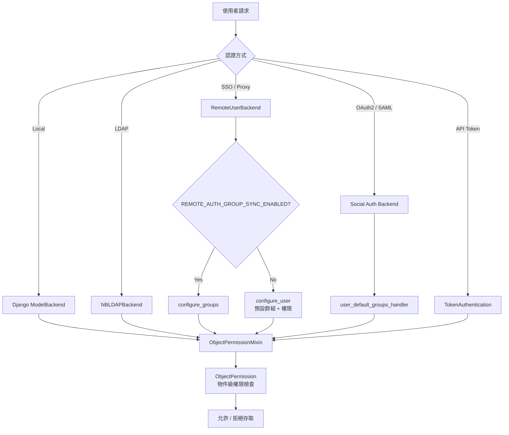
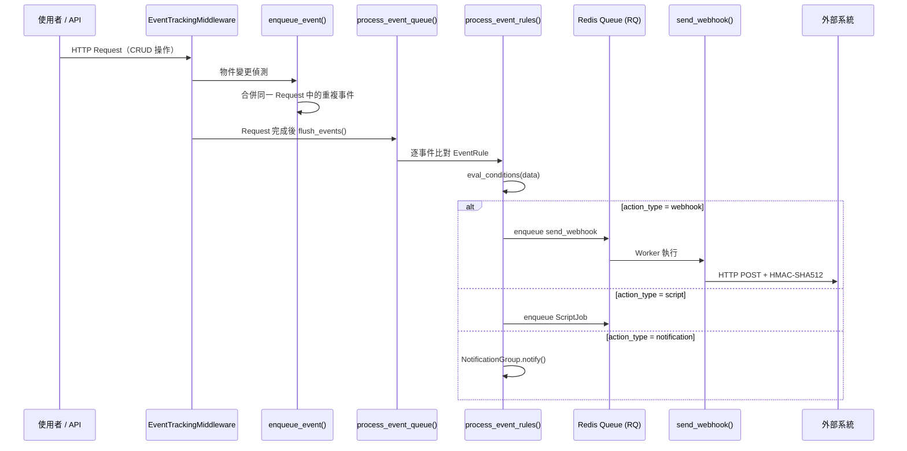
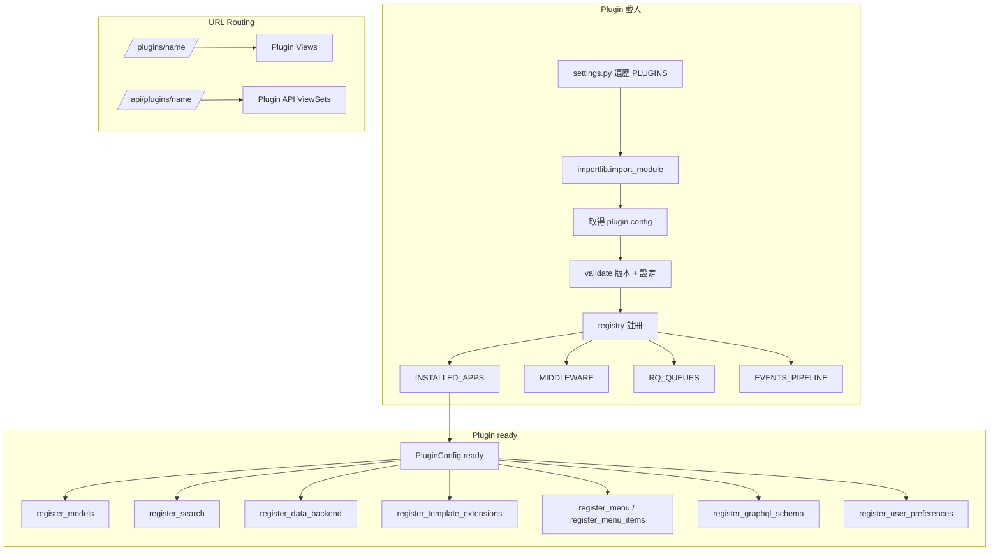
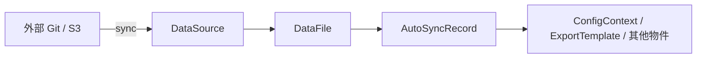
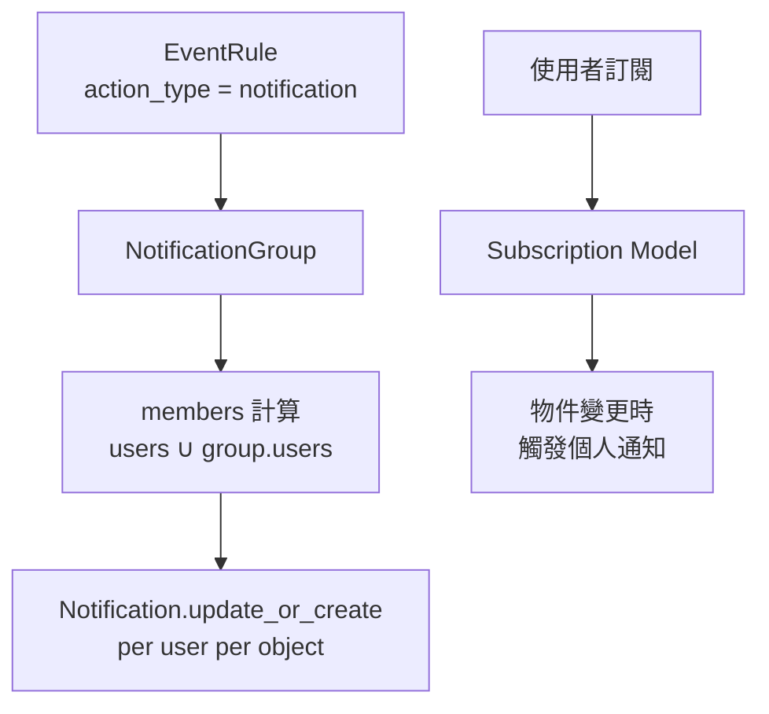
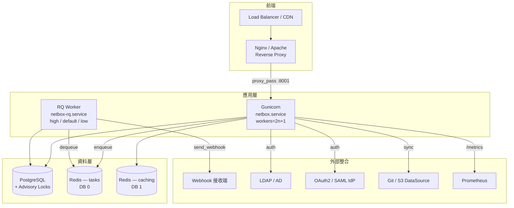

# NetBox — 外部整合與擴充

::: info 相關章節
本文聚焦於 NetBox 與外部系統的整合能力。其他深度分析請參考：
- [Architecture（架構總覽）](./architecture.md)
- [Core Features（核心功能）](./core-features.md)
- [Data Models（資料模型）](./data-models.md)
- [API Reference（API 參考）](./api-reference.md)
:::

NetBox 透過多種外部整合機制，將自身定位為 **網路自動化的 Source of Truth**。本章從原始碼層級剖析認證後端、Webhooks、背景任務、Plugin 系統、Data Sources 以及部署整合的完整實作。

---

## 1. 認證後端

NetBox 提供四種認證機制：本地帳號、LDAP、Remote User（SSO/Proxy Auth）、Social Auth（OAuth2/SAML），全部定義於 `authentication/__init__.py`。

### 1.1 認證後端架構

```python
# 檔案: netbox/netbox/authentication/__init__.py
AUTH_BACKEND_ATTRS = {
    # backend name: (title, MDI icon name)
    'amazon': ('Amazon AWS', 'aws'),
    'azuread-oauth2': ('Microsoft Entra ID', 'microsoft'),
    'github': ('GitHub', 'github'),
    'github-enterprise': ('GitHub Enterprise', 'github'),
    'gitlab': ('GitLab', 'gitlab'),
    'google-oauth2': ('Google', 'google'),
    'keycloak': ('Keycloak', None),
    'oidc': ('OpenID Connect', None),
    'okta': ('Okta', None),
    'salesforce-oauth2': ('Salesforce', 'salesforce'),
    # ... 共 50+ 個 Social Auth 後端
}
AUTH_BACKEND_ATTRS.update(getattr(settings, 'SOCIAL_AUTH_BACKEND_ATTRS', {}))
```

### 1.2 ObjectPermissionBackend — 物件級權限

所有認證後端共用 `ObjectPermissionMixin`，實現物件級別的權限檢查：

```python
# 檔案: netbox/netbox/authentication/__init__.py
class ObjectPermissionBackend(ObjectPermissionMixin, ModelBackend):
    pass
```

`ObjectPermissionMixin` 透過 `ObjectPermission` model 查詢使用者對特定物件的存取權限，支援 JSON constraint 條件過濾。

### 1.3 RemoteUserBackend — SSO / Proxy 認證

```python
# 檔案: netbox/netbox/authentication/__init__.py
class RemoteUserBackend(_RemoteUserBackend):
    @property
    def create_unknown_user(self):
        return settings.REMOTE_AUTH_AUTO_CREATE_USER

    def authenticate(self, request, remote_user, remote_groups=None):
        if not remote_user:
            return None
        username = self.clean_username(remote_user)

        if self.create_unknown_user:
            user, created = User._default_manager.get_or_create(**{
                User.USERNAME_FIELD: username
            })
            if created:
                user = self.configure_user(request, user)
        else:
            try:
                user = User._default_manager.get_by_natural_key(username)
            except User.DoesNotExist:
                pass

        if self.user_can_authenticate(user):
            if settings.REMOTE_AUTH_GROUP_SYNC_ENABLED:
                return self.configure_groups(user, remote_groups)
            else:
                return user
        return None

    def configure_groups(self, user, remote_groups):
        group_list = []
        for name in remote_groups:
            try:
                group_list.append(Group.objects.get(name=name))
            except Group.DoesNotExist:
                if settings.REMOTE_AUTH_AUTO_CREATE_GROUPS:
                    group_list.append(Group.objects.create(name=name))
        if group_list:
            user.groups.set(group_list)
        else:
            user.groups.clear()
        user.is_superuser = self._is_superuser(user)
        user.save()
        return user
```

### 1.4 NBLDAPBackend — LDAP 認證

LDAP 支援透過條件式匯入 `django-auth-ldap`（需額外安裝至 `local_requirements.txt`）：

```python
# 檔案: netbox/netbox/authentication/__init__.py
try:
    from django_auth_ldap.backend import LDAPBackend as LDAPBackend_
    from django_auth_ldap.backend import _LDAPUser

    class NBLDAPBackend(ObjectPermissionMixin, LDAPBackend_):
        def get_permission_filter(self, user_obj):
            permission_filter = super().get_permission_filter(user_obj)
            if (self.settings.FIND_GROUP_PERMS and
                    hasattr(user_obj, "ldap_user") and
                    hasattr(user_obj.ldap_user, "group_names")):
                permission_filter = permission_filter | Q(
                    groups__name__in=user_obj.ldap_user.group_names
                )
            return permission_filter

    _LDAPUser._mirror_groups = _mirror_groups
except ModuleNotFoundError:
    pass
```

### 1.5 Social Auth（OAuth2, SAML）

NetBox 透過 `python-social-auth`（`social-auth-app-django` + `social-auth-core`）整合超過 50 種外部 IdP。設定檔可指定 pipeline：

```python
# 檔案: netbox/netbox/settings.py (Social Auth Pipeline)
'social_core.pipeline.social_auth.social_details',
'social_core.pipeline.social_auth.social_uid',
'social_core.pipeline.social_auth.social_user',
'social_core.pipeline.social_auth.associate_user',
'social_core.pipeline.social_auth.load_extra_data',
```

新使用者建立後會自動加入預設群組：

```python
# 檔案: netbox/netbox/authentication/__init__.py
def user_default_groups_handler(backend, user, *args, **kwargs):
    # 將 remote auth 使用者加入 REMOTE_AUTH_DEFAULT_GROUPS
```

### 1.6 API Token 認證

NetBox REST API 支援兩種 Token 認證方式：
- **v1 格式**：`Authorization: Token <token>`
- **v2 格式**：`Authorization: Bearer <token>`

### 1.7 REMOTE_AUTH_* 設定

```python
# 檔案: netbox/netbox/settings.py (lines 154-168)
REMOTE_AUTH_AUTO_CREATE_GROUPS = getattr(configuration, 'REMOTE_AUTH_AUTO_CREATE_GROUPS', False)
REMOTE_AUTH_AUTO_CREATE_USER = getattr(configuration, 'REMOTE_AUTH_AUTO_CREATE_USER', False)
REMOTE_AUTH_BACKEND = getattr(configuration, 'REMOTE_AUTH_BACKEND', 'netbox.authentication.RemoteUserBackend')
REMOTE_AUTH_DEFAULT_GROUPS = getattr(configuration, 'REMOTE_AUTH_DEFAULT_GROUPS', [])
REMOTE_AUTH_DEFAULT_PERMISSIONS = getattr(configuration, 'REMOTE_AUTH_DEFAULT_PERMISSIONS', {})
REMOTE_AUTH_ENABLED = getattr(configuration, 'REMOTE_AUTH_ENABLED', False)
REMOTE_AUTH_GROUP_HEADER = getattr(configuration, 'REMOTE_AUTH_GROUP_HEADER', 'HTTP_REMOTE_USER_GROUP')
REMOTE_AUTH_GROUP_SEPARATOR = getattr(configuration, 'REMOTE_AUTH_GROUP_SEPARATOR', '|')
REMOTE_AUTH_GROUP_SYNC_ENABLED = getattr(configuration, 'REMOTE_AUTH_GROUP_SYNC_ENABLED', False)
REMOTE_AUTH_HEADER = getattr(configuration, 'REMOTE_AUTH_HEADER', 'HTTP_REMOTE_USER')
REMOTE_AUTH_SUPERUSER_GROUPS = getattr(configuration, 'REMOTE_AUTH_SUPERUSER_GROUPS', [])
REMOTE_AUTH_SUPERUSERS = getattr(configuration, 'REMOTE_AUTH_SUPERUSERS', [])
REMOTE_AUTH_USER_EMAIL = getattr(configuration, 'REMOTE_AUTH_USER_EMAIL', 'HTTP_REMOTE_USER_EMAIL')
REMOTE_AUTH_USER_FIRST_NAME = getattr(configuration, 'REMOTE_AUTH_USER_FIRST_NAME', 'HTTP_REMOTE_USER_FIRST_NAME')
REMOTE_AUTH_USER_LAST_NAME = getattr(configuration, 'REMOTE_AUTH_USER_LAST_NAME', 'HTTP_REMOTE_USER_LAST_NAME')
```

Backend 註冊邏輯：

```python
# 檔案: netbox/netbox/settings.py (lines 537-542)
if type(REMOTE_AUTH_BACKEND) not in (list, tuple):
    REMOTE_AUTH_BACKEND = [REMOTE_AUTH_BACKEND]
AUTHENTICATION_BACKENDS = [
    *REMOTE_AUTH_BACKEND,
    'netbox.authentication.ObjectPermissionBackend',
]
```

### 1.8 認證流程圖



---

## 2. Webhooks 與 Event Rules

NetBox 的事件系統將物件變更、Job 生命週期等事件推送到外部系統，支援 Webhook、Script 執行、Notification 三種 action 類型。

### 2.1 Event Types

```python
# 檔案: netbox/core/events.py
OBJECT_CREATED = 'object_created'
OBJECT_UPDATED = 'object_updated'
OBJECT_DELETED = 'object_deleted'

JOB_STARTED = 'job_started'
JOB_COMPLETED = 'job_completed'
JOB_FAILED = 'job_failed'
JOB_ERRORED = 'job_errored'
```

Webhook 發送時的事件名稱對映：

```python
# 檔案: netbox/extras/constants.py
WEBHOOK_EVENT_TYPES = {
    OBJECT_CREATED: 'created',
    OBJECT_UPDATED: 'updated',
    OBJECT_DELETED: 'deleted',
    JOB_STARTED: 'job_started',
    JOB_COMPLETED: 'job_ended',
    JOB_FAILED: 'job_ended',
    JOB_ERRORED: 'job_ended',
}
```

### 2.2 EventRule Model

```python
# 檔案: netbox/extras/models/models.py
class EventRule(CustomFieldsMixin, ExportTemplatesMixin, OwnerMixin, TagsMixin, ChangeLoggedModel):
    object_types = ManyToManyField('contenttypes.ContentType', related_name='event_rules')
    name = CharField(max_length=150, unique=True)
    description = CharField(max_length=200, blank=True)
    event_types = ArrayField(base_field=CharField(max_length=50))
    enabled = BooleanField(default=True)
    conditions = JSONField(blank=True, null=True)      # ConditionSet JSON

    # Action 設定
    action_type = CharField(choices=EventRuleActionChoices, default='webhook')
    action_object_type = ForeignKey('contenttypes.ContentType', related_name='eventrule_actions')
    action_object_id = PositiveBigIntegerField(blank=True, null=True)
    action_object = GenericForeignKey('action_object_type', 'action_object_id')
    action_data = JSONField(blank=True, null=True)
```

`action_type` 支援三種動作：
- **`webhook`** — 觸發 HTTP Webhook
- **`script`** — 執行 NetBox Script
- **`notification`** — 發送 Notification 給 NotificationGroup 成員

`conditions` 欄位接受 JSON 格式的 ConditionSet，透過 `eval_conditions(data)` 方法評估事件資料是否符合條件。

### 2.3 Webhook Model

```python
# 檔案: netbox/extras/models/models.py
class Webhook(CustomFieldsMixin, ExportTemplatesMixin, TagsMixin, OwnerMixin, ChangeLoggedModel):
    name = CharField(max_length=150, unique=True)
    description = CharField(max_length=200, blank=True)
    payload_url = CharField(max_length=500)          # 支援 Jinja2 模板
    http_method = CharField(default='POST')           # GET, POST, PUT, PATCH, DELETE
    http_content_type = CharField(max_length=100, default='application/json')
    additional_headers = TextField(blank=True)         # "Name: Value" 格式, 支援 Jinja2
    body_template = TextField(blank=True)              # Jinja2 模板
    secret = CharField(max_length=255, blank=True)     # HMAC-SHA512 簽章密鑰
    ssl_verification = BooleanField(default=True)
    ca_file_path = CharField(max_length=4096, blank=True, null=True)
```

### 2.4 Event 處理 Pipeline

#### EventContext — 延遲序列化

```python
# 檔案: netbox/extras/events.py
class EventContext(UserDict):
    """
    延遲序列化的事件容器。只有在消費者存取 event['data'] 時
    才會觸發 API Serializer 序列化。
    """
    def __init__(self, *args, **kwargs):
        super().__init__(*args, **kwargs)
        self._serialization_source = None
        if 'object' in self:
            self._serialization_source = super().__getitem__('object')

    def refresh_serialization_source(self, instance):
        self._serialization_source = instance
        if 'data' in self:
            del self['data']

    def freeze_data(self, instance):
        # 對 delete 事件預先序列化，避免物件被刪除後無法序列化
        super().__setitem__('data', serialize_for_event(instance))
        self._serialization_source = None

    def __getitem__(self, item):
        if item == 'data' and 'data' not in self:
            source = self._serialization_source or super().__getitem__('object')
            super().__setitem__('data', serialize_for_event(source))
        return super().__getitem__(item)
```

#### enqueue_event() — 事件入隊與合併

```python
# 檔案: netbox/extras/events.py
def enqueue_event(queue, instance, request, event_type):
    if not has_feature(instance, 'event_rules'):
        return

    key = f'{instance._meta.app_label}.{instance._meta.model_name}:{instance.pk}'

    if key in queue:
        # 合併：更新 postchange snapshot
        queue[key]['snapshots']['postchange'] = get_snapshots(instance, event_type)['postchange']
        if event_type == OBJECT_DELETED:
            queue[key]['event_type'] = event_type
        else:
            queue[key].refresh_serialization_source(instance)
    else:
        queue[key] = EventContext(
            object_type=ObjectType.objects.get_for_model(instance),
            object_id=instance.pk,
            object=instance,
            event_type=event_type,
            snapshots=get_snapshots(instance, event_type),
            request=request,
            user=request.user,
            username=request.user.username,
            request_id=request.id,
        )

    if event_type == OBJECT_DELETED:
        queue[key].freeze_data(instance)
```

#### process_event_rules() — 規則處理分派

```python
# 檔案: netbox/extras/events.py
def process_event_rules(event_rules, object_type, event):
    for event_rule in event_rules:
        if not event_rule.eval_conditions(event['data']):
            continue

        event_data = {**(event_rule.action_data or {}), **event['data']}

        if event_rule.action_type == EventRuleActionChoices.WEBHOOK:
            queue_name = get_config().QUEUE_MAPPINGS.get('webhook', RQ_QUEUE_DEFAULT)
            rq_queue = get_queue(queue_name)
            rq_queue.enqueue('extras.webhooks.send_webhook', **params)

        elif event_rule.action_type == EventRuleActionChoices.SCRIPT:
            ScriptJob.enqueue(**params)

        elif event_rule.action_type == EventRuleActionChoices.NOTIFICATION:
            event_rule.action_object.notify(
                object_type=object_type,
                object_id=event_data['id'],
                object_repr=event_data.get('display'),
                event_type=event['event_type'],
            )
```

### 2.5 send_webhook() — RQ Job

```python
# 檔案: netbox/extras/webhooks.py
def generate_signature(request_body, secret):
    hmac_prep = hmac.new(
        key=secret.encode('utf8'),
        msg=request_body,
        digestmod=hashlib.sha512
    )
    return hmac_prep.hexdigest()

@job('default')
def send_webhook(event_rule, object_type, event_type, data, timestamp, username,
                 request=None, snapshots=None):
    webhook = event_rule.action_object

    # 組裝 context
    context = {
        'event': WEBHOOK_EVENT_TYPES.get(event_type, event_type),
        'timestamp': timestamp,
        'object_type': '.'.join(object_type.natural_key()),
        'username': username,
        'request_id': request.id if request else None,
        'data': data,
    }
    if snapshots:
        context['snapshots'] = snapshots

    # Plugin callback 擴充
    for callback in registry['webhook_callbacks']:
        if ret := callback(object_type, event_type, data, request):
            callback_data.update(**ret)

    # Render headers + body（Jinja2 模板）
    headers = {'Content-Type': webhook.http_content_type}
    headers.update(webhook.render_headers(context))
    body = webhook.render_body(context)
    url = webhook.render_payload_url(context)

    # HMAC-SHA512 簽章
    prepared_request = requests.Request(method=webhook.http_method, url=url,
                                         headers=headers, data=body.encode('utf8')).prepare()
    if webhook.secret != '':
        prepared_request.headers['X-Hook-Signature'] = generate_signature(
            prepared_request.body, webhook.secret
        )

    # 發送
    with requests.Session() as session:
        session.verify = webhook.ca_file_path or webhook.ssl_verification
        response = session.send(prepared_request, proxies=resolve_proxies(url=url))
```

### 2.6 事件流程圖



---

## 3. Background Jobs（RQ）

NetBox 使用 **RQ（Redis Queue）**，而非 Celery，作為背景任務引擎。

### 3.1 佇列設定

```python
# 檔案: netbox/netbox/settings.py (lines 813-821)
RQ_QUEUES = {
    RQ_QUEUE_HIGH: RQ_PARAMS,
    RQ_QUEUE_DEFAULT: RQ_PARAMS,
    RQ_QUEUE_LOW: RQ_PARAMS,
}
# 加入 QUEUE_MAPPINGS 中定義的自訂佇列
RQ_QUEUES.update({
    queue: RQ_PARAMS for queue in set(QUEUE_MAPPINGS.values()) if queue not in RQ_QUEUES
})
```

三個優先級佇列定義於 `netbox/constants.py`：

| 佇列 | 常數 | 用途 |
|------|------|------|
| `high` | `RQ_QUEUE_HIGH` | 高優先級任務 |
| `default` | `RQ_QUEUE_DEFAULT` | 一般任務（Webhook、Script） |
| `low` | `RQ_QUEUE_LOW` | 低優先級任務（搜尋索引重建） |

### 3.2 QUEUE_MAPPINGS

```python
# 檔案: netbox/netbox/settings.py
QUEUE_MAPPINGS = getattr(configuration, 'QUEUE_MAPPINGS', {})
```

透過 `get_queue_for_model()` 將特定 model 或任務類型路由到指定佇列：

```python
# 檔案: netbox/utilities/rqworker.py
def get_queue_for_model(model):
    return get_config().QUEUE_MAPPINGS.get(model, RQ_QUEUE_DEFAULT)
```

Webhook 任務使用 `QUEUE_MAPPINGS.get('webhook', RQ_QUEUE_DEFAULT)` 決定佇列。

### 3.3 JobRunner 基礎類別

```python
# 檔案: netbox/netbox/jobs.py
class JobRunner(ABC):
    def __init__(self, job):
        self.job = job
        self.logger = logging.getLogger(f"netbox.jobs.{self.__class__.__name__}")
        self.logger.setLevel(logging.DEBUG)
        self.logger.addHandler(JobLogHandler(job))

    @classproperty
    def name(cls):
        return getattr(cls.Meta, 'name', cls.__name__)

    @abstractmethod
    def run(self, *args, **kwargs):
        pass

    @classmethod
    def handle(cls, job, *args, **kwargs):
        try:
            job.start()
            cls(job).run(*args, **kwargs)
            job.terminate()
        except JobFailed:
            job.terminate(status=JobStatusChoices.STATUS_FAILED)
        except Exception as e:
            job.terminate(status=JobStatusChoices.STATUS_ERRORED, error=repr(e))
        finally:
            # 週期性 Job 自動排程下一次執行
            if job.interval:
                new_scheduled_time = max(
                    (job.scheduled or job.started) + timedelta(minutes=job.interval),
                    timezone.now() + timedelta(minutes=1)
                )
                cls.enqueue(instance=job.object, schedule_at=new_scheduled_time,
                            interval=job.interval, **kwargs)

    @classmethod
    @advisory_lock(ADVISORY_LOCK_KEYS['job-schedules'])
    def enqueue_once(cls, instance=None, schedule_at=None, interval=None, *args, **kwargs):
        """冪等排程：若已存在相同排程則跳過"""
        job = cls.get_jobs(instance).filter(
            status__in=JobStatusChoices.ENQUEUED_STATE_CHOICES
        ).first()
        if job:
            if (not schedule_at or job.scheduled == schedule_at) and (job.interval == interval):
                return job
            job.delete()
        return cls.enqueue(instance=instance, schedule_at=schedule_at,
                           interval=interval, *args, **kwargs)
```

### 3.4 @system_job Decorator

```python
# 檔案: netbox/netbox/jobs.py
def system_job(interval):
    """將 JobRunner 註冊為系統背景排程任務"""
    if type(interval) is not int:
        raise ImproperlyConfigured("System job interval must be an integer (minutes).")

    def _wrapper(cls):
        registry['system_jobs'][cls] = {'interval': interval}
        return cls

    return _wrapper
```

### 3.5 Systemd Service

```ini
# 檔案: contrib/netbox-rq.service
[Unit]
Description=NetBox Request Queue Worker
Documentation=https://docs.netbox.dev/
After=network-online.target
Wants=network-online.target

[Service]
Type=simple
User=netbox
Group=netbox
WorkingDirectory=/opt/netbox
ExecStart=/opt/netbox/venv/bin/python3 /opt/netbox/netbox/manage.py rqworker high default low
Restart=on-failure
RestartSec=30
PrivateTmp=true

[Install]
WantedBy=multi-user.target
```

`rqworker high default low` 按優先級順序消費三個佇列。

---

## 4. Redis 整合

### 4.1 雙 Redis 連線

```python
# 檔案: netbox/netbox/configuration_example.py
REDIS = {
    'tasks': {
        'HOST': 'localhost',
        'PORT': 6379,
        # 'SENTINELS': [('mysentinel.redis.example.com', 6379)],
        # 'SENTINEL_SERVICE': 'netbox',
        'USERNAME': '',
        'PASSWORD': '',
        'DATABASE': 0,
        'SSL': False,
    },
    'caching': {
        'HOST': 'localhost',
        'PORT': 6379,
        'USERNAME': '',
        'PASSWORD': '',
        'DATABASE': 1,
        'SSL': False,
    }
}
```

| 連線 | 用途 | Database |
|------|------|----------|
| `tasks` | RQ 任務佇列 | 0 |
| `caching` | Django cache backend (`django-redis`) | 1 |

### 4.2 Sentinel 高可用

兩個 Redis 連線均支援 Redis Sentinel 配置，只需註解掉 `HOST`/`PORT` 並啟用 `SENTINELS` + `SENTINEL_SERVICE`。

### 4.3 Cache Backend — CachedValue

```python
# 檔案: netbox/extras/models/search.py
class CachedValue(models.Model):
    id = models.UUIDField(primary_key=True, default=uuid.uuid4)
    timestamp = models.DateTimeField(auto_now_add=True)
    object_type = models.ForeignKey('contenttypes.ContentType', on_delete=models.CASCADE)
    object_id = models.PositiveBigIntegerField()
    object = RestrictedGenericForeignKey(ct_field='object_type', fk_field='object_id')
    field = models.CharField(max_length=200)
    type = models.CharField(max_length=30)
    value = models.TextField()
    weight = models.PositiveSmallIntegerField(default=1000)
```

`CachedValue` 用於全文搜尋索引，在 `upgrade.sh` 中透過 `manage.py reindex --lazy` 重建。

### 4.4 Advisory Locks（django-pglocks）

NetBox 使用 PostgreSQL advisory locks 確保並行操作的原子性：

```python
# 檔案: netbox/netbox/constants.py
ADVISORY_LOCK_KEYS = {
    'available-prefixes': 100100,
    'available-ips': 100200,
    'available-vlans': 100300,
    'available-asns': 100400,
    'region': 105100,
    'sitegroup': 105200,
    'location': 105300,
    'tenantgroup': 105400,
    'contactgroup': 105500,
    'job-schedules': 110100,
    # ... 更多
}
```

使用範例：

```python
# 檔案: netbox/ipam/api/views.py
from django_pglocks import advisory_lock

@advisory_lock(ADVISORY_LOCK_KEYS['available-ips'])
def get_available_ips(self, request, pk=None):
    # 原子化分配可用 IP ...
```

---

## 5. Plugin 系統 API

### 5.1 PluginConfig 屬性

```python
# 檔案: netbox/netbox/plugins/__init__.py
class PluginConfig(AppConfig):
    # 中繼資料
    author = ''
    author_email = ''
    description = ''
    version = ''
    release_track = ''
    base_url = None              # /plugins/{base_url}/ 的 URL 前綴

    # 版本限制
    min_version = None           # 最低相容 NetBox 版本
    max_version = None           # 最高相容 NetBox 版本

    # 設定
    default_settings = {}
    required_settings = []

    # 擴充資源
    middleware = []              # 中介軟體
    queues = []                  # 專用 RQ 佇列
    django_apps = []             # 附加 Django apps
    search_indexes = None        # 搜尋索引定義
    data_backends = None         # 資料後端類別
    graphql_schema = None        # GraphQL schema
    menu = None                  # 導覽選單
    menu_items = None            # 選單項目
    template_extensions = None   # 模板擴充
    user_preferences = None      # 使用者偏好設定
    events_pipeline = []         # 事件 pipeline 處理器
```

### 5.2 Plugin 載入生命週期

```python
# 檔案: netbox/netbox/settings.py (lines 870-951)
for plugin_name in PLUGINS:
    # 1. 匯入 plugin module
    plugin = importlib.import_module(plugin_name)

    # 2. 取得 PluginConfig
    plugin_config: PluginConfig = plugin.config

    # 3. 驗證版本相容性與必要設定
    plugin_config.validate(PLUGINS_CONFIG[plugin_name], RELEASE.version)

    # 4. 註冊為已安裝
    registry['plugins']['installed'].append(plugin_name)

    # 5. 加入 INSTALLED_APPS（保持唯一性）
    INSTALLED_APPS.extend(django_apps)
    INSTALLED_APPS = list(dict.fromkeys(reversed(INSTALLED_APPS)))

    # 6. 加入 Middleware
    if plugin_config.middleware:
        MIDDLEWARE.extend(plugin_config.middleware)

    # 7. 建立專用 RQ 佇列（prefix: plugin_name）
    RQ_QUEUES.update({
        f"{plugin_name}.{queue}": RQ_PARAMS for queue in plugin_config.queues
    })

    # 8. 擴充 EVENTS_PIPELINE
    if plugin_config.events_pipeline:
        EVENTS_PIPELINE.extend(plugin_config.events_pipeline)
```

`PluginConfig.ready()` 在 Django app 就緒時觸發，負責註冊 search indexes、data backends、template extensions、navigation、GraphQL schema、user preferences 等資源。

### 5.3 Plugin URL Routing

Plugin URL 自動掛載到以下路徑：
- **Web UI**: `/plugins/{base_url}/`
- **REST API**: `/api/plugins/{base_url}/`

### 5.4 版本限制驗證

```python
# 檔案: netbox/netbox/plugins/__init__.py
@classmethod
def validate(cls, user_config, netbox_version):
    current_version = version.parse(netbox_version)
    if cls.min_version is not None:
        min_version = version.parse(cls.min_version)
        if current_version < min_version:
            raise IncompatiblePluginError(...)
    if cls.max_version is not None:
        max_version = version.parse(cls.max_version)
        if current_version > max_version:
            raise IncompatiblePluginError(...)

    for setting in cls.required_settings:
        if setting not in user_config:
            raise ImproperlyConfigured(...)

    for setting, value in cls.default_settings.items():
        if setting not in user_config:
            user_config[setting] = value
```

### 5.5 Plugin 架構圖



---

## 6. Data Sources

NetBox 支援從 Git 倉庫、S3 等外部來源同步資料檔案。

### 6.1 DataSource Model

```python
# 檔案: netbox/core/models/data.py
class DataSource(JobsMixin, PrimaryModel):
    name = models.CharField(max_length=100, unique=True)
    type = models.CharField(max_length=50)              # Backend 類型（git, S3 等）
    source_url = models.CharField(max_length=200)
    status = models.CharField(
        choices=DataSourceStatusChoices,
        default=DataSourceStatusChoices.NEW,
        editable=False
    )
    enabled = models.BooleanField(default=True)
    sync_interval = models.PositiveSmallIntegerField(
        choices=JobIntervalChoices,
        blank=True, null=True
    )
    ignore_rules = models.TextField(blank=True)         # 每行一個 glob pattern
    parameters = models.JSONField(blank=True, null=True) # Backend 特定參數
    last_synced = models.DateTimeField(blank=True, null=True, editable=False)
```

`DataSource.sync()` 方法會：
1. 呼叫 `get_backend()` 取得 backend 實例
2. 透過 `_walk(root)` 遍歷所有檔案
3. 依據 `ignore_rules` 過濾（`_ignore()`）
4. 建立/更新/刪除對應的 `DataFile` 記錄

### 6.2 DataFile Model

```python
# 檔案: netbox/core/models/data.py
class DataFile(models.Model):
    created = models.DateTimeField(auto_now_add=True)
    last_updated = models.DateTimeField(editable=False)
    source = models.ForeignKey('core.DataSource', on_delete=models.CASCADE, related_name='datafiles')
    path = models.CharField(max_length=1000, editable=False)  # 相對於 DataSource root 的路徑
    size = models.PositiveIntegerField(editable=False)
    hash = models.CharField(max_length=64, editable=False)     # SHA256 hex digest
    data = models.BinaryField()                                # 檔案內容
```

- `data_as_string` — 將 binary data 解碼為 UTF-8 字串
- `get_data()` — 將資料解析為 JSON/YAML
- `refresh_from_disk(source_root)` — 從磁碟更新屬性

### 6.3 AutoSyncRecord

```python
# 檔案: netbox/core/models/data.py
class AutoSyncRecord(models.Model):
    """將 DataFile 對映到已同步的物件，實現高效自動更新"""
    datafile = models.ForeignKey(DataFile, on_delete=models.CASCADE)
    object_type = models.ForeignKey('contenttypes.ContentType', on_delete=models.CASCADE)
    object_id = models.PositiveBigIntegerField()
    object = GenericForeignKey(ct_field='object_type', fk_field='object_id')
```



---

## 7. Email & Notifications

### 7.1 Email 設定

```python
# 檔案: netbox/netbox/configuration_example.py
EMAIL = {
    'SERVER': 'localhost',
    'PORT': 25,
    'USERNAME': '',
    'PASSWORD': '',
    'USE_SSL': False,
    'USE_TLS': False,
    'TIMEOUT': 10,
    'FROM_EMAIL': '',
}
```

### 7.2 Notification Model

```python
# 檔案: netbox/extras/models/notifications.py
class Notification(models.Model):
    created = models.DateTimeField(auto_now_add=True)
    read = models.DateTimeField(null=True, blank=True)
    user = models.ForeignKey(AUTH_USER_MODEL, on_delete=models.CASCADE, related_name='notifications')
    object_type = models.ForeignKey('contenttypes.ContentType', on_delete=models.PROTECT)
    object_id = models.PositiveBigIntegerField()
    object = GenericForeignKey()
    object_repr = models.CharField(max_length=200, editable=False)
    event_type = models.CharField(max_length=50)

    class Meta:
        ordering = ('-created', 'pk')
        constraints = (
            models.UniqueConstraint(
                fields=('object_type', 'object_id', 'user'),
                name='%(app_label)s_%(class)s_unique_per_object_and_user'
            ),
        )
```

### 7.3 NotificationGroup — 通知派發

```python
# 檔案: netbox/extras/models/notifications.py
class NotificationGroup(ChangeLoggedModel):
    name = models.CharField(max_length=100, unique=True)
    groups = models.ManyToManyField('users.Group', blank=True)
    users = models.ManyToManyField('users.User', blank=True)

    @cached_property
    def members(self):
        return self.users.union(
            User.objects.filter(groups__in=self.groups.all())
        ).order_by('username')

    def notify(self, object_type, object_id, **kwargs):
        for user in self.members:
            Notification.objects.update_or_create(
                object_type=object_type,
                object_id=object_id,
                user=user,
                defaults=kwargs
            )
```

### 7.4 Subscription Model

```python
# 檔案: netbox/extras/models/notifications.py
class Subscription(models.Model):
    """使用者對特定物件的訂閱，用於變更通知"""
    user = models.ForeignKey(AUTH_USER_MODEL, on_delete=models.CASCADE, related_name='subscriptions')
    object_type = models.ForeignKey('contenttypes.ContentType', on_delete=models.PROTECT)
    object_id = models.PositiveBigIntegerField()

    def clean(self):
        if not has_feature(self.object_type, 'notifications'):
            raise ValidationError(
                _("Objects of this type ({type}) do not support notifications.")
            )
```



---

## 8. Prometheus Metrics

### 8.1 整合架構

NetBox 透過 `django-prometheus`（v2.4.1）暴露 metrics，需在 `configuration.py` 設定 `METRICS_ENABLED = True`。

### 8.2 自訂 Metrics 類別

```python
# 檔案: netbox/netbox/metrics.py
from django_prometheus import middleware
from django_prometheus.conf import NAMESPACE
from prometheus_client import Counter

class Metrics(middleware.Metrics):
    def register(self):
        super().register()

        self.rest_api_requests = self.register_metric(
            Counter,
            "rest_api_requests_total_by_method",
            "Count of total REST API requests by method",
            ["method"],
            namespace=NAMESPACE,
        )
        self.rest_api_requests_by_view_method = self.register_metric(
            Counter,
            "rest_api_requests_total_by_view_method",
            "Count of REST API requests by view & method",
            ["view", "method"],
            namespace=NAMESPACE,
        )
        self.graphql_api_requests = self.register_metric(
            Counter,
            "graphql_api_requests_total",
            "Count of total GraphQL API requests",
            namespace=NAMESPACE,
        )
```

### 8.3 Middleware 整合

```python
# 檔案: netbox/netbox/middleware.py
class PrometheusBeforeMiddleware(middleware.PrometheusBeforeMiddleware):
    metrics_cls = Metrics

class PrometheusAfterMiddleware(middleware.PrometheusAfterMiddleware):
    metrics_cls = Metrics

    def process_response(self, request, response):
        response = super().process_response(request, response)
        if is_api_request(request):
            method = self._method(request)
            name = self._get_view_name(request)
            self.label_metric(self.metrics.rest_api_requests, request, method=method).inc()
            self.label_metric(self.metrics.rest_api_requests_by_view_method,
                              request, method=method, view=name).inc()
        elif is_graphql_request(request):
            self.metrics.graphql_api_requests.inc()
        return response
```

### 8.4 啟用方式

```python
# 檔案: netbox/netbox/settings.py
if METRICS_ENABLED:
    MIDDLEWARE = [
        'netbox.middleware.PrometheusBeforeMiddleware',
        *MIDDLEWARE,
        'netbox.middleware.PrometheusAfterMiddleware',
    ]
```

啟用後：
- Database backend 切換為 `django_prometheus.db.backends.postgresql`（自動收集 DB metrics）
- `/metrics` endpoint 暴露 Prometheus 格式的 metrics

---

## 9. 部署整合

### 9.1 Systemd Services

```ini
# 檔案: contrib/netbox.service
[Service]
Type=simple
User=netbox
Group=netbox
PIDFile=/var/tmp/netbox.pid
WorkingDirectory=/opt/netbox
ExecStart=/opt/netbox/venv/bin/gunicorn --pid /var/tmp/netbox.pid \
  --pythonpath /opt/netbox/netbox --config /opt/netbox/gunicorn.py netbox.wsgi
Restart=on-failure
RestartSec=30
```

```ini
# 檔案: contrib/netbox-rq.service
[Service]
ExecStart=/opt/netbox/venv/bin/python3 /opt/netbox/netbox/manage.py rqworker high default low
```

### 9.2 Gunicorn 設定

```python
# 檔案: contrib/gunicorn.py
bind = '127.0.0.1:8001'
workers = 5           # 建議 2n+1（n = CPU cores）
threads = 3
timeout = 120
max_requests = 5000
max_requests_jitter = 500
```

### 9.3 Nginx Reverse Proxy

```nginx
# 檔案: contrib/nginx.conf（簡化版）
server {
    listen 443 ssl;
    server_name netbox.example.com;

    location /static/ {
        alias /opt/netbox/netbox/static/;
    }

    location / {
        proxy_pass http://127.0.0.1:8001;
        proxy_set_header X-Forwarded-Host $http_host;
        proxy_set_header X-Real-IP $remote_addr;
        proxy_set_header X-Forwarded-Proto $scheme;
    }
}

server {
    listen 80;
    server_name netbox.example.com;
    return 301 https://$host$request_uri;
}
```

### 9.4 upgrade.sh 自動化

```bash
# 檔案: upgrade.sh（關鍵步驟）
# 1. Python 版本檢查（需 3.12+）
# 2. 重建 virtualenv
python3 -m venv /opt/netbox/venv

# 3. 安裝依賴
pip install -r requirements.txt
pip install -r local_requirements.txt  # 如果存在

# 4. 資料庫遷移
python3 netbox/manage.py migrate

# 5. 路徑追蹤
python3 netbox/manage.py trace_paths --no-input

# 6. 收集靜態檔案
python3 netbox/manage.py collectstatic --no-input

# 7. 清理過期 ContentType
python3 netbox/manage.py remove_stale_contenttypes --no-input

# 8. 搜尋索引重建
python3 netbox/manage.py reindex --lazy

# 9. 清除過期 sessions
python3 netbox/manage.py clearsessions
```

### 9.5 Docker

NetBox 官方提供 Docker 映像（`netboxcommunity/netbox`），包含 Gunicorn + RQ worker + PostgreSQL + Redis 的 compose 設定。Docker 相關檔案維護在獨立的 `netbox-docker` 倉庫中。

### 9.6 部署架構圖



---

## 小結

NetBox 的外部整合設計遵循幾個核心原則：

1. **可插拔的認證架構** — 透過 Django 認證後端機制，支援 LDAP、SSO、50+ OAuth2/SAML IdP，所有後端共用 `ObjectPermissionMixin` 實現統一的物件級權限控制。

2. **事件驅動的 Webhook 系統** — `EventRule` + `Webhook` 模型配合 `EventContext` 的延遲序列化與事件合併機制，在不影響請求效能的前提下，將變更推送到外部系統。

3. **輕量級任務佇列** — 選用 RQ 而非 Celery，搭配三級優先佇列與 `QUEUE_MAPPINGS` 路由，平衡簡潔性與靈活性。

4. **完整的 Plugin API** — `PluginConfig` 提供 middleware、queues、events_pipeline、search_indexes、graphql_schema 等十餘個擴充點，Plugin 載入時在 `settings.py` 完成註冊，`ready()` 階段完成資源綁定。

5. **運維友善的部署模式** — 提供 systemd unit files、Nginx 反向代理設定、Gunicorn 組態、`upgrade.sh` 一鍵升級腳本，以及 Prometheus metrics 整合，降低生產環境的運維門檻。
