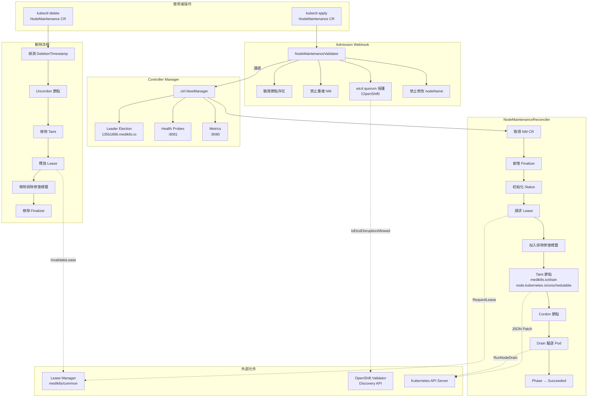

# NMO — 系統架構

本章從全局視角剖析 Node Maintenance Operator (NMO) 的專案結構、啟動流程、CRD 定義、建置系統以及 kubebuilder 專案配置。

::: info 相關章節
- Reconcile 與 Drain 核心邏輯請參閱 [核心功能分析](./core-features)
- CRD 定義與 Webhook 驗證請參閱 [控制器與 API](./controllers-api)
- 與 NHC 和 OpenShift 的整合請參閱 [外部整合](./integration)
:::

## 專案概述

**Node Maintenance Operator (NMO)** 是 [medik8s](https://github.com/medik8s) 專案下的 Kubernetes Operator，負責管理叢集節點的維護生命週期。使用者建立 `NodeMaintenance` CR 即可將節點設為維護模式（cordon + drain），刪除 CR 則自動恢復節點（uncordon）。

::: info 與 KubeVirt 的淵源
NMO 最初在 [kubevirt/node-maintenance-operator](https://github.com/kubevirt/node-maintenance-operator) 開發，後遷移至 medik8s 組織。其 drain 行為特別考量 VirtualMachineInstance Pod 的非典型 owner reference 場景，使用 `Force` 模式驅逐不受 ReplicaSet / DaemonSet 管理的 Pod。
:::

### 核心框架

| 項目 | 值 |
|------|-----|
| 語言 | Go 1.24（`toolchain go1.25.3`） |
| Operator 框架 | Operator SDK + kubebuilder v3 scaffold |
| controller-runtime | v0.22.5（對應 Kubernetes 1.34） |
| Kubernetes client | k8s.io/api、client-go、kubectl v0.34.3 |
| 共用模組 | `github.com/medik8s/common` v1.17.0（lease、etcd、nodes） |
| 測試框架 | Ginkgo v2.27.5 + Gomega v1.39.0 |
| 日誌 | go-logr + zap（結構化）、logrus（taint 管理） |

::: tip go.mod 版本策略
`go.mod` 使用 `go 1.24.11` 作為最低編譯版本，並透過 `toolchain go1.25.3` 指令確保下游安全性修補。所有 Kubernetes 相依套件統一鎖定 `v0.34.3`，與 controller-runtime `v0.22.5` 配合。
:::

## 系統架構圖



## Binary 入口

::: info 原始碼路徑
`main.go`
:::

`main.go` 是 Operator 的唯一入口，負責組裝所有元件並啟動 controller-runtime Manager。

### Scheme 註冊

```go
var scheme = k8sruntime.NewScheme()

func init() {
    utilruntime.Must(clientgoscheme.AddToScheme(scheme))
    utilruntime.Must(nodemaintenancev1beta1.AddToScheme(scheme))
}
```

透過 `init()` 將 Kubernetes 內建型別與 `NodeMaintenance` CRD 型別註冊至同一 Scheme，使 controller-runtime 能正確序列化/反序列化所有資源。

### 命令列參數

| 參數 | 預設值 | 說明 |
|------|--------|------|
| `--metrics-bind-address` | `:8080` | Prometheus metrics 端點 |
| `--health-probe-bind-address` | `:8081` | Health/Ready 探針端點 |
| `--leader-elect` | `false` | 啟用 Leader Election |
| `--enable-http2` | `false` | Webhook/Metrics 伺服器啟用 HTTP/2 |

::: tip HTTP/2 預設關閉
為降低 HTTP/2 相關 CVE 風險，NMO 預設停用 HTTP/2，強制使用 `http/1.1`。可透過 `--enable-http2` 開啟。
:::

### Manager 設定

```go
mgr, err := ctrl.NewManager(ctrl.GetConfigOrDie(), ctrl.Options{
    Scheme:                 scheme,
    WebhookServer:          webhook.NewServer(webhookOpts),
    HealthProbeBindAddress: probeAddr,
    LeaderElection:         enableLeaderElection,
    LeaderElectionID:       "135b1886.medik8s.io",
})
```

Manager 統一管理：
- **Webhook 伺服器**：處理 Admission Webhook 驗證
- **Health Probes**：`healthz` + `readyz` 端點，使用 `healthz.Ping`
- **Leader Election**：ID 為 `135b1886.medik8s.io`，確保多副本環境僅一個活躍實例

### Lease Manager 初始化

```go
type leaseManagerInitializer struct {
    cl client.Client
    lease.Manager
}

func (ls *leaseManagerInitializer) Start(context.Context) error {
    var err error
    ls.Manager, err = lease.NewManager(ls.cl, controllers.LeaseHolderIdentity)
    return err
}
```

Lease Manager 透過 `mgr.Add()` 註冊為 Runnable，在 Manager 啟動時自動初始化。使用 `medik8s/common` 套件的 `lease.Manager`，holder identity 為 `"node-maintenance"`。

### OpenShift 偵測

```go
openshiftCheck, err := utils.NewOpenshiftValidator(mgr.GetConfig())
isOpenShift := openshiftCheck.IsOpenshiftSupported()
```

透過 Kubernetes Discovery API 查詢 `config.openshift.io/v1` API Group 是否存在，以判斷叢集是否為 OpenShift。此旗標會傳遞至 Webhook，啟用 etcd quorum 保護機制。

### Webhook 憑證處理

```go
const (
    WebhookCertDir  = "/apiserver.local.config/certificates"
    WebhookCertName = "apiserver.crt"
    WebhookKeyName  = "apiserver.key"
)
```

Webhook 伺服器啟動前檢查 OLM 注入的憑證是否存在：
- **憑證存在**：使用指定路徑的 cert/key
- **憑證不存在**：列印 `"OLM injected certs for webhooks not found"` 日誌，使用 controller-runtime 預設行為

### 版本資訊輸出

```go
func printVersion() {
    setupLog.Info(fmt.Sprintf("Go Version: %s", runtime.Version()))
    setupLog.Info(fmt.Sprintf("Go OS/Arch: %s/%s", runtime.GOOS, runtime.GOARCH))
    setupLog.Info(fmt.Sprintf("Operator Version: %s", version.Version))
    setupLog.Info(fmt.Sprintf("Git Commit: %s", version.GitCommit))
    setupLog.Info(fmt.Sprintf("Build Date: %s", version.BuildDate))
}
```

啟動時輸出 Go 版本、OS/Arch、Operator 版本、Git Commit 與建置日期，資訊由 `version/version.go` 提供，在建置時透過 `ldflags` 注入。

## CRD 定義

::: info 原始碼路徑
`api/v1beta1/nodemaintenance_types.go`
:::

### NodeMaintenance 主結構

```go
//+kubebuilder:object:root=true
//+kubebuilder:subresource:status
//+kubebuilder:resource:scope=Cluster,shortName=nm

type NodeMaintenance struct {
    metav1.TypeMeta   `json:",inline"`
    metav1.ObjectMeta `json:"metadata,omitempty"`

    Spec   NodeMaintenanceSpec   `json:"spec,omitempty"`
    Status NodeMaintenanceStatus `json:"status,omitempty"`
}
```

| kubebuilder 標記 | 說明 |
|-----------------|------|
| `scope=Cluster` | Cluster-scoped 資源（無 namespace） |
| `shortName=nm` | 可用 `kubectl get nm` 簡寫查詢 |
| `subresource:status` | 啟用 `/status` 子資源，允許獨立更新 Status |

### NodeMaintenanceSpec

```go
type NodeMaintenanceSpec struct {
    // Node name to apply maintanance on/off
    NodeName string `json:"nodeName"`
    // Reason for maintanance
    Reason string `json:"reason,omitempty"`
}
```

| 欄位 | 型別 | 必填 | 說明 |
|------|------|------|------|
| `nodeName` | `string` | ✅ | 目標節點名稱 |
| `reason` | `string` | ❌ | 維護原因說明 |

### NodeMaintenanceStatus

```go
type NodeMaintenanceStatus struct {
    Phase             MaintenancePhase `json:"phase,omitempty"`
    DrainProgress     int              `json:"drainProgress,omitempty"`
    LastUpdate        metav1.Time      `json:"lastUpdate,omitempty"`
    LastError         string           `json:"lastError,omitempty"`
    PendingPods       []string         `json:"pendingPods,omitempty"`
    PendingPodsRefs   []PodReference   `json:"pendingPodsRefs,omitempty"`
    TotalPods         int              `json:"totalpods,omitempty"`
    EvictionPods      int              `json:"evictionPods,omitempty"`
    ErrorOnLeaseCount int              `json:"errorOnLeaseCount,omitempty"`
}
```

| 欄位 | 型別 | 說明 |
|------|------|------|
| `phase` | `MaintenancePhase` | 維護進度：`Running`、`Succeeded`、`Failed` |
| `drainProgress` | `int` | Drain 完成百分比（0–100） |
| `lastUpdate` | `metav1.Time` | 最近一次狀態更新時間 |
| `lastError` | `string` | 最近一次 reconcile 錯誤訊息 |
| `pendingPods` | `[]string` | 等待驅逐的 Pod 名稱清單 |
| `pendingPodsRefs` | `[]PodReference` | 等待驅逐的 Pod 完整引用（含 namespace） |
| `totalpods` | `int` | 維護開始時節點上的總 Pod 數 |
| `evictionPods` | `int` | 維護開始時需驅逐的 Pod 數 |
| `errorOnLeaseCount` | `int` | 連續取得 Lease 失敗次數（超過 3 次則判定失敗） |

### MaintenancePhase 列舉

```go
type MaintenancePhase string

const (
    MaintenanceRunning   MaintenancePhase = "Running"
    MaintenanceSucceeded MaintenancePhase = "Succeeded"
    MaintenanceFailed    MaintenancePhase = "Failed"
)
```

### PodReference 結構

```go
type PodReference struct {
    Namespace string `json:"namespace,omitempty"`
    Name      string `json:"name,omitempty"`
}
```

相較於 `pendingPods` 僅記錄 Pod 名稱，`PendingPodsRefs` 包含完整的 namespace + name，方便跨 namespace 追蹤。

### Finalizer

```go
const NodeMaintenanceFinalizer string = "foregroundDeleteNodeMaintenance"
```

Finalizer 確保刪除 CR 時執行清理邏輯（uncordon、移除 taint、釋放 lease、移除 remediation 排除標籤），而非直接丟棄資源。

## 目錄結構

```
node-maintenance-operator/
├── main.go                          # Binary 入口
├── go.mod / go.sum                  # Go 模組定義
├── Makefile                         # 建置、測試、部署目標
├── Dockerfile                       # 多階段容器映像檔建置
├── bundle.Dockerfile                # OLM Bundle 映像檔
├── PROJECT                          # kubebuilder 專案中繼資料
├── README.md                        # 專案說明文件
│
├── api/v1beta1/                     # CRD 型別定義
│   ├── nodemaintenance_types.go     #   Spec / Status / Phase 定義
│   ├── nodemaintenance_webhook.go   #   Admission Webhook 驗證邏輯
│   ├── groupversion_info.go         #   API Group 與 Scheme 註冊
│   └── zz_generated.deepcopy.go     #   自動產生的 DeepCopy 方法
│
├── controllers/                     # 控制器實作
│   ├── nodemaintenance_controller.go#   主 Reconcile 迴圈
│   ├── taint.go                     #   Taint 管理（新增/移除）
│   ├── utils.go                     #   輔助函式（Pod 名稱/引用清單）
│   ├── nodemaintenance_controller_test.go
│   └── controllers_suite_test.go
│
├── pkg/utils/                       # 共用工具
│   ├── validation.go                #   OpenShift 叢集偵測
│   ├── events.go                    #   Kubernetes Event 記錄
│   └── validation_test.go
│
├── version/
│   └── version.go                   # 版本變數（ldflags 注入）
│
├── config/                          # Kustomize 部署設定
│   ├── crd/                         #   CRD YAML 與 Kustomize patches
│   ├── rbac/                        #   ClusterRole / Binding / ServiceAccount
│   ├── webhook/                     #   Webhook 設定與 Service
│   ├── manager/                     #   Deployment 定義
│   ├── samples/                     #   NodeMaintenance CR 範例
│   ├── default/                     #   整合所有元件的 Kustomization
│   ├── certmanager/                 #   cert-manager 憑證設定
│   ├── prometheus/                  #   ServiceMonitor 設定
│   └── scorecard/                   #   Operator SDK scorecard 測試
│
├── bundle/                          # OLM Bundle（CSV + CRD + metadata）
│   ├── manifests/
│   ├── metadata/
│   └── tests/
│
├── hack/                            # 建置與自動化腳本
│   ├── build.sh                     #   Go 二進位編譯（ldflags 注入）
│   ├── functest.sh                  #   E2E 測試執行器
│   └── boilerplate.go.txt           #   授權聲明範本
│
├── test/
│   ├── e2e/                         #   端對端整合測試
│   └── manifests/                   #   測試用資源定義
│
└── must-gather/
    └── collection-scripts/          #   除錯資料蒐集腳本
```

## 建置系統

### Makefile 關鍵目標

::: info 原始碼路徑
`Makefile`
:::

| 目標 | 說明 |
|------|------|
| `make build` | 呼叫 `hack/build.sh` 編譯 manager 二進位 |
| `make run` | 本機直接執行控制器（`go run ./main.go`） |
| `make manifests` | 以 controller-gen 產生 CRD、RBAC、Webhook YAML |
| `make generate` | 產生 DeepCopy 等自動程式碼 |
| `make fmt` | 執行 `goimports`（含 import 排序） |
| `make vet` | 執行 `go vet` 靜態分析 |
| `make test` | 完整測試：產生、格式化、單元測試、驗證無未提交變更 |
| `make test-no-verify` | 單元測試（不驗證 git 狀態），使用 envtest |
| `make docker-build` | 建置 Docker 映像（含測試） |
| `make docker-push` | 推送映像至 registry |
| `make install` | 安裝 CRD 至叢集 |
| `make deploy` | 部署整個 Operator 至叢集 |
| `make bundle` | 產生 OLM Bundle 並驗證 |
| `make cluster-functest` | 執行 E2E 測試（需已部署的叢集） |

### 工具版本

| 工具 | 版本 |
|------|------|
| controller-gen | v0.20.0 |
| kustomize | v5.8.0 |
| envtest | Kubernetes 1.34 assets |
| ginkgo | v2.27.5 |
| operator-sdk | v1.37.0（最後支援 go/v3 的版本） |
| opm | v1.61.0 |

### hack/build.sh — 編譯腳本

::: info 原始碼路徑
`hack/build.sh`
:::

```bash
#!/bin/bash -ex

GIT_VERSION=$(git describe --always --tags || true)
VERSION=${CI_UPSTREAM_VERSION:-${GIT_VERSION}}
GIT_COMMIT=$(git rev-list -1 HEAD || true)
COMMIT=${CI_UPSTREAM_COMMIT:-${GIT_COMMIT}}
BUILD_DATE=$(date --utc -Iseconds)

mkdir -p bin

LDFLAGS_VALUE="-X github.com/medik8s/node-maintenance-operator/version.Version=${VERSION} "
LDFLAGS_VALUE+="-X github.com/medik8s/node-maintenance-operator/version.GitCommit=${COMMIT} "
LDFLAGS_VALUE+="-X github.com/medik8s/node-maintenance-operator/version.BuildDate=${BUILD_DATE} "
LDFLAGS_DEBUG="${LDFLAGS_DEBUG:-" -s -w"}"
LDFLAGS_VALUE+="${LDFLAGS_DEBUG}"

LDFLAGS="'-ldflags=${LDFLAGS_VALUE}'"
export GOFLAGS+=" ${LDFLAGS}"
export CGO_ENABLED=${CGO_ENABLED:-0}

GOOS=linux GOARCH=amd64 go build -o bin/manager main.go
```

**版本注入機制：**

| ldflags 變數 | 來源 | 說明 |
|-------------|------|------|
| `version.Version` | `git describe --always --tags` 或 `CI_UPSTREAM_VERSION` | 語意化版本號 |
| `version.GitCommit` | `git rev-list -1 HEAD` 或 `CI_UPSTREAM_COMMIT` | Git commit hash |
| `version.BuildDate` | `date --utc -Iseconds` | ISO 8601 建置時間戳 |

接收端為 `version/version.go`：

```go
package version

var (
    Version   = "0.0.1"   // 由 ldflags 覆寫
    GitCommit = "n/a"      // 由 ldflags 覆寫
    BuildDate = "n/a"      // 由 ldflags 覆寫
)
```

::: tip 建置特性
- **靜態連結**：`CGO_ENABLED=0`，產出無外部 C 相依的二進位
- **符號剝離**：預設 `-s -w` 減小二進位大小，可透過 `LDFLAGS_DEBUG` 環境變數覆寫以保留除錯資訊
- **CI 整合**：支援 `CI_UPSTREAM_VERSION` / `CI_UPSTREAM_COMMIT` 環境變數覆寫版本
- **固定平台**：`GOOS=linux GOARCH=amd64`
:::

### Dockerfile — 多階段建置

::: info 原始碼路徑
`Dockerfile`
:::

```dockerfile
# 階段一：Builder
FROM quay.io/centos/centos:stream9 AS builder
RUN dnf install -y jq git && dnf clean all -y

COPY go.mod go.sum ./
# 從 go.mod 的 toolchain 指令動態偵測 Go 版本並下載
RUN export GO_VERSION=$(grep -oE "toolchain go[[:digit:]]\.[[:digit:]]+\.[[:digit:]]" \
    go.mod | awk '{print $2}') && \
    curl -sL -o go.tar.gz "https://golang.org/dl/${GO_FILENAME}" && \
    tar -C /usr/local -xzf go.tar.gz

COPY api/ controllers/ pkg/ hack/ main.go vendor/ version/ .git/ ./
RUN ./hack/build.sh

# 階段二：Runtime
FROM registry.access.redhat.com/ubi9/ubi-micro:latest
COPY --from=builder /workspace/bin/manager .
USER 65532:65532
ENTRYPOINT ["/manager"]
```

| 階段 | Base Image | 用途 |
|------|-----------|------|
| Builder | `centos:stream9` | 安裝 jq/git、動態下載 Go、執行 `hack/build.sh` |
| Runtime | `ubi9/ubi-micro` | Red Hat 最小化映像，僅包含 manager 二進位 |

::: tip 動態 Go 版本
Builder 階段從 `go.mod` 的 `toolchain` 指令解析 Go 版本，再從 `go.dev/dl` API 動態下載對應的 Linux/AMD64 發行版。這確保容器建置的 Go 版本與 `go.mod` 宣告一致。
:::

## PROJECT 檔案

::: info 原始碼路徑
`PROJECT`
:::

```yaml
domain: medik8s.io
layout:
- go.kubebuilder.io/v3
plugins:
  manifests.sdk.operatorframework.io/v2: {}
  scorecard.sdk.operatorframework.io/v2: {}
projectName: node-maintenance-operator
repo: github.com/medik8s/node-maintenance-operator
resources:
- api:
    crdVersion: v1
    namespaced: true
  controller: true
  domain: medik8s.io
  group: nodemaintenance
  kind: NodeMaintenance
  path: github.com/medik8s/node-maintenance-operator
  version: v1beta1
  webhooks:
    validation: true
    webhookVersion: v1
version: "3"
```

| 欄位 | 值 | 說明 |
|------|-----|------|
| `domain` | `medik8s.io` | API Group 的域名後綴 |
| `layout` | `go.kubebuilder.io/v3` | kubebuilder v3 版面配置 |
| `plugins` | `manifests.sdk` / `scorecard.sdk` | Operator SDK 的 Bundle 與 Scorecard 外掛 |
| `projectName` | `node-maintenance-operator` | 專案名稱 |
| `version` | `"3"` | PROJECT 檔案格式版本 |
| `resources[0].kind` | `NodeMaintenance` | 管理的 CRD 種類 |
| `resources[0].group` | `nodemaintenance` | CRD 所屬 API Group（完整為 `nodemaintenance.medik8s.io`） |
| `resources[0].version` | `v1beta1` | CRD API 版本 |
| `resources[0].webhooks.validation` | `true` | 啟用 Validating Webhook |
| `resources[0].api.crdVersion` | `v1` | CRD 使用 `apiextensions/v1`（非 v1beta1） |

::: tip namespaced 差異
PROJECT 檔案中 `namespaced: true` 是 kubebuilder scaffold 的預設值，但實際 CRD 透過 `//+kubebuilder:resource:scope=Cluster` 標記覆寫為 **Cluster-scoped**。以 `nodemaintenance_types.go` 中的 kubebuilder 標記為準。
:::
