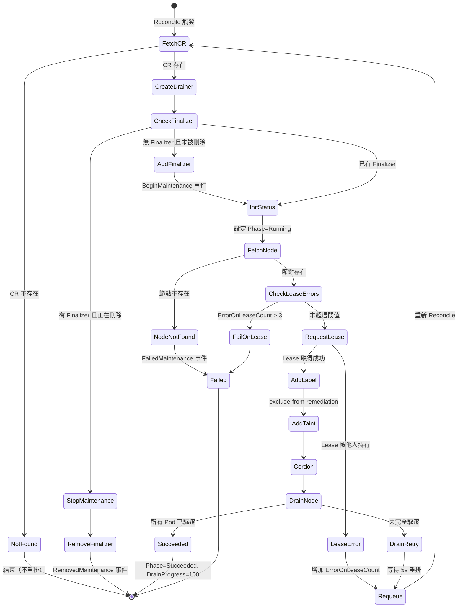
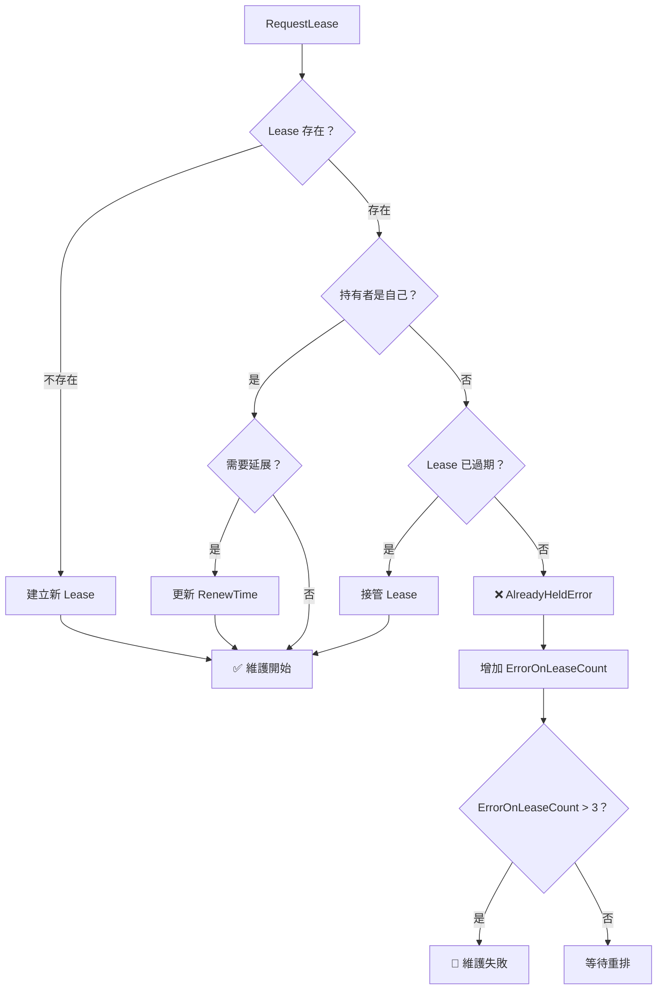
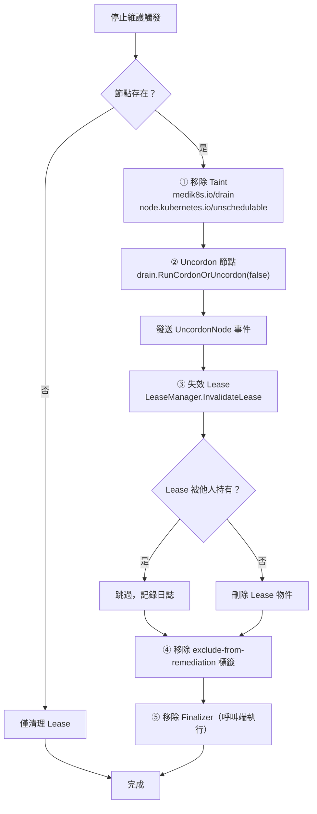

# NMO — 核心功能分析

Node Maintenance Operator 的核心任務是安全地將 Kubernetes 節點置入維護模式。本章深入分析六大核心機制：Reconcile 狀態機、Drain 邏輯、Taint 管理、Lease 協調、狀態追蹤與停止維護流程。

::: info 相關章節
- 系統整體架構請參閱 [系統架構](./architecture)
- CRD 定義與 Webhook 驗證請參閱 [控制器與 API](./controllers-api)
- 與 NHC 和 OpenShift 的整合請參閱 [外部整合](./integration)
:::

## Reconcile 狀態機

### 完整 Reconcile 流程

控制器的進入點是 `Reconcile()` 方法，定義於 `controllers/nodemaintenance_controller.go`（第 104 行）。每次 Reconcile 循環依序執行以下步驟：

```go
// controllers/nodemaintenance_controller.go:104-108
func (r *NodeMaintenanceReconciler) Reconcile(ctx context.Context, req ctrl.Request) (ctrl.Result, error) {
    r.logger = log.FromContext(ctx)
    r.logger.Info("Reconciling NodeMaintenance")
    defer r.logger.Info("Reconcile completed")
    emptyResult := ctrl.Result{}
```

#### 步驟 1：取得 NodeMaintenance CR

```go
// controllers/nodemaintenance_controller.go:111-124
nm := &v1beta1.NodeMaintenance{}
err := r.Client.Get(ctx, req.NamespacedName, nm)
if err != nil {
    if apiErrors.IsNotFound(err) {
        r.logger.Info("NodeMaintenance not found", "name", req.NamespacedName)
        return emptyResult, nil
    }
    r.logger.Info("Error reading the request object, requeuing.")
    return emptyResult, err
}
```

若 CR 已被刪除（NotFound），直接結束不重新排隊。

#### 步驟 2：建立 Drainer

```go
// controllers/nodemaintenance_controller.go:125-128
drainer, err := createDrainer(ctx, r.MgrConfig)
if err != nil {
    return emptyResult, err
}
```

每次 Reconcile 都會建立新的 `drain.Helper` 實例（詳見 [Drain 邏輯](#drain-邏輯)）。

#### 步驟 3：Finalizer 與刪除處理

```go
// controllers/nodemaintenance_controller.go:130-158
if !controllerutil.ContainsFinalizer(nm, v1beta1.NodeMaintenanceFinalizer) &&
    nm.ObjectMeta.DeletionTimestamp.IsZero() {
    // 新建 CR → 加入 Finalizer
    controllerutil.AddFinalizer(nm, v1beta1.NodeMaintenanceFinalizer)
    if err := r.Client.Update(ctx, nm); err != nil {
        return r.onReconcileError(ctx, nm, drainer, err)
    }
    utils.NormalEvent(r.Recorder, nm, utils.EventReasonBeginMaintenance,
        utils.EventMessageBeginMaintenance)
} else if controllerutil.ContainsFinalizer(nm, v1beta1.NodeMaintenanceFinalizer) &&
    !nm.ObjectMeta.DeletionTimestamp.IsZero() {
    // CR 被刪除 → 執行停止維護
    if err := r.stopNodeMaintenanceOnDeletion(ctx, drainer, nm.Spec.NodeName); err != nil {
        // ...
    }
    controllerutil.RemoveFinalizer(nm, v1beta1.NodeMaintenanceFinalizer)
    // ...
}
```

::: info Finalizer 名稱
定義於 `api/v1beta1/nodemaintenance_types.go` 第 28 行：`foregroundDeleteNodeMaintenance`。確保 CR 被刪除前一定會執行清理邏輯（uncordon + 移除 taint + 失效 lease）。
:::

#### 步驟 4：初始化狀態

```go
// controllers/nodemaintenance_controller.go:160-170
needUpdate, err := initMaintenanceStatus(ctx, nm, drainer)
if err != nil {
    r.logger.Error(err, "Failed to initalize NodeMaintenance status")
    return r.onReconcileError(ctx, nm, drainer, err)
}
if needUpdate {
    if err = r.Client.Status().Update(ctx, nm); err != nil {
        return r.onReconcileError(ctx, nm, drainer, err)
    }
}
```

`initMaintenanceStatus`（第 439 行）僅在 `Phase == ""` 時執行一次，設定 `Phase=Running`、計算 `TotalPods`、`EvictionPods`、`PendingPods`。

#### 步驟 5：Lease 管理

```go
// controllers/nodemaintenance_controller.go:208
err = r.LeaseManager.RequestLease(ctx, node, LeaseDuration)
```

取得或延展 Lease，防止並行維護（詳見 [Lease 協調機制](#lease-協調機制)）。

#### 步驟 6：加入標籤與 Taint → Cordon → Drain

```go
// controllers/nodemaintenance_controller.go:232-251
if err := addExcludeRemediationLabel(ctx, node, r.Client, r.logger); err != nil {
    return r.onReconcileError(ctx, nm, drainer, err)
}

err = AddOrRemoveTaint(drainer.Client, true, node, ctx)
// ...
if err = drain.RunCordonOrUncordon(drainer, node, true); err != nil {
    return r.onReconcileError(ctx, nm, drainer, err)
}

if err = drain.RunNodeDrain(drainer, nodeName); err != nil {
    r.logger.Info("Not all pods evicted", "nodeName", nodeName, "error", err)
    waitOnReconcile := waitDurationOnDrainError
    return r.onReconcileErrorWithRequeue(ctx, nm, drainer, err, &waitOnReconcile)
}
```

#### 步驟 7：成功完成

```go
// controllers/nodemaintenance_controller.go:258-269
nm.Status.Phase = v1beta1.MaintenanceSucceeded
nm.Status.DrainProgress = 100
nm.Status.PendingPods = nil
nm.Status.PendingPodsRefs = nil
err = r.Client.Status().Update(ctx, nm)
```

### 狀態機 Mermaid 圖



::: warning 重排策略
- Drain 失敗：固定 5 秒後重排（`waitDurationOnDrainError = 5 * time.Second`）
- 其他錯誤：指數退避重排（由 controller-runtime 管理）
- 節點不存在（`expectedNodeNotFoundErrorMsg`）：不重排，避免無限重試
:::

## Drain 邏輯

### createDrainer 函式

`createDrainer`（第 274 行）建立 `drain.Helper` 結構，每個參數都有其針對 KubeVirt 工作負載的設計理由：

```go
// controllers/nodemaintenance_controller.go:274-326
func createDrainer(ctx context.Context, mgrConfig *rest.Config) (*drain.Helper, error) {
    drainer := &drain.Helper{}

    drainer.Force = true
    drainer.DeleteEmptyDirData = true
    drainer.IgnoreAllDaemonSets = true
    drainer.GracePeriodSeconds = -1
    drainer.Timeout = DrainerTimeout  // 30s

    cs, err := kubernetes.NewForConfig(mgrConfig)
    if err != nil {
        return nil, err
    }
    drainer.Client = cs
    drainer.DryRunStrategy = util.DryRunNone
    drainer.Ctx = ctx

    drainer.Out = writer{klog.Info}
    drainer.ErrOut = writer{klog.Error}

    drainer.OnPodDeletedOrEvicted = func(pod *corev1.Pod, usingEviction bool) {
        var verbString string
        if usingEviction {
            verbString = "Evicted"
        } else {
            verbString = "Deleted"
        }
        msg := fmt.Sprintf("pod: %s:%s %s from node: %s",
            pod.ObjectMeta.Namespace, pod.ObjectMeta.Name,
            verbString, pod.Spec.NodeName)
        klog.Info(msg)
    }
    return drainer, nil
}
```

### 參數設計解析

| 參數 | 值 | 設計理由 |
|------|------|------|
| `Force` | `true` | VMI Pod 不被 ReplicaSet/DaemonSet 管理，標準 drain 會拒絕驅逐這類「無控制器」Pod。medik8s 自身控制器負責 VMI 的重新排程 |
| `DeleteEmptyDirData` | `true` | VMI Pod 使用 emptyDir Volume，其中的資料是暫時性的，驅逐後可安全刪除 |
| `IgnoreAllDaemonSets` | `true` | 每個跑 VMI 的節點都有 `virt-handler` DaemonSet，忽略它們才能繼續 drain 流程 |
| `GracePeriodSeconds` | `-1` | 負值表示使用 Pod 自身定義的 `terminationGracePeriodSeconds`，尊重每個 VMI 的優雅關機時間 |
| `Timeout` | `30s` | 單輪 drain 嘗試的超時時間。超時後會觸發重排（5 秒後），讓 controller 重新評估剩餘 Pod |

::: tip Force 模式的關鍵作用
程式碼原文註解（第 277-282 行）明確說明：
> *This is required because VirtualMachineInstance pods are not owned by a ReplicaSet or DaemonSet controller. medik8s has its own controllers which manage the underlying VirtualMachineInstance pods.*

也就是說，NMO 依賴 medik8s 生態系的其他控制器（如 Node Health Check）來確保 VMI 被重新排程到其他節點。
:::

### OnPodDeletedOrEvicted 回呼

每當一個 Pod 被成功驅逐或刪除時，`OnPodDeletedOrEvicted` 回呼會透過 `klog` 記錄該事件：

```
pod: default:my-vmi-launcher Evicted from node: worker-1
```

這提供了逐 Pod 的驅逐進度追蹤能力。

## Taint 管理

### 兩個維護 Taint

`controllers/taint.go`（第 17-30 行）定義了兩個用於節點維護的 Taint：

```go
// controllers/taint.go:17-30
const (
    medik8sDrainTaintKey      = "medik8s.io/drain"
    nodeUnschedulableTaintKey = "node.kubernetes.io/unschedulable"
)

var medik8sDrainTaint = &corev1.Taint{
    Key:    medik8sDrainTaintKey,
    Effect: corev1.TaintEffectNoSchedule,
}

var nodeUnschedulableTaint = &corev1.Taint{
    Key:    nodeUnschedulableTaintKey,
    Effect: corev1.TaintEffectNoSchedule,
}

var maintenanceTaints = []corev1.Taint{*nodeUnschedulableTaint, *medik8sDrainTaint}
```

| Taint Key | Effect | 用途 |
|-----------|--------|------|
| `medik8s.io/drain` | `NoSchedule` | medik8s 生態系專用標記，通知其他 medik8s 控制器（如 NHC）此節點正在被 drain |
| `node.kubernetes.io/unschedulable` | `NoSchedule` | Kubernetes 標準 taint，與 `kubectl cordon` 行為一致，防止新 Pod 排程到此節點 |

::: info 為什麼需要兩個 Taint？
`node.kubernetes.io/unschedulable` 只防止排程，但其他 medik8s 工具（如 Node Health Check）不會識別它。`medik8s.io/drain` 是 medik8s 自定義的信號，讓整個 medik8s 生態系知道此節點正在進行維護操作。
:::

### Taint 的原子性更新

`AddOrRemoveTaint`（第 32 行）使用 **JSON Patch + test-and-set** 模式確保原子性：

```go
// controllers/taint.go:32-78
func AddOrRemoveTaint(clientset kubernetes.Interface, add bool, node *corev1.Node, ctx context.Context) error {
    // ...
    // 先序列化當前 taints 作為 test 條件
    oldTaints, err := json.Marshal(node.Spec.Taints)

    // 構造原子 patch：先 test 再 add/replace
    test := fmt.Sprintf(`{ "op": "test", "path": "/spec/taints", "value": %s }`,
        string(oldTaints))

    _, err = client.Patch(ctx, node.Name, types.JSONPatchType,
        []byte(fmt.Sprintf("[ %s, %s ]", test, patch)), v1.PatchOptions{})
    // ...
}
```

這個 `test` 操作確保：如果在 patch 發送前 taints 已被其他控制器修改，操作會失敗並重試，避免覆蓋其他控制器的 taint 變更。

### 輔助函式

- **`addTaints`**（第 81 行）：將維護 taint 加入現有列表，使用 `MatchTaint()` 避免重複
- **`deleteTaint`**（第 99 行）：根據 key + effect 匹配刪除指定 taint
- **`deleteTaints`**（第 111 行）：批次刪除多個 taint

## Lease 協調機制

### 概述

NMO 使用 `medik8s/common` 套件的 `lease.Manager` 來協調節點維護權限，防止多個維護操作同時作用於同一節點。

### 核心常數

```go
// controllers/nodemaintenance_controller.go:51-60
const (
    maxAllowedErrorToUpdateOwnedLease = 3
    waitDurationOnDrainError          = 5 * time.Second
    LeaseHolderIdentity = "node-maintenance"
    LeaseDuration       = 3600 * time.Second  // 1 小時
    DrainerTimeout      = 30 * time.Second
)
```

### Lease 命名規則

Lease 名稱由 `generateLeaseName` 產生（`vendor/github.com/medik8s/common/pkg/lease/manager.go` 第 311 行）：

```go
// vendor/github.com/medik8s/common/pkg/lease/manager.go:311-313
func generateLeaseName(kind string, name string) string {
    return strings.ToLower(fmt.Sprintf("%s-%s", kind, name))
}
```

由於傳入的物件是 `*corev1.Node`，最終 Lease 名稱格式為 `node-<節點名稱>`（例如 `node-worker-1`），存放在 `medik8s-leases` namespace。

### LeaseManager 初始化

```go
// main.go:167-176
type leaseManagerInitializer struct {
    cl client.Client
    lease.Manager
}

func (ls *leaseManagerInitializer) Start(context.Context) error {
    var err error
    ls.Manager, err = lease.NewManager(ls.cl, controllers.LeaseHolderIdentity)
    return err
}
```

在 Manager 啟動時（`Start` 回呼）才初始化 `lease.Manager`，holder identity 固定為 `"node-maintenance"`。

### 取得與延展 Lease

```go
// vendor/github.com/medik8s/common/pkg/lease/manager.go:153-219
func (l *manager) requestLease(ctx context.Context, obj client.Object,
    leaseDuration time.Duration) error {
    lease, err := l.getLease(ctx, obj)

    if err != nil {
        if apierrors.IsNotFound(err) {
            // Lease 不存在 → 建立新 Lease
            return l.createLease(ctx, obj, leaseDuration)
        }
        return err
    }

    if lease.Spec.HolderIdentity != nil &&
        *lease.Spec.HolderIdentity == l.holderIdentity {
        // 自己持有 → 檢查是否需要延展
        needUpdateLease, setAcquire = needUpdateOwnedLease(lease, currentTime, leaseDuration)
    } else {
        // 他人持有 → 檢查是否已過期
        if isValidLease(lease, currentTime.Time) {
            return AlreadyHeldError{holderIdentity: identity}
        }
        // 已過期 → 接管
    }
    // ...
}
```

### 防止並行維護的機制



::: warning ErrorOnLeaseCount 閾值
`maxAllowedErrorToUpdateOwnedLease = 3`。當連續超過 3 次無法延展自己持有的 Lease 時（例如 NHC 接管了 Lease），控制器會認為維護已無法繼續，自動執行 `stopNodeMaintenanceImp` 回復節點，並將 Phase 設為 `Failed`。
:::

### Lease 失效

```go
// vendor/github.com/medik8s/common/pkg/lease/manager.go:221-239
func (l *manager) invalidateLease(ctx context.Context, obj client.Object) error {
    lease, err := l.getLease(ctx, obj)
    if err != nil {
        if apierrors.IsNotFound(err) {
            return nil  // 已不存在，無需操作
        }
        return err
    }
    if lease.Spec.HolderIdentity != nil &&
        l.holderIdentity != *lease.Spec.HolderIdentity {
        return AlreadyHeldError{*lease.Spec.HolderIdentity}
    }
    // 刪除 Lease 物件
    return l.Client.Delete(ctx, lease)
}
```

失效操作會直接 **刪除** Lease 物件，而非僅標記過期。如果 Lease 已被他人持有，則跳過刪除並記錄日誌。

## 狀態追蹤

### Status 結構

```go
// api/v1beta1/nodemaintenance_types.go:68-99
type NodeMaintenanceStatus struct {
    Phase           MaintenancePhase  // Running / Succeeded / Failed
    DrainProgress   int               // 驅逐進度百分比 (0-100)
    LastUpdate      metav1.Time       // 最後更新時間
    LastError       string            // 最近一次錯誤訊息
    PendingPods     []string          // 待驅逐 Pod 名稱列表
    PendingPodsRefs []PodReference    // 待驅逐 Pod 的 namespace/name 參照
    TotalPods       int               // 節點上的 Pod 總數
    EvictionPods    int               // 需要驅逐的 Pod 數量
    ErrorOnLeaseCount int             // 連續 Lease 錯誤次數
}
```

### 三階段 Phase 模型

```go
// api/v1beta1/nodemaintenance_types.go:34-41
const (
    MaintenanceRunning   MaintenancePhase = "Running"
    MaintenanceSucceeded MaintenancePhase = "Succeeded"
    MaintenanceFailed    MaintenancePhase = "Failed"
)
```

| Phase | 觸發條件 | 含義 |
|-------|---------|------|
| `Running` | `initMaintenanceStatus` 首次設定 | 維護進行中，正在 drain |
| `Succeeded` | `drain.RunNodeDrain` 成功完成 | 所有 Pod 已驅逐，節點已進入維護模式 |
| `Failed` | 節點不存在，或 Lease 連續失敗 > 3 次 | 維護失敗，節點已被 uncordon 回復 |

### DrainProgress 計算

Drain 進度百分比在 `onReconcileErrorWithRequeue`（第 467 行）中計算：

```go
// controllers/nodemaintenance_controller.go:472-479
pendingList, _ := drainer.GetPodsForDeletion(nm.Spec.NodeName)
if pendingList != nil {
    nm.Status.PendingPods = GetPodNameList(pendingList.Pods())
    nm.Status.PendingPodsRefs = GetPodRefList(pendingList.Pods())
    if nm.Status.EvictionPods != 0 {
        nm.Status.DrainProgress =
            (nm.Status.EvictionPods - len(nm.Status.PendingPods)) * 100 / nm.Status.EvictionPods
    }
}
```

::: tip 進度計算公式
```
DrainProgress = (EvictionPods - len(PendingPods)) × 100 ÷ EvictionPods
```
- `EvictionPods`：初始化時記錄的需驅逐 Pod 總數
- `PendingPods`：當前仍待驅逐的 Pod 數量
- 當所有 Pod 驅逐完成，Reconcile 成功路徑直接設定 `DrainProgress = 100`
:::

### PendingPods 追蹤

控制器使用兩種格式追蹤待驅逐 Pod：

```go
// controllers/utils.go:31-48
func GetPodNameList(pods []corev1.Pod) (result []string) {
    for _, pod := range pods {
        result = append(result, pod.ObjectMeta.Name)
    }
    return result
}

func GetPodRefList(pods []corev1.Pod) (result []v1beta1.PodReference) {
    for _, pod := range pods {
        result = append(result, v1beta1.PodReference{
            Namespace: pod.Namespace,
            Name:      pod.Name,
        })
    }
    return result
}
```

- **`PendingPods`**：純名稱列表（`[]string`），便於快速查看
- **`PendingPodsRefs`**：包含 namespace 的完整參照（`[]PodReference`），用於精確定位

### 錯誤報告

`onReconcileErrorWithRequeue`（第 467 行）是統一的錯誤處理入口：

```go
// controllers/nodemaintenance_controller.go:467-496
func (r *NodeMaintenanceReconciler) onReconcileErrorWithRequeue(ctx context.Context,
    nm *v1beta1.NodeMaintenance, drainer *drain.Helper, err error,
    duration *time.Duration) (ctrl.Result, error) {

    nm.Status.LastError = err.Error()
    setLastUpdate(nm)

    // 更新 PendingPods 和 DrainProgress...

    updateErr := r.Client.Status().Update(ctx, nm)

    // 特殊處理：節點不存在 → 不重排
    if nm.Spec.NodeName != "" &&
        err.Error() == fmt.Sprintf(expectedNodeNotFoundErrorMsg, nm.Spec.NodeName) {
        return ctrl.Result{}, nil
    }

    if duration != nil {
        // 固定時間重排
        return ctrl.Result{RequeueAfter: *duration}, nil
    }
    // 指數退避重排
    return ctrl.Result{}, err
}
```

| 欄位 | 更新時機 | 用途 |
|------|---------|------|
| `LastError` | 每次 Reconcile 錯誤 | 記錄最新錯誤訊息，便於 debug |
| `LastUpdate` | 每次狀態變更 | 時間戳，追蹤控制器活動狀態 |
| `ErrorOnLeaseCount` | Lease 取得失敗時 | 計數器，超過閾值觸發 Failed |

## 停止維護流程

### 觸發時機

停止維護在兩種情況下觸發：
1. **CR 被刪除**：透過 `stopNodeMaintenanceOnDeletion`（第 405 行）
2. **Lease 連續失敗**：透過 `stopNodeMaintenanceImp`（第 379 行）

### stopNodeMaintenanceOnDeletion

```go
// controllers/nodemaintenance_controller.go:405-423
func (r *NodeMaintenanceReconciler) stopNodeMaintenanceOnDeletion(ctx context.Context,
    drainer *drain.Helper, nodeName string) error {

    node, err := r.fetchNode(ctx, drainer, nodeName)
    if err != nil {
        if apiErrors.IsNotFound(err) {
            // 節點已刪除（GC 場景），但仍需清理 Lease
            if err := r.LeaseManager.InvalidateLease(ctx,
                &corev1.Node{ObjectMeta: metav1.ObjectMeta{Name: nodeName}}); err != nil {
                // 如果 Lease 被他人持有，跳過
                var alreadyHeldErr lease.AlreadyHeldError
                if errors.As(err, &alreadyHeldErr) {
                    r.logger.Info("lease is held by another entity, skipping...")
                } else {
                    return err
                }
            }
            return nil
        }
        return err
    }
    return r.stopNodeMaintenanceImp(ctx, drainer, node)
}
```

::: info Garbage Collection 場景
NodeMaintenance CR 設定了 Node 作為 OwnerReference（`setOwnerRefToNode`，第 328 行）。當 Node 被刪除時，CR 會被 Kubernetes GC 自動清理。此時節點已不存在，但 Lease 物件仍在 `medik8s-leases` namespace，必須主動清理。
:::

### stopNodeMaintenanceImp — 核心清理邏輯

```go
// controllers/nodemaintenance_controller.go:379-403
func (r *NodeMaintenanceReconciler) stopNodeMaintenanceImp(ctx context.Context,
    drainer *drain.Helper, node *corev1.Node) error {

    // 步驟 1: 移除維護 Taint
    err := AddOrRemoveTaint(drainer.Client, false, node, ctx)
    if err != nil {
        return err
    }

    // 步驟 2: Uncordon 節點
    if err = drain.RunCordonOrUncordon(drainer, node, false); err != nil {
        return err
    }

    utils.NormalEvent(r.Recorder, node, utils.EventReasonUncordonNode,
        utils.EventMessageUncordonNode)

    // 步驟 3: 失效 Lease
    if err := r.LeaseManager.InvalidateLease(ctx, node); err != nil {
        var alreadyHeldErr lease.AlreadyHeldError
        if errors.As(err, &alreadyHeldErr) {
            r.logger.Info("lease is held by another entity, skipping invalidation")
        } else {
            return err
        }
    }

    // 步驟 4: 移除 exclude-from-remediation 標籤
    return removeExcludeRemediationLabel(ctx, node, r.Client, r.logger)
}
```

### 完整清理步驟



::: warning 清理順序的重要性
清理步驟的順序經過精心設計：
1. **先移除 Taint** → 讓排程器能重新考慮此節點
2. **再 Uncordon** → 實際恢復節點可排程狀態
3. **然後失效 Lease** → 釋放維護鎖，允許其他維護操作
4. **最後移除標籤** → 重新允許 medik8s 健康檢查修復此節點
5. **移除 Finalizer** → 讓 Kubernetes 完成 CR 的最終刪除

這確保節點在每個步驟都處於一致的狀態。
:::
