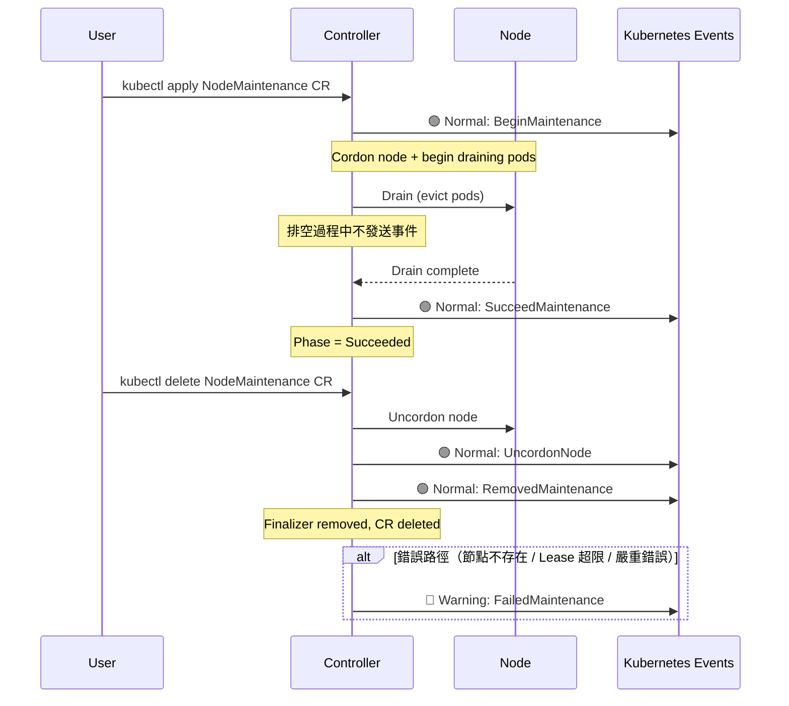

# Node Maintenance Operator — 事件記錄與可觀測性

**章節**：維運進階｜**讀者**：Operators、SREs

---

## 1. Kubernetes Events

NMO 透過 `record.EventRecorder` 介面向 Kubernetes API Server 發送事件。事件輔助函式定義於 `pkg/utils/events.go`：

```go
// 檔案: pkg/utils/events.go
func NormalEvent(recorder record.EventRecorder, object runtime.Object, reason, message string) {
    recorder.Event(object, corev1.EventTypeNormal, reason, message)
}

func WarningEvent(recorder record.EventRecorder, object runtime.Object, reason, message string) {
    recorder.Event(object, corev1.EventTypeWarning, reason, message)
}
```

Recorder 在 `main.go` 初始化，元件名稱為 `"NodeMaintenance"`：

```go
// 檔案: main.go
Recorder: mgr.GetEventRecorderFor("NodeMaintenance")
```

所有事件的 `source.component` 欄位都會顯示為 `NodeMaintenance`，方便過濾。

---

## 2. 完整事件清單

| Reason | Type | Message | 觸發位置 |
|--------|------|---------|---------|
| `BeginMaintenance` | Normal | "Begin a node maintenance" | 新增 finalizer 時（`controllers/nodemaintenance_controller.go` line 137） |
| `SucceedMaintenance` | Normal | "Node maintenance was succeeded" | 排空完成，Phase = Succeeded 時 |
| `UncordonNode` | Normal | "Uncordon a node" | 停止維護、恢復節點時 |
| `RemovedMaintenance` | Normal | "Removed a node maintenance" | 移除 finalizer，CR 完全刪除時 |
| `FailedMaintenance` | Warning | "Failed a node maintenance" | 節點不存在 / Lease 超過上限 / 其他嚴重錯誤 |

::: tip 事件保留時間
Kubernetes 預設保留事件 **1 小時**。若需長期保存，建議搭配外部事件收集工具（如 Falco、kube-events-exporter）。
:::

---

## 3. 事件生命週期圖

以下流程圖展示一次完整維護週期中各事件的觸發順序：



---

## 4. 查看事件

```bash
# 查看所有維護相關事件（按時間排序）
kubectl get events --sort-by='.lastTimestamp' | grep -i maintenance

# 查看特定 CR 的事件
kubectl describe nm <name>

# 監控即時事件
kubectl get events -w | grep NodeMaintenance
```

::: tip 事件查詢技巧
使用 `kubectl describe nm <name>` 可同時看到 CR 狀態與相關事件，是快速診斷維護流程的第一步。
:::

---

## 5. 健康探針

NMO Manager 提供兩個 HTTP 健康端點，由 `config/manager/manager.yaml` 設定：

```yaml
# 檔案: config/manager/manager.yaml
livenessProbe:
  httpGet:
    path: /healthz
    port: 8081
  initialDelaySeconds: 15
  periodSeconds: 20

readinessProbe:
  httpGet:
    path: /readyz
    port: 8081
  initialDelaySeconds: 5
  periodSeconds: 10
```

在 `main.go` 中以 `healthz.Ping` 實作：

```go
// 檔案: main.go
mgr.AddHealthzCheck("healthz", healthz.Ping)
mgr.AddReadyzCheck("readyz", healthz.Ping)
```

兩個端點均使用 `healthz.Ping`：只要 Manager 程序正在運行即回傳 HTTP 200。監聽埠預設為 `:8081`，可透過 `--health-probe-bind-address` 覆寫。

| 端點 | 用途 | 失敗影響 |
|------|------|---------|
| `/healthz` | Liveness — Pod 是否存活 | kubelet 重啟 Pod |
| `/readyz` | Readiness — Pod 是否就緒接收流量 | 從 Service Endpoint 移除 |

---

## 6. Prometheus Metrics

Metrics 端點預設監聽 `:8080`，可透過 `--metrics-bind-address` 覆寫。

NMO 本身**未定義自訂應用指標**，僅暴露 `controller-runtime` 標準指標：

| Metric | 說明 |
|--------|------|
| `controller_runtime_reconcile_total` | reconcile 總次數（依 result 分類：success / error） |
| `controller_runtime_reconcile_duration_seconds` | reconcile 執行時間分布（histogram） |
| `controller_runtime_webhook_requests_total` | webhook 請求總數 |
| `controller_runtime_webhook_latency_seconds` | webhook 請求延遲（histogram） |

```bash
# 直接查詢 metrics 端點（需先 port-forward）
kubectl port-forward -n node-maintenance-operator-system \
  deployment/node-maintenance-operator-controller-manager 8080:8080

curl http://localhost:8080/metrics | grep controller_runtime_reconcile
```

---

## 7. ServiceMonitor 整合

NMO 的 RBAC 已包含 `monitoring.coreos.com/servicemonitors: get,create` 權限，可與 Prometheus Operator 整合。

```bash
# 確認 ServiceMonitor 是否已建立
kubectl get servicemonitor -n node-maintenance-operator-system
```

若叢集已部署 Prometheus Operator，可手動建立 ServiceMonitor 讓 Prometheus 自動抓取指標：

```yaml
# 檔案: config/prometheus/servicemonitor.yaml
apiVersion: monitoring.coreos.com/v1
kind: ServiceMonitor
metadata:
  name: node-maintenance-operator
  namespace: node-maintenance-operator-system
spec:
  selector:
    matchLabels:
      control-plane: controller-manager
  endpoints:
    - port: metrics
      path: /metrics
```

---

## 8. 日誌格式與等級

NMO 使用 **zap logger**（development mode），輸出結構化 JSON 日誌。

```bash
# 調整日誌等級（在 Deployment 的 args 中加入）
--zap-level=debug    # 詳細偵錯日誌
--zap-level=info     # 預設（一般操作）
--zap-level=error    # 只顯示錯誤
```

日誌範例：

```json
{"level":"info","ts":"2024-01-15T10:00:00Z","logger":"controller","msg":"Begin a node maintenance","nodeName":"node02"}
```

::: tip 日誌收集建議
在生產環境中建議搭配 **Fluentd** 或 **Vector** 將 JSON 日誌轉送至集中式日誌平台（如 Loki、Elasticsearch），並以 `reason` 欄位建立過濾索引。
:::

---

## 9. 建議監控 Alert Rules

NMO 未內建告警規則，以下為建議的 Prometheus AlertManager 規則（需自行建立）：

```yaml
# 建議的告警規則（需自行建立）
- alert: NodeMaintenanceFailed
  expr: kube_customresource_status_phase{kind="NodeMaintenance", phase="Failed"} > 0
  for: 5m
  labels:
    severity: warning
  annotations:
    summary: "Node maintenance failed"
    description: "NodeMaintenance CR {{ $labels.name }} 進入 Failed 狀態，請檢查事件與 Controller 日誌。"

- alert: NodeMaintenanceStuck
  expr: kube_customresource_status_phase{kind="NodeMaintenance", phase="Running"} > 0
  for: 2h
  labels:
    severity: warning
  annotations:
    summary: "Node maintenance running for more than 2 hours"
    description: "NodeMaintenance CR {{ $labels.name }} 已持續 Running 超過 2 小時，請確認節點排空是否卡住。"
```

> **注意**：上述 `kube_customresource_status_phase` 指標需搭配 [kube-state-metrics CustomResourceState](https://github.com/kubernetes/kube-state-metrics/blob/main/docs/customresourcestate-metrics.md) 設定才會存在。

---

::: info 相關章節
- [疑難排解與偵錯](./troubleshooting-and-debugging)
- [安裝與部署](./installation-and-deployment)
- [架構概覽](./architecture)
:::
