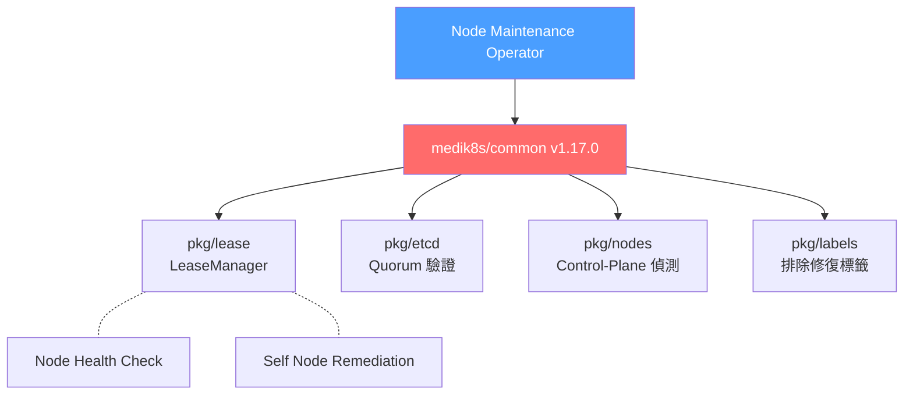
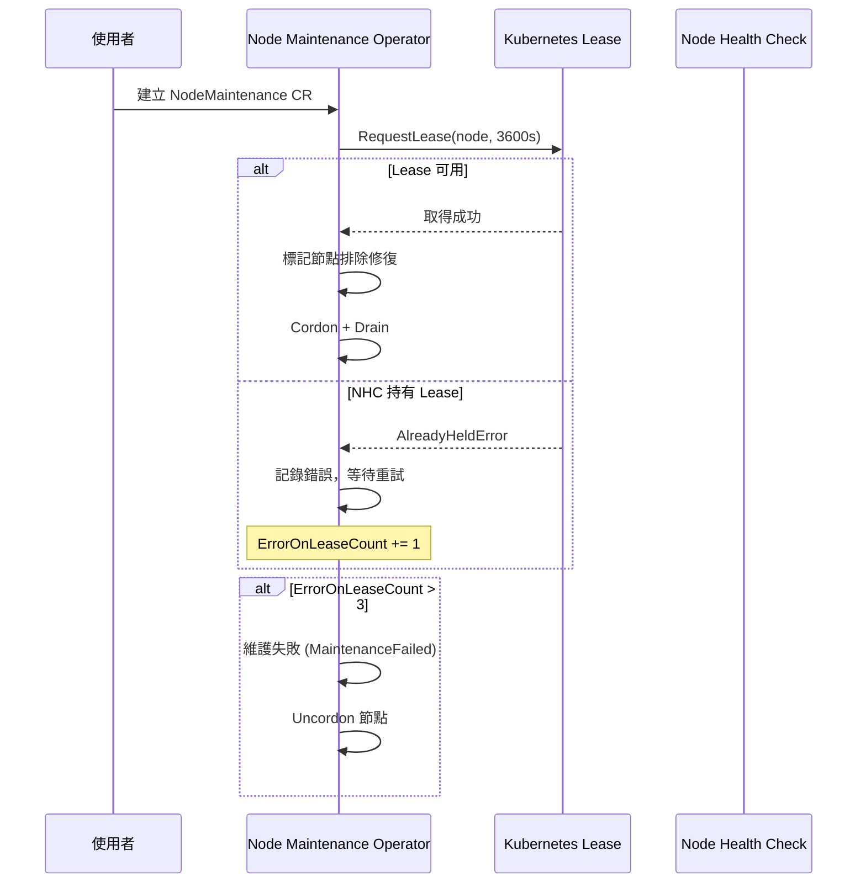
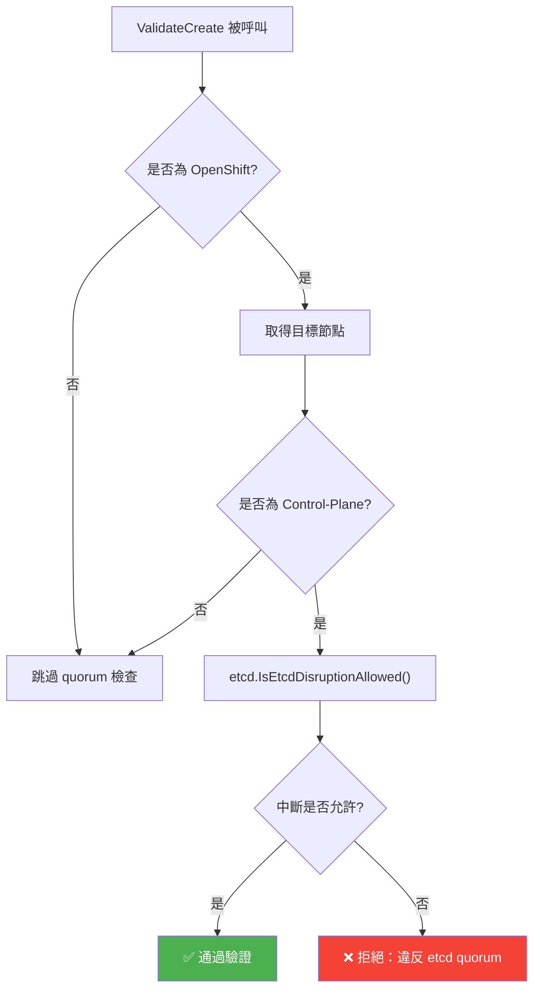
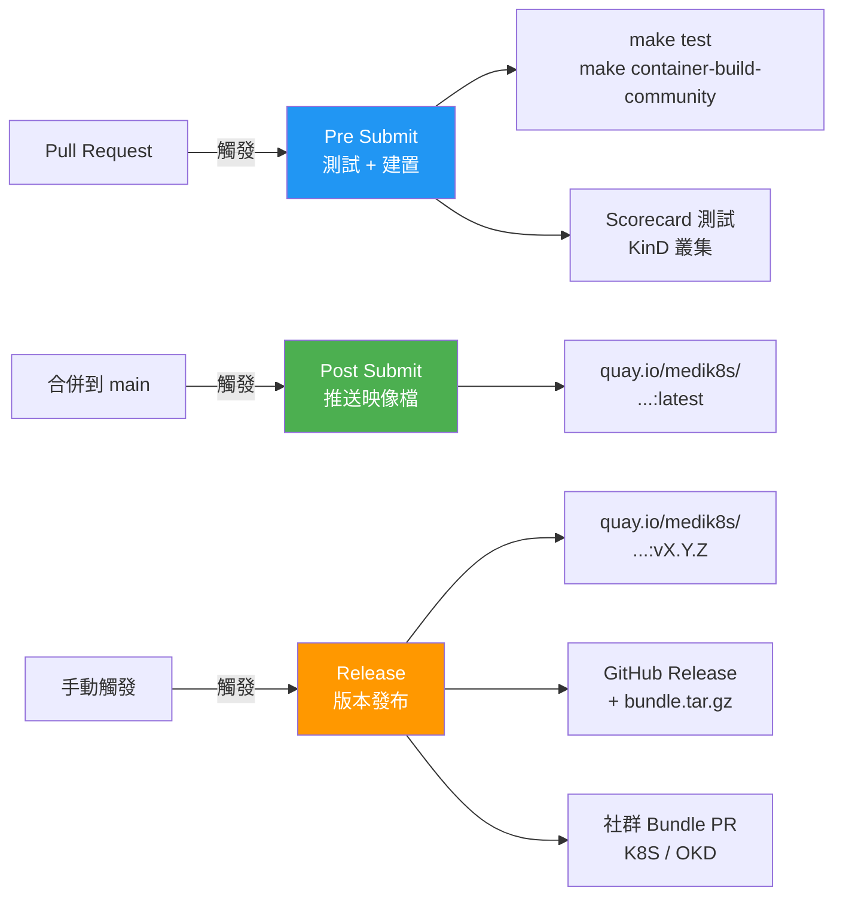
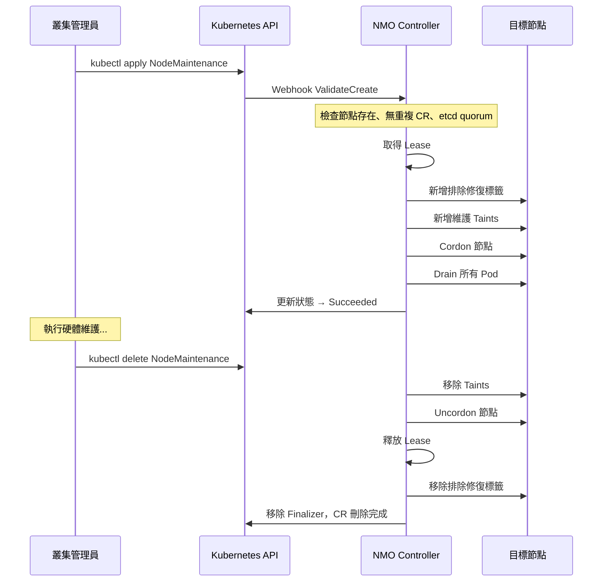

# NMO — 外部整合

::: info 相關章節
- 系統整體架構請參閱 [系統架構](./architecture)
- Reconcile 與 Drain 核心邏輯請參閱 [核心功能分析](./core-features)
- CRD 定義與 Webhook 驗證請參閱 [控制器與 API](./controllers-api)
:::

本章分析 Node Maintenance Operator (NMO) 如何與 KubeVirt、medik8s 生態系、OpenShift、OLM 及 CI/CD 流程進行整合，並提供實際使用範例。

## KubeVirt 整合

::: info 原始碼路徑
`controllers/nodemaintenance_controller.go` — `createDrainer` 函式
:::

NMO 的 drain 邏輯是針對 KubeVirt 虛擬機工作負載量身打造的。當建立 `drain.Helper` 時，三個關鍵旗標專為 VirtualMachineInstance (VMI) Pod 設計：

```go
func createDrainer(ctx context.Context, mgrConfig *rest.Config) (*drain.Helper, error) {
    drainer := &drain.Helper{}

    // VMI Pod 不受 ReplicaSet 或 DaemonSet 管理，必須強制處理
    drainer.Force = true

    // VMI Pod 使用 emptyDir 儲存臨時資料，終止後可安全刪除
    drainer.DeleteEmptyDirData = true

    // 忽略 DaemonSet 管理的 Pod（如 virt-handler）
    drainer.IgnoreAllDaemonSets = true

    drainer.GracePeriodSeconds = -1    // 使用 Pod 預設終止寬限期
    drainer.Timeout = DrainerTimeout   // 30 秒逾時
    // ...
}
```

### Drain 參數對照表

| 參數 | 值 | 與 KubeVirt 的關聯 |
|------|------|---------------------|
| `Force` | `true` | VMI Pod 不受 ReplicaSet/DaemonSet 擁有，drain 無法保證替換排程，但 medik8s 自有控制器會處理 VMI 重新調度 |
| `DeleteEmptyDirData` | `true` | VMI Pod 使用 `emptyDir` 存放臨時虛擬機資料，終止後可安全刪除 |
| `IgnoreAllDaemonSets` | `true` | 每個運行 VMI 的節點同時運行 `virt-handler` DaemonSet，drain 時需跳過 |
| `GracePeriodSeconds` | `-1` | 使用 Pod 自身定義的終止寬限期，讓 VMI 有足夠時間進行 live migration |
| `Timeout` | `30s` | 單次 drain 嘗試逾時，失敗後 5 秒重試 |

### Pod 驅逐回呼

drain 完成時會記錄每個 Pod 的驅逐狀態：

```go
drainer.OnPodDeletedOrEvicted = func(pod *corev1.Pod, usingEviction bool) {
    var verbString string
    if usingEviction {
        verbString = "Evicted"
    } else {
        verbString = "Deleted"
    }
    msg := fmt.Sprintf("pod: %s:%s %s from node: %s",
        pod.ObjectMeta.Namespace, pod.ObjectMeta.Name,
        verbString, pod.Spec.NodeName)
    klog.Info(msg)
}
```

### 維護 Taint

::: info 原始碼路徑
`controllers/taint.go`
:::

NMO 在維護期間為節點加上兩個 Taint，防止新的 VMI 被調度到正在維護的節點：

```go
const (
    medik8sDrainTaintKey      = "medik8s.io/drain"
    nodeUnschedulableTaintKey = "node.kubernetes.io/unschedulable"
)

var maintenanceTaints = []corev1.Taint{
    {Key: "node.kubernetes.io/unschedulable", Effect: NoSchedule},
    {Key: "medik8s.io/drain", Effect: NoSchedule},
}
```

::: tip
`medik8s.io/drain` Taint 讓其他 medik8s 元件（如 Self Node Remediation）可以辨識節點正處於排空狀態，避免重複操作。
:::

## medik8s 生態系整合

::: info 原始碼路徑
`go.mod` — 依賴版本 `github.com/medik8s/common v1.17.0`
:::

NMO 使用 `medik8s/common` 共享函式庫的四個子套件，實現跨 medik8s 專案的一致行為：



### pkg/lease — LeaseManager

LeaseManager 透過 Kubernetes Lease 物件實現分散式協調，確保同一時間只有一個 medik8s 元件能對特定節點進行操作。

**初始化（main.go）：**

```go
type leaseManagerInitializer struct {
    cl client.Client
    lease.Manager
}

func (ls *leaseManagerInitializer) Start(context.Context) error {
    var err error
    ls.Manager, err = lease.NewManager(ls.cl, controllers.LeaseHolderIdentity)
    return err
}
```

**Reconcile 中請求 Lease（controllers/nodemaintenance_controller.go）：**

```go
err = r.LeaseManager.RequestLease(ctx, node, LeaseDuration)
if err != nil {
    var alreadyHeldErr lease.AlreadyHeldError
    if errors.As(err, &alreadyHeldErr) {
        r.logger.Error(err, "lease is held by another entity")
        // NHC 或其他 medik8s 元件持有 Lease，NMO 退讓
        return r.onReconcileError(ctx, nm, drainer, ...)
    }
}
```

**停止維護時釋放 Lease：**

```go
if err := r.LeaseManager.InvalidateLease(ctx, node); err != nil {
    var alreadyHeldErr lease.AlreadyHeldError
    if errors.As(err, &alreadyHeldErr) {
        // Lease 已被其他實體持有（如 NHC），跳過釋放
        r.logger.Info("lease is held by another entity, then skipping invalidation when stopping node maintenance")
    } else {
        return err
    }
}
```

### pkg/etcd — Quorum 驗證

::: info 原始碼路徑
`api/v1beta1/nodemaintenance_webhook.go`
:::

在 Webhook 驗證階段，針對 OpenShift 叢集的 control-plane 節點檢查 etcd 仲裁：

```go
import "github.com/medik8s/common/pkg/etcd"

isDisruptionAllowed, err := etcd.IsEtcdDisruptionAllowed(
    context.Background(), v.client, nodemaintenancelog, node,
)
if !isDisruptionAllowed {
    return fmt.Errorf(ErrorControlPlaneQuorumViolation, nodeName)
}
```

### pkg/nodes — Control-Plane 偵測

同樣在 Webhook 中使用，判斷目標節點是否為 control-plane 節點：

```go
import "github.com/medik8s/common/pkg/nodes"

if !nodes.IsControlPlane(node) {
    // 非 control-plane 節點，無需檢查 etcd quorum
    return nil
}
```

### pkg/labels — 排除修復標籤

::: info 原始碼路徑
`controllers/nodemaintenance_controller.go`
:::

維護開始時為節點新增 `remediation.medik8s.io/exclude-from-remediation` 標籤，防止 NHC/SNR 在維護期間對該節點發起修復：

```go
import commonLabels "github.com/medik8s/common/pkg/labels"

func addExcludeRemediationLabel(ctx context.Context, node *corev1.Node,
    r client.Client, log logr.Logger) error {
    if node.Labels[commonLabels.ExcludeFromRemediation] != "true" {
        patch := client.MergeFrom(node.DeepCopy())
        node.Labels[commonLabels.ExcludeFromRemediation] = "true"
        if err := r.Patch(ctx, node, patch); err != nil {
            return err
        }
    }
    return nil
}
```

維護結束時移除標籤：

```go
func removeExcludeRemediationLabel(ctx context.Context, node *corev1.Node,
    r client.Client, log logr.Logger) error {
    if node.Labels[commonLabels.ExcludeFromRemediation] == "true" {
        patch := client.MergeFrom(node.DeepCopy())
        delete(node.Labels, commonLabels.ExcludeFromRemediation)
        return r.Patch(ctx, node, patch)
    }
    return nil
}
```

### 四大套件整合對照

| 套件 | 使用位置 | 功能 |
|------|----------|------|
| `pkg/lease` | Controller Reconcile、main.go 初始化 | 分散式 Lease 協調，防止 NMO 與 NHC 衝突 |
| `pkg/etcd` | Webhook ValidateCreate | 檢查 etcd quorum，防止 control-plane 節點維護導致叢集不可用 |
| `pkg/nodes` | Webhook ValidateCreate | 判斷節點是否為 control-plane，決定是否執行 quorum 檢查 |
| `pkg/labels` | Controller Reconcile（開始/結束維護） | 新增/移除排除修復標籤，協調 NHC 行為 |

## Node Health Check (NHC) 協調

NMO 與 Node Health Check Operator 透過 Kubernetes Lease 物件實現 **互斥協調**，確保不會同時對同一節點進行維護和自動修復。

### Lease 配置

```go
const (
    LeaseHolderIdentity = "node-maintenance"  // NMO 的 Lease 持有者身份
    LeaseDuration       = 3600 * time.Second  // Lease 有效期 1 小時
)
```

::: warning
NHC 使用不同的 `LeaseHolderIdentity`。當 NHC 已持有某節點的 Lease 時，NMO 嘗試建立 `NodeMaintenance` 會收到 `AlreadyHeldError`，維護操作將被推遲。
:::

### 協調流程



### 錯誤處理機制

控制器追蹤連續 Lease 錯誤次數，超過上限後自動失敗：

```go
const maxAllowedErrorToUpdateOwnedLease = 3

if nm.Status.ErrorOnLeaseCount > maxAllowedErrorToUpdateOwnedLease {
    // Lease 無法延展，維護失敗
    err = r.stopNodeMaintenanceImp(ctx, drainer, node)
    nm.Status.Phase = v1beta1.MaintenanceFailed
    nm.Status.LastError = fmt.Sprintf(
        "maintenance failed: lease could not be extended after %d attempts",
        nm.Status.ErrorOnLeaseCount,
    )
}
```

### 雙向保護

| 情境 | NMO 行為 |
|------|----------|
| NMO 持有 Lease，NHC 嘗試修復 | NHC 取得 `AlreadyHeldError`，NMO 節點帶有 `exclude-from-remediation` 標籤 |
| NHC 持有 Lease，使用者建立 NodeMaintenance | NMO 取得 `AlreadyHeldError`，等待重試或最終失敗 |
| NMO 維護結束，釋放 Lease | Lease 歸還，NHC 可正常監控該節點 |
| NMO 停止維護時 Lease 已被 NHC 搶走 | 跳過 `InvalidateLease`，繼續清理流程 |

## OpenShift 整合

### 平台偵測

::: info 原始碼路徑
`pkg/utils/validation.go`
:::

NMO 在啟動時透過 Kubernetes Discovery API 偵測是否運行於 OpenShift 叢集：

```go
func (v *OpenshiftValidator) validateIsOpenshift(config *rest.Config) error {
    dc, err := discovery.NewDiscoveryClientForConfig(config)
    if err != nil {
        return err
    }
    apiGroups, err := dc.ServerGroups()
    if err != nil {
        return err
    }

    kind := schema.GroupVersionKind{
        Group: "config.openshift.io", Version: "v1", Kind: "ClusterVersion",
    }
    for _, apiGroup := range apiGroups.Groups {
        for _, supportedVersion := range apiGroup.Versions {
            if supportedVersion.GroupVersion == kind.GroupVersion().String() {
                v.isOpenshiftSupported = true
                return nil
            }
        }
    }
    return nil
}
```

偵測結果在 `main.go` 中傳遞給 Webhook：

```go
openshiftCheck, err := utils.NewOpenshiftValidator(mgr.GetConfig())
isOpenShift := openshiftCheck.IsOpenshiftSupported()

// 傳遞 OpenShift 狀態給 Webhook
(&nodemaintenancev1beta1.NodeMaintenance{}).SetupWebhookWithManager(isOpenShift, mgr)
```

::: tip
偵測邏輯檢查的是 `config.openshift.io/v1` API Group（ClusterVersion），而非 `oauth.openshift.io`。RBAC 規則中包含 `oauth.openshift.io` 權限是為了確保 Operator 在 OpenShift 環境中有足夠的 API 存取權限。
:::

### etcd Quorum 驗證

::: info 原始碼路徑
`api/v1beta1/nodemaintenance_webhook.go`
:::

在 OpenShift 叢集中，對 control-plane 節點建立 `NodeMaintenance` 時，Webhook 會驗證 etcd quorum 是否允許中斷：

```go
const (
    EtcdQuorumPDBNewName   = "etcd-guard-pdb"    // OCP 4.11+ 的 PDB 名稱
    EtcdQuorumPDBOldName   = "etcd-quorum-guard"  // OCP 4.10 以前的 PDB 名稱
    EtcdQuorumPDBNamespace = "openshift-etcd"
)

func (v *NodeMaintenanceValidator) validateControlPlaneQuorum(nodeName string) error {
    if !v.isOpenShift {
        return nil  // 非 OpenShift 叢集跳過檢查
    }

    node, err := getNode(nodeName, v.client)
    if err != nil {
        return err
    }

    if !nodes.IsControlPlane(node) {
        return nil  // 非 control-plane 節點跳過檢查
    }

    // 檢查 etcd 是否允許中斷
    isDisruptionAllowed, err := etcd.IsEtcdDisruptionAllowed(
        context.Background(), v.client, nodemaintenancelog, node,
    )
    if !isDisruptionAllowed {
        return fmt.Errorf(ErrorControlPlaneQuorumViolation, nodeName)
    }
    return nil
}
```

### 驗證流程



::: warning
etcd quorum 驗證仰賴 `openshift-etcd` namespace 中的 PodDisruptionBudget。OCP 4.11+ 使用 `etcd-guard-pdb`，4.10 及之前使用 `etcd-quorum-guard`。`medik8s/common` 的 `etcd.IsEtcdDisruptionAllowed()` 會自動處理兩種命名。
:::

### OpenShift 專用 RBAC

控制器宣告了 OpenShift 相關的 RBAC 權限：

```go
//+kubebuilder:rbac:groups="oauth.openshift.io",resources=*,verbs=*
//+kubebuilder:rbac:groups="policy",resources=poddisruptionbudgets,verbs=get;list;watch
```

## OLM 整合

::: info 原始碼路徑
`bundle/` 目錄
:::

NMO 遵循 Operator Lifecycle Manager (OLM) 規範打包，支援透過 OperatorHub 安裝。

### Bundle 目錄結構

```
bundle/
├── manifests/
│   ├── node-maintenance-operator.clusterserviceversion.yaml    # CSV 定義
│   ├── nodemaintenance.medik8s.io_nodemaintenances.yaml        # CRD
│   ├── node-maintenance-operator-controller-manager-metrics-service_v1_service.yaml
│   ├── node-maintenance-operator-metrics-reader_rbac.authorization.k8s.io_v1_clusterrole.yaml
│   └── node-maintenance-operator-webhook-service_v1_service.yaml
├── metadata/
│   └── annotations.yaml                                        # Bundle 通道與格式
└── tests/
    └── scorecard/                                               # OLM Scorecard 測試
```

### ClusterServiceVersion 關鍵配置

```yaml
apiVersion: operators.coreos.com/v1alpha1
kind: ClusterServiceVersion
metadata:
  annotations:
    capabilities: Basic Install
    categories: OpenShift Optional
    olm.skipRange: '>=0.12.0'
    operatorframework.io/suggested-namespace: openshift-workload-availability
    repository: https://github.com/medik8s/node-maintenance-operator
    support: Medik8s
  name: node-maintenance-operator.v0.0.1
spec:
  customresourcedefinitions:
    owned:
    - description: NodeMaintenance is the Schema for the nodemaintenances API
      displayName: Node Maintenance
      kind: NodeMaintenance
      name: nodemaintenances.nodemaintenance.medik8s.io
```

### Bundle Metadata

```yaml
# bundle/metadata/annotations.yaml
annotations:
  operators.operatorframework.io.bundle.mediatype.v1: registry+v1
  operators.operatorframework.io.bundle.manifests.v1: manifests/
  operators.operatorframework.io.bundle.metadata.v1: metadata/
  operators.operatorframework.io.bundle.package.v1: node-maintenance-operator
  operators.operatorframework.io.bundle.channels.v1: stable
  operators.operatorframework.io.bundle.channel.default.v1: stable
  operators.operatorframework.io.metrics.builder: operator-sdk-v1.37.0
```

### 部署特性

CSV 中的 Deployment 定義了 NMO 的部署特性：

| 特性 | 設定值 |
|------|--------|
| 映像檔 | `quay.io/medik8s/node-maintenance-operator:latest` |
| 副本數 | 1 |
| Priority Class | `system-cluster-critical` |
| Security Context | `runAsNonRoot: true`, `readOnlyRootFilesystem: true` |
| CPU 限制 | 100m request / 200m limit |
| Memory 限制 | 20Mi request / 100Mi limit |
| Node Affinity | 偏好 control-plane 節點 |
| Tolerations | `master`、`control-plane`、`infra` 節點 |
| Webhook Port | 9443 |
| Health Probe | `:8081/healthz`、`:8081/readyz` |

### 訂閱模型

透過 OLM Subscription 安裝：

```yaml
apiVersion: operators.coreos.com/v1alpha1
kind: Subscription
metadata:
  name: node-maintenance-operator
  namespace: openshift-workload-availability
spec:
  channel: stable
  name: node-maintenance-operator
  source: redhat-operators        # OpenShift 使用 redhat-operators
  sourceNamespace: openshift-marketplace
  installPlanApproval: Automatic
```

::: tip
`olm.skipRange: '>=0.12.0'` 允許從 0.12.0 以後的任何版本直接升級到當前版本，無需逐版升級。
:::

## CI/CD 整合

::: info 原始碼路徑
`.github/workflows/`
:::

NMO 使用 GitHub Actions 實現三階段 CI/CD 流程：



### Pre Submit（pre-submit.yaml）

**觸發條件：** push 到 `main`/`release-*` 分支，或對這些分支發起 Pull Request。

**Job 1：build**

```yaml
jobs:
  build:
    runs-on: ubuntu-22.04
    steps:
    - uses: actions/checkout@v6
      with:
        fetch-depth: 0
    - uses: actions/setup-go@v6
      with:
        go-version-file: go.mod
    - run: make test                         # 靜態檢查 + 單元測試
    - run: make container-build-community    # 建置容器映像檔
```

**Job 2：scorecard-k8s**

在 KinD (Kubernetes in Docker) 叢集上執行 OLM Scorecard 測試：

```yaml
scorecard-k8s:
  runs-on: ubuntu-22.04
  env:
    KIND_VERSION: v0.22.0
    K8S_VERSION: v1.27.11
    NMO_VERSION: 0.18.0
    NMO_PREVIOUS_VERSION: 0.17.0
  steps:
    - uses: container-tools/kind-action@v2    # 建立 KinD 叢集
    - run: PREVIOUS_VERSION=${{env.NMO_PREVIOUS_VERSION}} VERSION=${{env.NMO_VERSION}} make bundle-community
    - run: OPERATOR_NAMESPACE=default make test-scorecard
```

### Post Submit（post-submit.yaml）

**觸發條件：** push 到 `main` 分支。

```yaml
push_to_registry:
  runs-on: ubuntu-22.04
  steps:
    - uses: docker/login-action@v3
      with:
        registry: quay.io
        username: ${{ secrets.QUAY_USERNAME }}
        password: ${{ secrets.QUAY_PASSWORD }}
    - run: export IMAGE_REGISTRY=quay.io/medik8s && make container-build-and-push-community
```

推送未版本化的 `latest` 映像檔到 `quay.io/medik8s/`。

### Release（release.yaml）

**觸發條件：** 手動 `workflow_dispatch`，支援三種操作：

| 操作 | 說明 |
|------|------|
| `build_and_push_images` | 建置並推送版本化映像檔，建立 GitHub Release |
| `create_k8s_release_pr` | 向 K8S 社群 operator 目錄發起 PR |
| `create_okd_release_pr` | 向 OKD 社群 operator 目錄發起 PR |

**版本發布時產生的映像檔：**

```bash
# Operator 映像檔
quay.io/medik8s/node-maintenance-operator:v${VERSION}
# OLM Bundle 映像檔
quay.io/medik8s/node-maintenance-operator-bundle:v${VERSION}
# Catalog 索引映像檔
quay.io/medik8s/node-maintenance-operator-catalog:v${VERSION}
```

社群 Bundle PR 使用 `medik8s/.github` 共享 workflow：

```yaml
create_k8s_release_pr:
  uses: medik8s/.github/.github/workflows/release_community_bundle.yaml@main
  with:
    version: ${{ inputs.version }}
    previous_version: ${{ inputs.previous_version }}
    community: 'K8S'
    make_targets: "bundle-community-k8s"
```

## 使用範例

### 建立 NodeMaintenance

::: info 原始碼路徑
`config/samples/nodemaintenance_v1beta1_nodemaintenance.yaml`
:::

```yaml
apiVersion: nodemaintenance.medik8s.io/v1beta1
kind: NodeMaintenance
metadata:
  name: nodemaintenance-sample
spec:
  nodeName: node02
  reason: "Test node maintenance"
```

```bash
# 查看可用節點
kubectl get nodes

# 建立維護請求
kubectl apply -f config/samples/nodemaintenance_v1beta1_nodemaintenance.yaml

# 或直接指定節點名稱建立
cat <<EOF | kubectl apply -f -
apiVersion: nodemaintenance.medik8s.io/v1beta1
kind: NodeMaintenance
metadata:
  name: maintain-worker-1
spec:
  nodeName: worker-1
  reason: "硬體升級 — 更換記憶體模組"
EOF
```

### 監控維護狀態

```bash
# 查看維護狀態
kubectl get nodemaintenance

# 查看詳細狀態（包含 drain 進度、pending pods）
kubectl get nodemaintenance maintain-worker-1 -o yaml

# 監看狀態變化
kubectl get nodemaintenance -w
```

維護狀態轉換：

```
建立 CR → Running → Succeeded（所有 Pod 已驅逐）
                  → Failed（Lease 失敗或其他錯誤）
```

### 結束維護

刪除 `NodeMaintenance` CR 即可結束維護，控制器會自動：

1. 移除 `medik8s.io/drain` 和 `node.kubernetes.io/unschedulable` Taint
2. Uncordon 節點
3. 釋放 Lease
4. 移除 `exclude-from-remediation` 標籤

```bash
# 結束維護
kubectl delete nodemaintenance maintain-worker-1

# 驗證節點已恢復排程
kubectl get node worker-1
```

### 完整維護工作流程



::: warning
在 OpenShift 上對 control-plane 節點建立 `NodeMaintenance` 時，如果 etcd quorum 不允許中斷，Webhook 會直接拒絕該請求。請確保叢集中有足夠的健康 control-plane 節點。
:::
