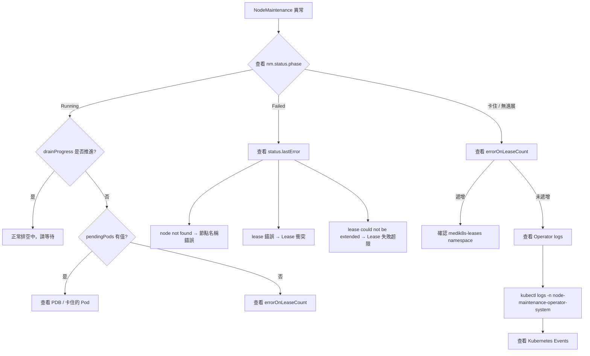

# Node Maintenance Operator — 故障排除指南

**適用對象**：Operators、SREs

---

## 1. 快速診斷流程



---

## 2. 常見失敗模式

### 2.1 節點不存在（Node Not Found）

- **症狀**：`phase=Failed`，`lastError` 含 `"node not found"`
- **原因**：`spec.nodeName` 填錯，或節點已被刪除
- **處理**：刪除 NodeMaintenance CR，確認節點名稱後重建

```bash
kubectl get nodes
kubectl delete nm <name>
# 確認正確節點名稱後重建
```

---

### 2.2 重複維護（Duplicate NodeMaintenance）

- **症狀**：Webhook 拒絕 CREATE，錯誤 `"a NodeMaintenance for node X already exists"`
- **原因**：同節點已有維護請求
- **處理**：確認現有請求，刪除舊請求後重建

```bash
kubectl get nm
kubectl delete nm <existing-name>
```

---

### 2.3 Lease 取得失敗（Lease Conflict）

- **症狀**：`errorOnLeaseCount` 遞增，`lastError` 含 `"can't update or invalidate the lease"`
- **原因**：另一個 medik8s operator（如 NHC）正在管理該節點
- **處理**：等待另一個 operator 釋放 lease，或手動刪除相關 lease

```bash
# 查看 lease 物件
kubectl get lease -n medik8s-leases
kubectl describe lease node-<nodename> -n medik8s-leases
```

---

### 2.4 Lease 失敗超過上限（ErrorOnLeaseCount > 3）

- **症狀**：`phase=Failed`，`lastError` 含 `"lease could not be extended after N attempts"`
- **原因**：連續 3 次以上無法取得或更新 lease
- **處理**：確認 `medik8s-leases` namespace 存在，並確認 RBAC 允許 leases 操作

```bash
kubectl get namespace medik8s-leases
kubectl auth can-i update leases -n medik8s-leases \
  --as=system:serviceaccount:node-maintenance-operator-system:node-maintenance-operator-controller-manager
```

---

### 2.5 Pod 驅逐卡住

- **症狀**：`drainProgress` 不變，`pendingPods` 有值
- **原因**：PodDisruptionBudget 阻止驅逐，或 Pod 卡在 `Terminating` 狀態

```bash
# 查看待驅逐的 Pod 狀態
kubectl get pods -n <namespace> <pod-name>

# 查看 PDB 狀態
kubectl get pdb -A
kubectl describe pdb <name> -n <namespace>
```

::: warning 謹慎操作
強制刪除 Pod 可能導致資料遺失，請確認業務影響後再執行。

```bash
# 強制刪除卡住的 Pod（謹慎使用）
kubectl delete pod <pod-name> -n <namespace> --force --grace-period=0
```
:::

---

### 2.6 Webhook 憑證問題

- **症狀**：NodeMaintenance 建立被拒絕，API server 回報 TLS 錯誤
- **原因**：webhook 憑證未正確注入
- **處理**：確認憑證目錄是否存在且有效

```bash
# 確認憑證目錄
kubectl exec -n node-maintenance-operator-system \
  $(kubectl get pod -n node-maintenance-operator-system -l control-plane=controller-manager -o name) \
  -- ls /apiserver.local.config/certificates/
```

---

### 2.7 etcd Quorum 被拒絕（OpenShift）

- **症狀**：Webhook 拒絕，`"can not put master/control-plane node into maintenance at this moment"`
- **原因**：目前 etcd 不允許更多節點中斷
- **處理**：等待其他 etcd 成員恢復正常後再試

```bash
# 確認 etcd 成員健康狀態
kubectl get etcd -o jsonpath='{.items[*].status.conditions}' 2>/dev/null || \
  kubectl -n openshift-etcd get pods -l app=etcd
```

---

## 3. 查看 Operator 日誌

```bash
# 即時日誌
kubectl logs -n node-maintenance-operator-system \
  -l control-plane=controller-manager -f

# 查看特定維護相關日誌
kubectl logs -n node-maintenance-operator-system \
  -l control-plane=controller-manager | grep -i "maintenance\|lease\|drain"
```

---

## 4. 查看 Kubernetes Events

```bash
# 查看 NodeMaintenance 相關事件
kubectl get events --field-selector reason=BeginMaintenance
kubectl get events --field-selector reason=FailedMaintenance
kubectl get events --field-selector reason=SucceedMaintenance

# 查看特定 CR 的事件
kubectl describe nm <name>
```

### Event 類型說明

| Reason | Type | 觸發時機 |
|--------|------|----------|
| `BeginMaintenance` | Normal | 新增 finalizer 時 |
| `SucceedMaintenance` | Normal | 排空完成時 |
| `UncordonNode` | Normal | 恢復節點時 |
| `RemovedMaintenance` | Normal | 刪除 finalizer 時 |
| `FailedMaintenance` | Warning | 維護失敗時 |

---

## 5. must-gather 收集

使用 must-gather 收集診斷資料，適用於 OpenShift 環境。

```bash
# 檔案: must-gather/collection-scripts/gather

# OpenShift 使用 must-gather
oc adm must-gather \
  --image=quay.io/medik8s/node-maintenance-must-gather:latest
```

收集的資料包含：

- 所有 Node 物件
- NodeMaintenance CRD 定義
- Operator pod 日誌
- 所有 NodeMaintenance CR
- 叢集資源使用量（CPU / Memory）

---

## 6. 手動清理維護狀態（緊急）

當 operator 無回應且節點卡在 cordoned 狀態時，可手動清理。

::: warning 緊急操作
以下操作會繞過 operator 的狀態管理，請確認 operator 確實無法恢復後再執行，避免造成狀態不一致。
:::

```bash
# 手動 uncordon
kubectl uncordon <node-name>

# 手動移除 NMO taints
kubectl taint node <node-name> medik8s.io/drain:NoSchedule-
kubectl taint node <node-name> node.kubernetes.io/unschedulable:NoSchedule-

# 移除 label
kubectl label node <node-name> medik8s.io/exclude-from-remediation-

# 刪除 NodeMaintenance CR（可能需要先移除 finalizer）
kubectl patch nm <name> -p '{"metadata":{"finalizers":[]}}' --type=merge
kubectl delete nm <name>
```

---

::: info 相關章節
- [Lease-Based Coordination](./lease-based-coordination) — 了解 operator 間 lease 協調機制
- [Node Drainage Process](./node-drainage-process) — 排空流程詳解與 PDB 互動
- [Event Recording and Observability](./event-recording-and-observability) — Kubernetes Events 與監控整合
:::
