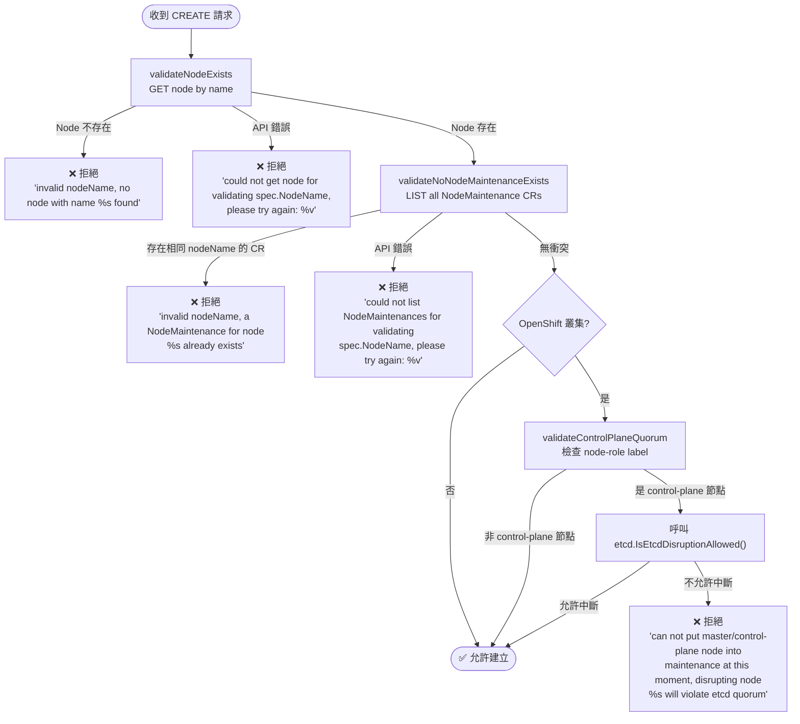

# Node Maintenance Operator — Admission Validation Webhook

**章節**: 核心功能 ｜ **對象**: Operators、平台工程師

---

## Webhook 基本資訊

Node Maintenance Operator 僅實作 **ValidatingWebhook**，不含 MutatingWebhook。所有 `NodeMaintenance` 資源在建立與更新時都必須通過此 Webhook 的驗證才能寫入叢集。

| 屬性 | 值 |
|---|---|
| 類型 | `ValidatingWebhookConfiguration` |
| Path | `/validate-nodemaintenance-medik8s-io-v1beta1-nodemaintenance` |
| 操作 | `CREATE`, `UPDATE` |
| failurePolicy | `Fail`（嚴格模式） |
| Timeout | 15 秒 |
| Port | 9443 |

::: warning failurePolicy: Fail
Webhook 若無法連線或逾時，**所有** NodeMaintenance 的建立與更新請求都將被拒絕。請確保 Webhook Server（Operator Pod）保持健康。
:::

---

## ValidateCreate 檢查流程

收到 `CREATE` 請求後，Webhook 依序執行以下三項驗證：



### 步驟 1 — validateNodeExists

透過 `GET` 取得指定名稱的 Node 物件，確認節點真實存在於叢集中。

- **找不到節點** → 以 `ErrorNodeNotExists` 拒絕請求
- **API 錯誤** → 以暫時性錯誤訊息拒絕，提示使用者重試

### 步驟 2 — validateNoNodeMaintenanceExists

`LIST` 叢集中所有 `NodeMaintenance` CR，檢查是否已有相同 `spec.nodeName` 的資源存在。

- **已有重複資源** → 以 `ErrorNodeMaintenanceExists` 拒絕請求
- **API 錯誤** → 以暫時性錯誤訊息拒絕，提示使用者重試

### 步驟 3 — validateControlPlaneQuorum（僅 OpenShift）

::: tip 此步驟只在 OpenShift 叢集執行
詳細偵測邏輯請參閱下方「[OpenShift 感知邏輯](#openshift-感知邏輯)」章節。
:::

若目標節點帶有以下任一 label，視為 control-plane 節點：
- `node-role.kubernetes.io/master`
- `node-role.kubernetes.io/control-plane`

接著呼叫 `etcd.IsEtcdDisruptionAllowed()` 判斷此時對該節點進行維護是否會破壞 etcd quorum。若不允許，以 `ErrorControlPlaneQuorumViolation` 拒絕請求。

---

## ValidateUpdate 限制

收到 `UPDATE` 請求時，Webhook **只檢查一項限制**：`spec.nodeName` 欄位不可變更。

```go
// 檔案: api/v1beta1/nodemaintenance_webhook.go
const ErrorNodeNameUpdateForbidden = "updating spec.NodeName isn't allowed"
```

若偵測到 `spec.nodeName` 與原始值不同，立即以 `ErrorNodeNameUpdateForbidden` 拒絕請求。其餘欄位（例如 `spec.reason`）允許更新。

---

## ValidateDelete

`DELETE` 操作**不執行任何驗證**，永遠允許刪除 `NodeMaintenance` 資源。

---

## 錯誤訊息常數（完整清單）

```go
// 檔案: api/v1beta1/nodemaintenance_webhook.go
const (
    ErrorNodeNotExists               = "invalid nodeName, no node with name %s found"
    ErrorNodeMaintenanceExists       = "invalid nodeName, a NodeMaintenance for node %s already exists"
    ErrorControlPlaneQuorumViolation = "can not put master/control-plane node into maintenance at this moment, disrupting node %s will violate etcd quorum"
    ErrorNodeNameUpdateForbidden     = "updating spec.NodeName isn't allowed"
)
```

---

## OpenShift 感知邏輯

Operator 在啟動時透過 Discovery API 自動偵測當前叢集類型，偵測流程如下：

1. 建立 `Discovery` client
2. 呼叫 `ServerGroups()` 取得所有 API Group
3. 搜尋包含 `config.openshift.io` 群組且具備 `ClusterVersion` kind 的項目
4. 若找到 → 設定 `isOpenshiftSupported = true`

```go
// 檔案: pkg/utils/validation.go
// 偵測 OpenShift 並設定旗標，後續 validateControlPlaneQuorum 依此決定是否執行
```

---

## etcd Quorum 保護（OpenShift 限定）

使用 `github.com/medik8s/common/pkg/etcd` 套件：

```go
// 檔案: pkg/utils/validation.go
IsEtcdDisruptionAllowed(ctx, cl, log, node) (bool, error)
```

判斷邏輯：
- 查詢 `openshift-etcd` namespace 中的 PodDisruptionBudget（PDB）
- 若 `pdb.Status.DisruptionsAllowed >= 1`，表示允許中斷 → 返回 `true`
- 若目標節點上已有被中斷的 etcd Pod，視為「已中斷狀態」→ 返回 `true`（避免重複阻擋）
- 否則返回 `false`，Webhook 以 `ErrorControlPlaneQuorumViolation` 拒絕請求

::: warning 此保護機制只在 OpenShift 生效
Kubernetes 原生叢集不會執行 etcd quorum 檢查，可以對 control-plane 節點進行維護，但需自行確保叢集穩定性。
:::

---

## Webhook 憑證設定

Webhook Server 需要 TLS 憑證才能正常運作，支援兩種方式：

### 方式一：OLM 注入（預設）

透過 Operator Lifecycle Manager（OLM）自動注入憑證，路徑為：

- 憑證：`/apiserver.local.config/certificates/apiserver.crt`
- 私鑰：`/apiserver.local.config/certificates/apiserver.key`

此為預設方式，在透過 OLM 安裝時無需額外設定。

### 方式二：cert-manager

若環境中已部署 cert-manager，可解除 `config/default/kustomization.yaml` 中的相關註解以啟用 cert-manager 管理憑證。

```yaml
// 檔案: config/default/kustomization.yaml
# 解除以下區塊的註解以啟用 cert-manager 憑證管理
# - ../certmanager
# - path: webhookcainjection_patch.yaml
```

---

## 測試 Webhook

以下範例可用於驗證 Webhook 是否正常運作：

```bash
# 測試節點不存在
kubectl apply -f - <<EOF
apiVersion: nodemaintenance.medik8s.io/v1beta1
kind: NodeMaintenance
metadata:
  name: test-invalid
spec:
  nodeName: non-existent-node
  reason: "test"
EOF
# 預期輸出: invalid nodeName, no node with name non-existent-node found
```

```bash
# 測試重複維護
# 步驟 1：先建立第一個維護請求（假設節點 worker-1 存在）
kubectl apply -f - <<EOF
apiVersion: nodemaintenance.medik8s.io/v1beta1
kind: NodeMaintenance
metadata:
  name: maintenance-worker-1
spec:
  nodeName: worker-1
  reason: "first maintenance"
EOF

# 步驟 2：再嘗試對相同節點建立第二個維護請求
kubectl apply -f - <<EOF
apiVersion: nodemaintenance.medik8s.io/v1beta1
kind: NodeMaintenance
metadata:
  name: maintenance-worker-1-duplicate
spec:
  nodeName: worker-1
  reason: "duplicate maintenance"
EOF
# 預期輸出: invalid nodeName, a NodeMaintenance for node worker-1 already exists
```

::: tip 查看 Webhook 日誌
```bash
kubectl logs -n node-maintenance-operator-system \
  deployment/node-maintenance-operator-controller-manager \
  -c manager | grep -i webhook
```
:::

---

::: info 相關章節
- [CRD 規格說明](./crd-specification) — `NodeMaintenance` 資源的完整欄位定義
- [Lease-Based Coordination](./lease-based-coordination) — 多副本 Operator 的協調機制
- [安裝與部署](./installation-and-deployment) — Operator 部署方式與憑證設定
:::
