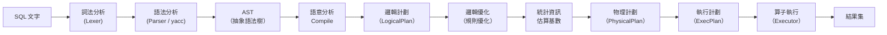
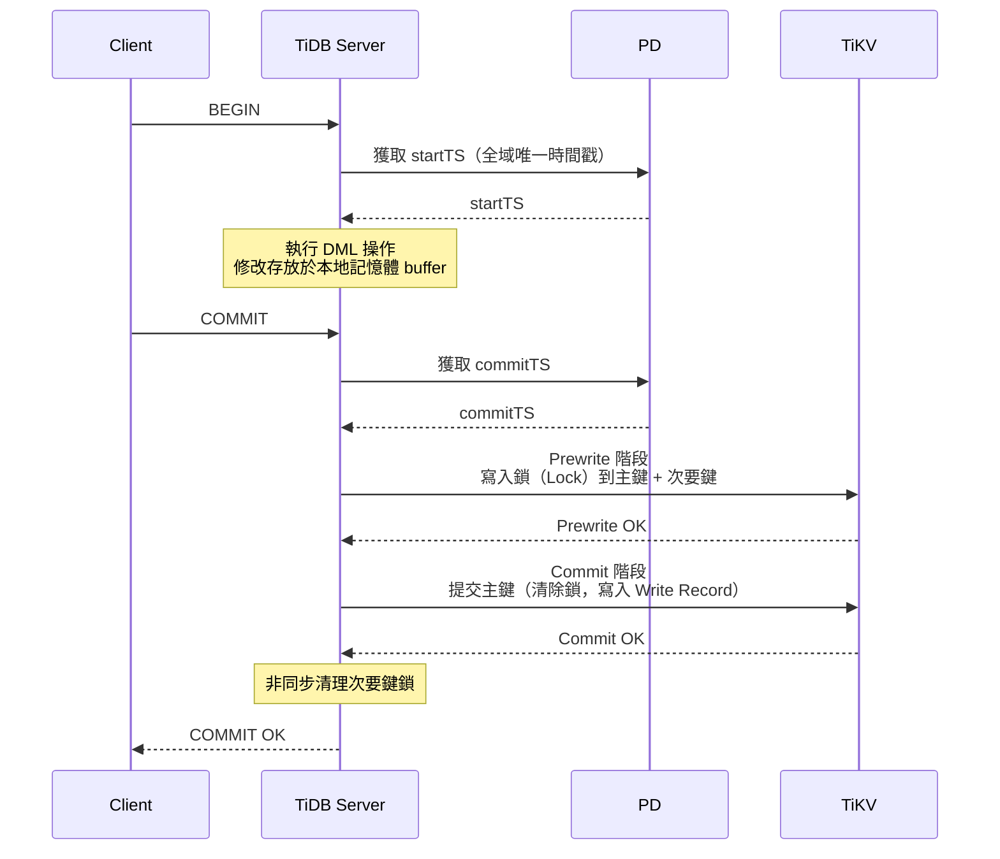
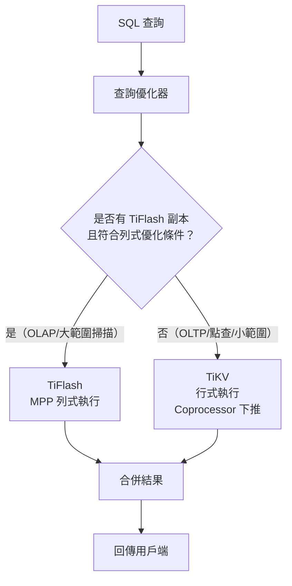
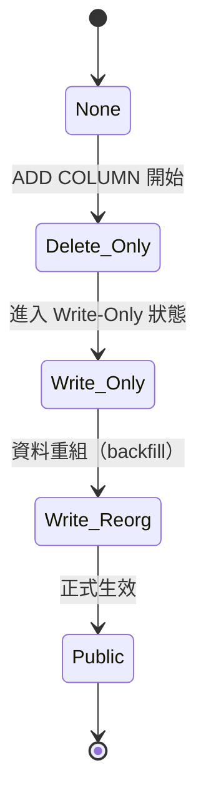

# TiDB — 核心功能分析

::: tip 分析版本
本文件基於 commit [`6f4dd4fd`](https://github.com/pingcap/tidb/commit/6f4dd4fdab3774e5d7355039df79112dbe59cc6e) 進行分析。
:::

::: info 相關章節
- 專案簡介與總覽請參閱 [專案總覽](./index)
- 系統元件與目錄結構請參閱 [系統架構](./architecture)
- HTTP API 與 Session 管理請參閱 [控制器與 API](./controllers-api)
- 備份、匯入與外部整合請參閱 [外部整合](./integration)
:::

## SQL 解析與執行流程

TiDB 採用多階段管線處理每一條 SQL 語句：



### SQL 解析器（`pkg/parser`）

TiDB 擁有自己的 SQL 解析器，不依賴 MySQL 原始碼：

- 採用 `goyacc` 生成的 LALR(1) 解析器
- 支援 MySQL 8.0 語法，含 Window Function、CTE（Common Table Expression）、JSON 函數等
- 產生 AST（Abstract Syntax Tree），各節點定義於 `pkg/parser/ast/` 目錄
- 內建 `format` 套件可將 AST 序列化回 SQL 文字（用於 Binding 等功能）

### 查詢優化器（`pkg/planner`）

| 子套件 | 功能 |
|--------|------|
| `pkg/planner/core` | 核心優化規則（謂詞下推、連接重排、索引選擇） |
| `pkg/planner/cardinality` | 基數估算，驅動物理計劃選擇 |
| `pkg/planner/cascades` | Cascades 優化框架（實驗性） |
| `pkg/planner/memo` | Memo 結構，記錄等價邏輯表達式 |
| `pkg/planner/funcdep` | 函數依賴（Functional Dependency）分析 |
| `pkg/planner/indexadvisor` | 索引建議功能 |
| `pkg/planner/util` | 優化器通用工具函式 |

優化器依次執行以下步驟：

1. **邏輯優化**：套用規則優化（謂詞下推、列裁剪、子查詢展開等）
2. **基數估算**：利用統計資訊估算每個算子的輸出行數
3. **物理計劃生成**：依據代價模型選擇最佳存取路徑（IndexScan vs TableScan）
4. **執行計劃建立**：生成可執行的 Executor 樹

## 分散式交易機制

TiDB 基於 Google **Percolator** 論文實作的 2PC（Two-Phase Commit）分散式交易：



### MVCC（多版本並行控制）

| 概念 | 說明 |
|------|------|
| **startTS** | 事務開始時間戳，作為讀取快照版本 |
| **commitTS** | 事務提交時間戳，作為資料寫入版本 |
| **Lock** | Prewrite 階段寫入的悲觀/樂觀鎖 |
| **Write Record** | 提交後的版本記錄，指向對應的 Value |
| **Default CF** | TiKV 中存放實際資料值的 Column Family |
| **Write CF** | 存放版本提交記錄與鎖資訊的 Column Family |
| **Lock CF** | 存放 Percolator 鎖的 Column Family |

TiDB 支援**樂觀交易**（Optimistic）與**悲觀交易**（Pessimistic）兩種模式，預設為悲觀交易（與 MySQL 行為相符）。

## HTAP 查詢路由



TiDB 優化器根據以下條件自動選擇路由：

- 查詢涉及大量資料掃描（全表掃描、聚合）→ 優先選擇 TiFlash MPP
- 點查或索引查詢 → 優先選擇 TiKV Coprocessor
- 可透過 `SET SESSION tidb_isolation_read_engines` 強制指定引擎
- 可使用 `/*+ READ_FROM_STORAGE(TIFLASH[t]) */` Hint 強制使用 TiFlash

## DDL 非同步機制

TiDB 實作了 **Online DDL**（線上 Schema 變更），核心邏輯位於 `pkg/ddl/`：



| 機制 | 說明 |
|------|------|
| **多版本 Schema** | 同一時間允許多個 TiDB Server 使用不同版本的 Schema |
| **DDL Owner 選舉** | 叢集中只有一個 TiDB Server 作為 DDL Owner，負責執行 DDL 任務 |
| **非同步 Backfill** | 新增索引時，通過分散式任務框架對現有資料進行索引填充 |
| **Multi-Schema Change** | 支援單一 DDL 語句同時修改多個欄位（減少版本切換次數） |
| **Distributed DDL** | TiDB 7.x 起支援分散式 DDL，多個 TiDB Server 同時協助 backfill |

## 統計資訊與代價優化器

統計資訊模組位於 `pkg/statistics/`，提供以下資料結構：

| 資料結構 | 說明 | 用途 |
|---------|------|------|
| **Histogram（直方圖）** | 等深直方圖，每個 bucket 記錄範圍與行數 | 範圍查詢基數估算 |
| **TopN** | 記錄出現頻率最高的前 N 個值 | 高頻值精確估算 |
| **CM-Sketch** | Count-Min Sketch 近似頻率統計 | 點查詢基數估算 |
| **Correlation** | 欄位與主鍵的相關性係數 | 估算索引掃描回表代價 |

統計資訊更新機制：

- **自動收集**：`ANALYZE TABLE` 定期執行（`tidb_auto_analyze_ratio` 控制觸發閾值）
- **增量更新**：DML 操作後更新修改行數計數器（`modifyCount`）
- **快速統計**：`ANALYZE` 使用採樣演算法（Bernoulli 採樣），非全表掃描

## TTL（Time-To-Live）資料自動過期

TTL 功能（`pkg/ttl/`）允許為資料表設定過期時間，自動刪除過期資料：

```sql
-- 建立 TTL 資料表，資料 30 天後自動刪除
CREATE TABLE t (
    id INT PRIMARY KEY,
    created_at TIMESTAMP
) TTL = `created_at` + INTERVAL 30 DAY;
```

| 機制 | 說明 |
|------|------|
| **掃描任務** | TTL Worker 定期掃描過期資料，拆分為多個小批次任務 |
| **分散式刪除** | 多個 TiDB Server 協同執行刪除，避免單點壓力 |
| **不阻塞 DML** | 刪除操作以低優先級執行，不影響線上交易 |

## Resource Group 資源管控

Resource Group（`pkg/resourcegroup/`）為 TiDB 7.x 引入的多租戶資源隔離功能：

```sql
-- 建立 Resource Group，限制 RU（Request Unit）消耗
CREATE RESOURCE GROUP app_group RU_PER_SEC = 3000;

-- 設定 Session 使用指定 Resource Group
SET RESOURCE GROUP app_group;
```

- 以 **RU（Request Unit）** 為統一資源計量單位
- 支援讀寫 RU 限速（Rate Limiter）與優先級排程
- 可對 TiKV / TiFlash 的 CPU、I/O 進行細粒度管控
