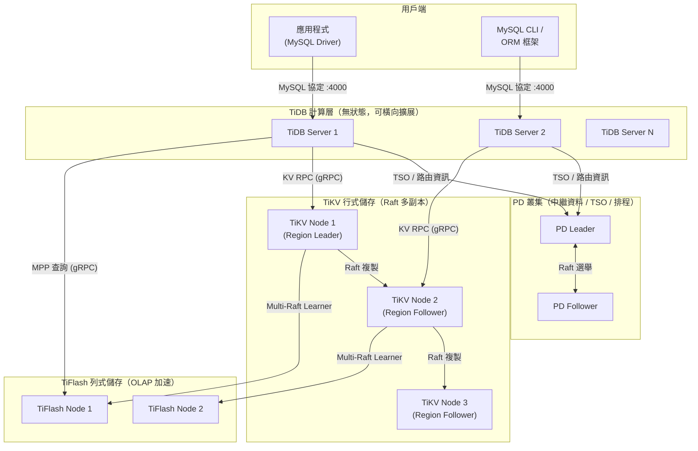

# TiDB — 專案總覽

::: tip 分析版本
本文件基於 commit [`6f4dd4fd`](https://github.com/pingcap/tidb/commit/6f4dd4fdab3774e5d7355039df79112dbe59cc6e) 進行分析。
:::

## 專案資訊

| 欄位 | 內容 |
|------|------|
| **專案名稱** | TiDB |
| **GitHub 連結** | [pingcap/tidb](https://github.com/pingcap/tidb) |
| **程式語言** | Go |
| **Go 版本** | 1.25.8 |
| **模組名稱** | `github.com/pingcap/tidb` |
| **授權條款** | Apache 2.0 |
| **開發組織** | PingCAP, Inc. |
| **官方網站** | [pingcap.com](https://www.pingcap.com/) |
| **官方文件** | [docs.pingcap.com](https://docs.pingcap.com/tidb/stable) |
| **雲端服務** | [TiDB Cloud](https://tidbcloud.com/) |
| **專案類型** | 分散式 HTAP SQL 資料庫 |

## 專案簡介

**TiDB**（發音 /'taɪdiːbi:/，Ti 代表鈦元素 Titanium）是由 PingCAP 開發的開源、雲原生、分散式 SQL 資料庫，專為高可用性、水平與垂直可擴展性、強一致性及高效能而設計。TiDB 完全相容 MySQL 8.0 協定，讓現有應用程式無需或僅需少量修改即可遷移至 TiDB 叢集，並提供完整的 ACID 分散式交易保障。

TiDB 的核心架構將計算層（TiDB Server）與儲存層（TiKV / TiFlash）徹底分離，兩者皆可獨立橫向擴展。儲存層採用 Raft 共識協定確保資料多副本強一致性，即使部分節點故障也能自動容錯恢復。TiDB 同時提供行式儲存引擎 TiKV 與列式儲存引擎 TiFlash，透過 Multi-Raft Learner 協定實現即時資料同步，使同一套資料庫能同時承擔 OLTP（線上交易）與 OLAP（分析查詢）工作負載，即所謂的 **HTAP（Hybrid Transactional/Analytical Processing）**。

TiDB 可部署於公有雲、私有機房或 Kubernetes 環境。官方提供 [TiDB Operator](https://docs.pingcap.com/tidb-in-kubernetes/stable/tidb-operator-overview/) 自動化 Kubernetes 上的叢集運維，亦提供全託管的 [TiDB Cloud](https://tidbcloud.com/) 服務。整個專案以 Apache 2.0 授權完全開源，所有原始碼均可在 GitHub 上取得。

## 文件目錄

| 文件 | 說明 |
|------|------|
| [系統架構](./architecture) | 專案目錄結構、核心組件分工、TiDB Server 內部流程、儲存層設計、Raft 協定 |
| [核心功能分析](./core-features) | SQL 解析與執行、分散式交易（2PC）、HTAP 查詢路由、DDL 非同步機制、統計資訊與代價優化器 |
| [控制器與 API](./controllers-api) | HTTP Status API、TiDB Dashboard、planner/executor 套件、Session 管理、Plugin 系統 |
| [外部整合](./integration) | BR 備份還原、TiDB Lightning 資料匯入、Dumpling 資料匯出、TiCDC 變更資料捕獲、雲端儲存整合 |

## 系統架構概覽

TiDB 叢集由三個主要核心元件組成，各自職責分明：

| 元件 | 角色 | 說明 |
|------|------|------|
| **TiDB Server** | 計算層 | 無狀態 SQL 引擎，負責協議處理、SQL 解析、查詢優化、執行計劃分發 |
| **TiKV** | 行式儲存層 | 基於 RocksDB 的分散式 KV 儲存，以 Raft 組保證強一致性 |
| **PD（Placement Driver）** | 中繼資料與排程層 | 管理 Region 分佈、TSO 時間戳服務、叢集拓撲與負載均衡 |
| **TiFlash** | 列式儲存層 | 透過 Multi-Raft Learner 從 TiKV 非同步複製資料，加速 OLAP 查詢 |
| **TiDB Dashboard** | 管理介面 | 視覺化叢集診斷、慢查詢分析、熱點分析 |



## 核心子專案

TiDB monorepo 中內含三個重要的獨立工具子專案：

| 子專案 | 目錄 | 說明 |
|--------|------|------|
| **BR** | `br/` | 分散式備份與還原工具，支援全量/增量備份，目標支援 S3/GCS/Azure |
| **TiDB Lightning** | `lightning/` | TB 級資料快速匯入工具，支援 Physical Import Mode 與 Logical Import Mode |
| **Dumpling** | `dumpling/` | 高效能資料匯出工具，MySQL 相容，支援平行匯出與雲端儲存 |

## 建置系統

TiDB 使用 **GNU Make** 搭配 `Makefile` + `Makefile.common` 管理建置流程：

```bash
make                    # 建置 TiDB Server（預設目標）
make all                # 建置所有目標
make server             # 僅建置 TiDB Server
make build_br           # 建置 BR 備份還原工具
make build_lightning    # 建置 TiDB Lightning
make build_dumpling     # 建置 Dumpling
make test               # 執行所有測試
make ut                 # 執行單元測試
make check              # 完整品質檢查
make fmt                # 格式化 Go 程式碼
```

## 與現有生態系比較

| 專案 | 類別 | 主要語言 | 核心功能 | 與 TiDB 的關係 |
|------|------|---------|---------|--------------|
| **TiDB** | 分散式 SQL 資料庫 | Go | HTAP、MySQL 相容、水平擴展 | 本專案 |
| **KubeVirt** | 虛擬化平台 | Go | Kubernetes 上運行 VM | 可作為 TiDB Cloud 底層運算資源 |
| **CDI** | 資料管理 | Go | PV 資料匯入、VM 映像管理 | TiDB 備份資料可存放於 PV |
| **Multus CNI** | 網路外掛 | Go | Pod 多網路介面 | TiDB 叢集節點可利用 Multus 進行網路隔離 |
| **Monitoring** | 可觀測性 | Go/YAML | Prometheus + Grafana 監控棧 | TiDB 原生整合 Prometheus，提供 Grafana Dashboard |
| **NetBox** | 網路 IPAM/DCIM | Python/Django | 網路設備與 IP 資產管理 | 資料中心基礎設施管理，與 TiDB 部署環境規劃相關 |

::: info 相關章節
本文件為 TiDB 系列分析的總覽入口。各子系統的深入分析請參閱：
- [系統架構](./architecture)：TiDB Server 內部元件、儲存層設計、Raft 協定實作
- [核心功能分析](./core-features)：SQL 解析執行、分散式交易、HTAP 查詢、DDL 機制
- [控制器與 API](./controllers-api)：HTTP API、Dashboard、Session 管理、Plugin 系統
- [外部整合](./integration)：BR、Lightning、Dumpling、TiCDC、雲端儲存整合
:::
