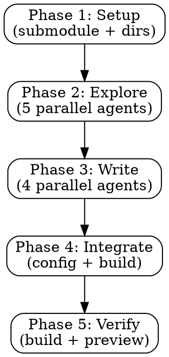

# Analyzing Source Code

## Overview

A systematic, parallelized workflow for analyzing open-source project source code and generating comprehensive VitePress documentation in zh-TW. Every piece of documentation must reference real source files — **zero fabrication tolerance**.

**Core principle:** Read the code first, write the docs second. Every code block needs a file path. Every claim needs a source.

## When to Use

- Adding a new open-source project (git submodule) to the documentation site
- Performing deep source code analysis for any Kubernetes operator, Go project, or YAML-based project
- Generating structured, consistent documentation from a codebase
- Expanding an existing multi-project VitePress documentation site

**When NOT to use:**
- Quick README-level summaries (just read the README)
- Projects you don't have source access to
- Non-technical documentation

## Core Workflow



### Phase 1: Setup (Sequential)

1. Add the project as a git submodule at the repo root
2. Create documentation directory: `docs-site/{project-name}/`
3. Create `index.md` with project overview and doc navigation table
4. Update `docs-site/.vitepress/config.js`:
   - Add sidebar array for the new project
   - Add to nav dropdown under "📦 專案"
   - Add sidebar route mapping

### Phase 2: Exploration (5 Parallel Agents)

Launch 5 `explore` agents simultaneously. Each agent must read **actual source files**, not just list directories.

See [exploration-prompts.md](./exploration-prompts.md) for the complete prompt templates.

| Agent | Focus | Key Files to Read |
|-------|-------|-------------------|
| **structure** | Project layout, binaries, packages, CRDs, build system | README.md, go.mod, Makefile, cmd/*, PROJECT |
| **controllers** | All controllers, registration order, reconcile loops | controllers/*, cmd/*/main.go, pkg/controller/* |
| **api-types** | CRD definitions, spec/status fields, all types | api/*, pkg/apis/*, staging/*/types.go |
| **features** | Key functionality, algorithms, data flows | pkg/*, internal/*, core business logic |
| **integrations** | External project references, auth, webhooks, RBAC | go.mod imports, config/rbac/*, *_webhook.go |

::: warning 適應不同專案類型
Not all projects are Kubernetes operators. Adapt the agents:
- **YAML-based projects** (e.g., common-instancetypes): Focus on YAML definitions, Kustomize, validation scripts
- **Monitoring/tools projects** (e.g., monitoring): Focus on tool implementations, metrics, dashboards
- **Operators** (e.g., CDI, NMO): Standard controller/CRD/webhook analysis
:::

### Conditional Analysis Dimensions

根據專案特性，探索與撰寫階段需額外涵蓋以下內容：

| 條件 | 額外分析內容 | 文件歸屬 |
|------|-------------|----------|
| 含有特殊演算法（排程、選擇策略、狀態機轉換） | 獨立區塊說明演算法邏輯、時間/空間複雜度、決策流程圖 | core-features.md |
| 提供 HTTP/gRPC API 供外部呼叫 | API endpoint 清單、Request/Response 結構、HTTP status codes、認證方式 | controllers-api.md |
| 含有 Webhook（Validating/Mutating） | Webhook 路徑、觸發資源、驗證規則、拒絕情境與錯誤訊息 | controllers-api.md |
| 使用狀態機（Phase/State transitions） | 完整狀態流轉圖（Mermaid stateDiagram）、觸發條件、錯誤狀態處理 | architecture.md |
| 含有 CLI 工具或子命令 | 指令清單、參數說明、使用範例 | core-features.md |
| 含有自定義 Metrics | Metric 名稱、類型、Labels、PromQL 範例 | integration.md |

#### 演算法分析格式

```markdown
## {演算法名稱}

### 問題定義

{這個演算法要解決什麼問題}

### 核心邏輯

\```go
// 檔案: pkg/path/to/algorithm.go
// 實際演算法程式碼
\```

### 決策流程

\```mermaid
flowchart TD
    A[輸入] --> B{條件判斷}
    B -->|情境 A| C[策略 A]
    B -->|情境 B| D[策略 B]
\```

### 複雜度與限制

| 面向 | 說明 |
|------|------|
| 時間複雜度 | O(n) / O(n log n) 等 |
| 限制條件 | {具體限制} |
| Fallback 策略 | {降級方案} |
```

#### API 分析格式

```markdown
## API Endpoints

### {HTTP Method} {Path}

**功能**: {說明}

**Request:**
\```json
{
  "field": "value"
}
\```

**Response:**

| HTTP Status | 說明 |
|-------------|------|
| 200 | 成功 |
| 400 | 請求格式錯誤 |
| 401 | 未認證（Token 過期或無效） |
| 403 | 權限不足 |
| 404 | 資源不存在 |
| 409 | 資源衝突 |
| 500 | 內部錯誤 |

**認證方式**: Bearer Token / ServiceAccount / mTLS

\```go
// 檔案: pkg/apiserver/handler.go
// 實際 handler 程式碼
\```
```

### Phase 3: Documentation Writing (4 Parallel Agents)

Launch 4 `general-purpose` agents to write markdown pages based on exploration findings.

See [doc-templates.md](./doc-templates.md) for the complete page templates.

| Page | Content |
|------|---------|
| **architecture.md** | Project overview, system architecture (Mermaid), binary/tool table, directory structure, build system, state machines |
| **core-features.md** | Key features with real code snippets, processing pipelines, algorithms, configurations |
| **controllers-api.md** | Controllers/tools, CRD type definitions, webhooks, validation, test architecture |
| **integration.md** | External integrations, auth mechanisms, RBAC, CI/CD, ecosystem connections |

### Phase 4: Site Integration (Sequential)

1. Update sidebar in `config.js` with all 5 entries (index + 4 pages)
2. Update `index.md` to link to all pages (remove any 🚧 placeholders)
3. Update homepage `docs-site/index.md` with new project card and table row

### Phase 5: Verification

1. Run `npm run build` — must succeed with zero errors
2. Run `npm run dev` — visually verify navigation and content
3. Git commit with descriptive message

## Documentation Standards

### Language
- All documentation in **zh-TW** (Traditional Chinese)
- Technical terms keep English originals (e.g., Controller, CRD, Webhook)
- Code comments remain in English

### Code References (Zero Fabrication Rule)
```markdown
// ✅ CORRECT — includes real file path
\```go
// 檔案: pkg/controller/clone/planner.go
func (p *Planner) ChooseStrategy(ctx context.Context) (*cdiv1.CDICloneStrategy, error) {
    // actual code from the file
}
\```

// ❌ WRONG — no file path, possibly fabricated
\```go
func handleClone() {
    // looks plausible but might not exist
}
\```
```

**Rules:**
- Every code block MUST include the source file path as a comment
- Use actual variable/function/type names from the source
- When showing partial code, indicate with `// ...` what's omitted
- Never invent functions, types, or behaviors

### VitePress Features
- **Mermaid diagrams** for architecture and state machines — **必須安裝 `vitepress-plugin-mermaid`**
  ```bash
  npm install vitepress-plugin-mermaid mermaid --save-dev
  ```
  ```js
  // config.js
  import { withMermaid } from 'vitepress-plugin-mermaid'
  export default withMermaid(defineConfig({ /* ... */ }))
  ```
- **`::: tip` / `::: info` / `::: warning`** containers for callouts
- **Tables** for structured data (binaries, CRDs, metrics, permissions)
- **Code blocks** with language syntax highlighting (go, yaml, bash, json)
- **⚠️ 注意**: `{{ }}` Go/GitHub Actions template syntax 在 code fence 外會被 Vue 解析而報錯，需改寫或使用 inline code

### Page Structure Template
```markdown
---
layout: doc
---

# {Page Title}

## 概述

Brief overview connecting this to the project's purpose.

## {Major Section}

### {Subsection}

\```go
// 檔案: path/to/real/file.go
actual code from the repository
\```

::: tip 重點
Key insight derived from the code analysis
:::

## 小結

Summary of what was covered and key takeaways.
```

## Quick Reference

| Step | Action | Parallelism | Tools |
|------|--------|-------------|-------|
| Setup | Submodule + directories + index.md | Sequential | git, create |
| Explore | 5 agents analyzing source code | All parallel | explore agent |
| Write | 4 documentation pages | All parallel | general-purpose agent |
| Integrate | Config + homepage + sidebar | Sequential | edit |
| Verify | Build + preview + commit | Sequential | bash |

## Common Mistakes

| Mistake | Fix |
|---------|-----|
| Fabricating code that looks plausible | Always `view` or `grep` the actual file first |
| Missing file paths on code blocks | Add `// 檔案: path/to/file.go` as first comment line |
| Shallow directory listing without reading code | Read `main.go`, reconciler, types.go — not just `ls` |
| Copy-paste from README without verification | README can be outdated; verify against actual source |
| Assuming standard operator structure | Check first — some projects are YAML-based, tools, or libraries |
| Forgetting to update all 3 config points | Sidebar array + nav dropdown + sidebar route mapping |
| Not building before committing | Always `npm run build` to catch broken links or syntax |
| Missing `layout: doc` frontmatter | Every page must start with `---\nlayout: doc\n---` |
| Inconsistent page titles | Use `{Project} — {Topic}` format consistently |
| No cross-references between pages | Add `::: info 相關章節` box with links to sibling pages |
| `{{ }}` template syntax outside code fences | Vue interprets these — rewrite or wrap in code spans |

## Makefile Integration

The project Makefile should include these targets for first-time setup:

```makefile
# 首次完整設置
setup: check-deps init-submodules install

# 檢查必要工具
check-deps:
	@command -v node >/dev/null 2>&1 || { echo "❌ Node.js 未安裝"; exit 1; }
	@command -v git >/dev/null 2>&1 || { echo "❌ git 未安裝"; exit 1; }

# 初始化 git submodules
init-submodules:
	git submodule update --init --recursive

# 安裝 npm 依賴
install:
	npm install
```
