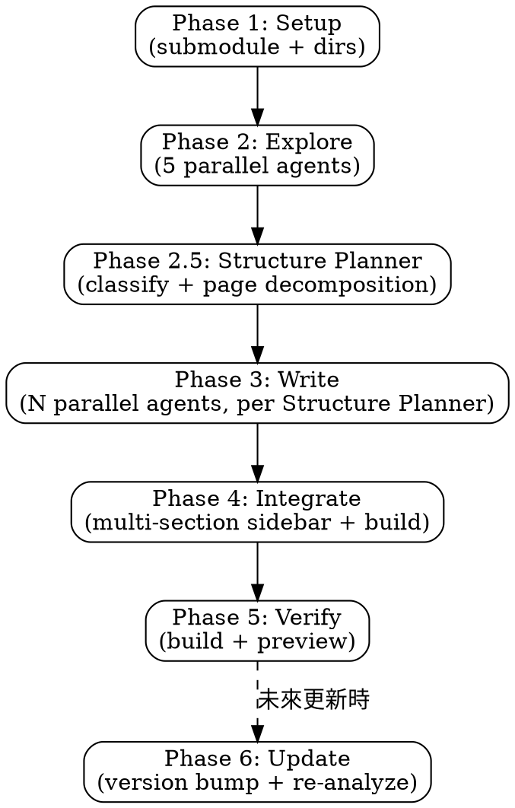
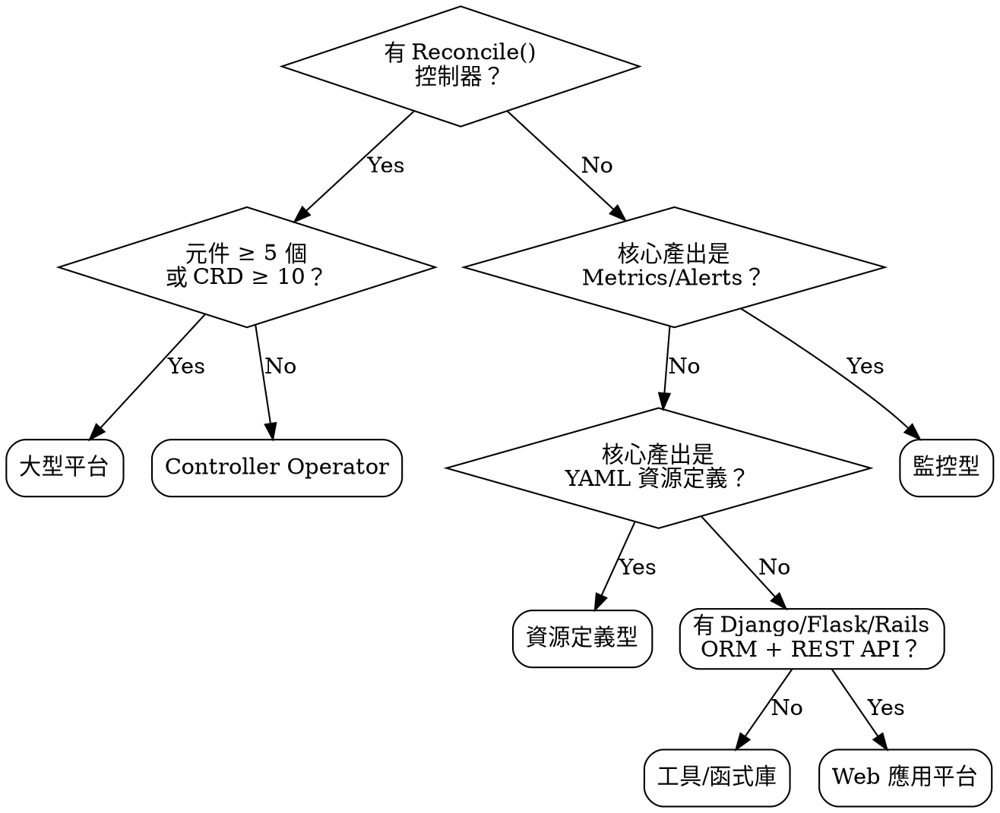
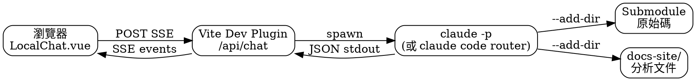
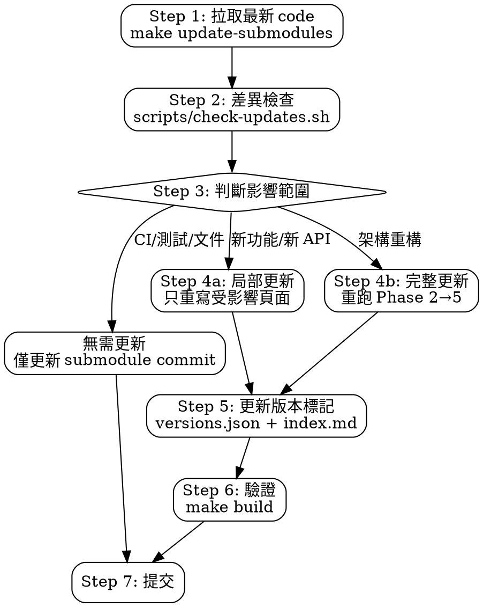

# Analyzing Source Code

## Overview

A systematic, parallelized workflow for analyzing open-source project source code and generating comprehensive VitePress documentation in zh-TW. Every piece of documentation must reference real source files — **zero fabrication tolerance**.

**Core principle:** Read the code first, write the docs second. Every code block needs a file path. Every claim needs a source.

## When to Use

- Adding a new open-source project (git submodule) to the documentation site
- Performing deep source code analysis for any Kubernetes operator, Go project, or YAML-based project
- Generating structured, consistent documentation from a codebase
- Expanding an existing multi-project VitePress documentation site
- **「請根據最新版本分析」** — 觸發 Phase 6 增量更新流程（差異分析 → 局部更新受影響頁面）

**When NOT to use:**
- Quick README-level summaries (just read the README)
- Projects you don't have source access to
- Non-technical documentation

## Core Workflow



### Phase 1: Setup (Sequential)

1. Add the project as a git submodule at the repo root
   - 確認目標 repo 的預設分支（可能是 `main`、`master`、`develop` 等）
   - 在 `.gitmodules` 中設定 `branch`，若使用者未指定則預設為 `main`
   ```bash
   git submodule add {repo-url} {project-name}
   # 確認預設分支
   git -C {project-name} remote show origin | grep 'HEAD branch'
   # 設定追蹤分支（使用實際的預設分支，非硬編碼 main）
   git config -f .gitmodules submodule.{project-name}.branch {actual-default-branch}
   ```
2. Create documentation directory: `docs-site/{project-name}/`
3. Create `index.md` with project overview and doc navigation table
4. Update `docs-site/.vitepress/config.js`:
   - Add sidebar array for the new project
   - Add to nav dropdown under "📦 專案"
   - Add sidebar route mapping

### Phase 2: Exploration (5 Parallel Agents)

Launch 5 `explore` agents simultaneously. Each agent must read **actual source files**, not just list directories.

See [exploration-prompts.md](./exploration-prompts.md) for the complete prompt templates.

| Agent | Focus | Key Files to Read |
|-------|-------|-------------------|
| **structure** | Project layout, binaries, packages, CRDs, build system | README.md, go.mod, Makefile, cmd/*, PROJECT |
| **controllers** | All controllers, registration order, reconcile loops | controllers/*, cmd/*/main.go, pkg/controller/* |
| **api-types** | CRD definitions, spec/status fields, all types | api/*, pkg/apis/*, staging/*/types.go |
| **features** | Key functionality, algorithms, data flows | pkg/*, internal/*, core business logic |
| **integrations** | External project references, auth, webhooks, RBAC | go.mod imports, config/rbac/*, *_webhook.go |

### Phase 2.5: Project Type Classification

**在探索結果回來後、撰寫文件前，必須先判定專案類型。** 類型決定 Phase 3 產生哪些頁面。

#### 判定流程



#### 類型與頁面對照表

| 專案類型 | 必要頁面 | 條件頁面 | 範例專案 |
|----------|----------|----------|----------|
| **Controller Operator** | architecture, core-features, integration | `controllers-api.md` | CDI, NMO |
| **大型平台** | architecture, core-features, integration | `controllers-api.md` + 可加 `lifecycle.md`, `api-reference.md` | Forklift, KubeVirt |
| **監控型** | architecture, core-features, integration | `metrics-alerts.md`（取代 controllers-api） | Monitoring |
| **資源定義型** | architecture, core-features, integration | `resource-catalog.md`（取代 controllers-api） | Common Instancetypes |
| **工具/函式庫** | architecture, core-features, integration | `cli-reference.md` 或 `api-reference.md` | kubectl 插件、SDK |
| **Web 應用平台** | architecture, core-features, integration | `data-models.md` + `api-reference.md` | NetBox |

#### 判定依據

| 信號 | 類型 |
|------|------|
| 有 `controllers/`、`Reconcile()` 函式、operator-sdk 結構 | Controller Operator |
| 元件 ≥ 5、CRD ≥ 10、多個 controller + REST API | 大型平台 |
| 核心產出為 PrometheusRule、AlertRule、Dashboard JSON、無 controller | 監控型 |
| 核心產出為 YAML/JSON 資源定義、Kustomize overlay、無 controller | 資源定義型 |
| 提供 CLI、SDK 或 library package、無 CRD | 工具/函式庫 |
| `apps.py` 橫跨多個 Django apps、`models.py` 含 50+ models、`serializers/`、`views/viewsets/`、REST framework、`urls.py` API routing、`templates/`、GraphQL schema | Web 應用平台 |

::: warning 根據專案類型選擇頁面模板
分類後請使用對應的頁面模板。條件頁面名稱與內容結構差異如下：
- **Controller Operator / 大型平台** → `controllers-api.md`：控制器、CRD 定義、Webhook、RBAC
- **監控型** → `metrics-alerts.md`：工具實作、指標目錄、告警規則、Dashboard
- **資源定義型** → `resource-catalog.md`：YAML 資源定義、分類目錄、Label 規範、驗證測試
- **工具/函式庫** → `cli-reference.md`：指令清單、參數、使用範例、Public API
- **Web 應用平台** → `data-models.md`：ORM 資料模型深度分析（ERD、Mixin 模式、Migration）；`api-reference.md`：REST API 與 GraphQL 端點完整參考
:::

### Structure Planner: 動態頁面架構規劃

**在類型分類完成後，必須執行 Structure Planner，決定本專案應產生哪些頁面、每頁涵蓋哪些主題。** 固定模板只是底線，Structure Planner 會根據複雜度信號向上擴充。

#### 步驟一：計算複雜度分數

從探索結果中提取以下信號，加總得到 **Complexity Score (CS)**：

| 信號 | 條件 | 加分 |
|------|------|------|
| 控制器數量 | 每個 Reconciler / controller +1 | +1 per |
| CRD / 資料模型數量 | 每個 CRD 或 ORM Model +0.5 | +0.5 per |
| 二進位 / 服務數量 | 每個獨立 `cmd/` entry point +0.5 | +0.5 per |
| 外部整合數量 | 每個外部系統（DB、佇列、雲端 API）+0.5 | +0.5 per |
| 獨特演算法 | 狀態機、排程、CBT、guest conversion 等 +2 each | +2 per |
| Webhook 系統 | Validating + Mutating 皆存在 | +2 |
| 多來源支援 | 支援 ≥ 3 種不同 provider/backend | +3 |
| 非同步工作流 | Background jobs、queue、lease 協調 | +2 |
| API 介面多樣性 | REST + GraphQL 同時存在 | +2 |
| 插件/擴充框架 | Plugin system、custom scripts、hooks | +2 |

**參考基準（已驗證）：**

| 專案 | CS | 建議頁數 |
|------|----|---------|
| NMO（1 controller, 1 CRD, lease + webhook） | ~10 | 11 頁 |
| Forklift（9 controllers, 9 CRDs, 7 providers, virt-v2v, CBT） | ~30 | 20 頁 |
| NetBox（10 apps, 26+ models, REST+GraphQL, plugins） | ~45 | 35 頁 |

**頁數公式：**
```
建議頁數 = max(固定底線頁數, floor(CS × 0.7) + 固定底線頁數)
```

固定底線頁數依類型：Controller Operator = 4、大型平台 = 6、Web 應用平台 = 8、其他 = 4。

---

#### 步驟二：特徵萃取 — 識別「值得獨立成頁」的特性

遍歷探索結果，對每個獨特特性回答以下問題：
1. **深度（Depth）**：理解此特性是否需要超過 500 字的說明？
2. **獨立性（Independence）**：此特性能否獨立閱讀，不強依賴其他頁面？
3. **使用者價值（User Value）**：哪種讀者（開發者/運維/架構師）會需要查閱這個主題？

若三題皆「是」，則獨立成頁；若只有兩題，則合併到最相關的既有頁面內的獨立 `##` 小節。

**常見觸發獨立成頁的特性清單：**

| 特性信號 | 建議頁面名稱 |
|---------|------------|
| 有 lease / 分散式協調機制 | `coordination.md` |
| 有 taint 管理且邏輯複雜 | `node-management.md` |
| 有 Webhook 且邏輯超過 200 行 | `webhooks.md` |
| 有 warm migration / CBT / 增量備份 | `warm-migration.md` |
| 有 guest OS conversion（virt-v2v 等） | `guest-conversion.md` |
| 有多種 volume populator 實作 | `volume-populators.md` |
| 有跨叢集 / multi-cluster 流程 | `remote-cluster.md` |
| 有 Django app 區分的 domain model | 每個 domain 一頁 `models-{domain}.md` |
| 有 REST API 且端點超過 20 個 | `api-reference.md` |
| 有 GraphQL schema | `graphql-api.md` |
| 有插件開發框架 | `plugin-development.md` |
| 有 RBAC 且涉及多個 API group | `rbac-permissions.md` |
| 有 CLI 工具且指令超過 5 個 | `cli-reference.md` |
| 有 Prometheus metrics 且自定義超過 10 個 | `observability.md` |
| 有多種 provider / backend 類型 | `provider-types.md` |
| 有 pre/post hook 執行框架 | `hooks.md` |
| 有 validation / pre-flight check 系統 | `validations.md` |
| 有背景任務 / 排程 / queue | `background-jobs.md` |
| 有 change log / audit trail | `audit-logging.md` |
| 有 troubleshooting 複雜度 ≥ 中等 | `troubleshooting.md` |

---

#### 步驟三：建立頁面清單

整合固定底線頁面與步驟二識別的獨立頁面，產生完整清單。格式如下：

```
## 頁面規劃清單（{專案名稱}）

### 固定底線頁面
1. index.md — 專案總覽與導覽
2. architecture.md — 系統架構
3. core-features.md — 核心功能
4. integration.md — 外部整合
[+ 依類型的條件頁面]

### Structure Planner 擴充頁面
5. {filename}.md — {標題}
   理由：{說明為何獨立成頁，參照哪個特性信號}
   主題：{3-5 個主要涵蓋項目}
...
```

---

#### 步驟四：確認分區（Section）

當擴充頁面總數 ≥ 8 時，必須將頁面分組為區塊（Section），避免 sidebar 過長。分區準則：

| 區塊名稱建議 | 收納頁面類型 |
|-------------|------------|
| 系統架構 | architecture, overview, deployment |
| 核心概念 | CRD spec, data models, workflows |
| 進階功能 | 專案特有的深度特性頁面 |
| API 與整合 | REST, GraphQL, webhooks, external integrations |
| 維運操作 | installation, RBAC, troubleshooting, performance |
| 開發指南 | controller implementation, testing, extensibility |

---

#### Structure Planner 輸出格式

Structure Planner 完成後，必須輸出以下格式供 Phase 3 agent 使用：

```markdown
## Structure Planner 輸出：{專案名稱}

**Complexity Score:** {N}
**專案類型:** {類型}
**建議頁數:** {N} 頁，{M} 個 Section

### 頁面清單

| # | 檔名 | 標題 | Section | 理由摘要 |
|---|------|------|---------|---------|
| 1 | index.md | 專案總覽 | 概述 | 固定底線 |
| 2 | architecture.md | 系統架構 | 概述 | 固定底線 |
| ... | ... | ... | ... | ... |
| N | {filename}.md | {標題} | {section} | {特性信號} |

### 各頁面詳細規劃

#### {filename}.md — {標題}
- **Section:** {區塊名稱}
- **目標讀者:** 開發者 / 運維 / 架構師
- **主要涵蓋主題:**
  1. {主題 1}
  2. {主題 2}
  3. {主題 3}
- **關鍵原始碼參考:** {檔案路徑}
```

::: tip Structure Planner 的目標
不是為了多寫頁面而寫，而是確保每個重要概念都有足夠的空間被深入解釋。
頁面過少 → 重要細節被壓縮 → 讀者看不懂。
頁面過多 → 內容碎片化 → 讀者不知從何讀起。
Structure Planner 就是在這兩個極端之間找到最適合該專案的平衡點。
:::

### Conditional Analysis Dimensions

根據專案特性，探索與撰寫階段需額外涵蓋以下內容：

| 條件 | 額外分析內容 | 文件歸屬 |
|------|-------------|----------|
| 含有特殊演算法（排程、選擇策略、狀態機轉換） | 獨立區塊說明演算法邏輯、時間/空間複雜度、決策流程圖 | core-features.md |
| 提供 HTTP/gRPC API 供外部呼叫 | API endpoint 清單、Request/Response 結構、HTTP status codes、認證方式 | controllers-api.md |
| 含有 Webhook（Validating/Mutating） | Webhook 路徑、觸發資源、驗證規則、拒絕情境與錯誤訊息 | controllers-api.md |
| 使用狀態機（Phase/State transitions） | 完整狀態流轉圖（Mermaid stateDiagram）、觸發條件、錯誤狀態處理 | architecture.md |
| 含有 CLI 工具或子命令 | 指令清單、參數說明、使用範例 | core-features.md |
| 含有自定義 Metrics | Metric 名稱、類型、Labels、PromQL 範例 | integration.md |

#### 演算法分析格式

```markdown
## {演算法名稱}

### 問題定義

{這個演算法要解決什麼問題}

### 核心邏輯

\```go
// 檔案: pkg/path/to/algorithm.go
// 實際演算法程式碼
\```

### 決策流程

\```mermaid
flowchart TD
    A[輸入] --> B{條件判斷}
    B -->|情境 A| C[策略 A]
    B -->|情境 B| D[策略 B]
\```

### 複雜度與限制

| 面向 | 說明 |
|------|------|
| 時間複雜度 | O(n) / O(n log n) 等 |
| 限制條件 | {具體限制} |
| Fallback 策略 | {降級方案} |
```

#### API 分析格式

```markdown
## API Endpoints

### {HTTP Method} {Path}

**功能**: {說明}

**Request:**
\```json
{
  "field": "value"
}
\```

**Response:**

| HTTP Status | 說明 |
|-------------|------|
| 200 | 成功 |
| 400 | 請求格式錯誤 |
| 401 | 未認證（Token 過期或無效） |
| 403 | 權限不足 |
| 404 | 資源不存在 |
| 409 | 資源衝突 |
| 500 | 內部錯誤 |

**認證方式**: Bearer Token / ServiceAccount / mTLS

\```go
// 檔案: pkg/apiserver/handler.go
// 實際 handler 程式碼
\```
```

### Phase 3: Documentation Writing (依 Structure Planner 動態啟動)

**Phase 3 不再使用固定 4 頁模板。** 必須先讀取 Phase 2.5 Structure Planner 的輸出清單，再依清單中每一頁啟動對應的 `general-purpose` agent 平行撰寫。

See [doc-templates.md](./doc-templates.md) for the complete page templates.

#### 啟動原則

1. **每一頁獨立一個 agent**：不同頁面之間無依賴，全部平行啟動
2. **agent prompt 必須包含：**
   - Structure Planner 對該頁面的詳細規劃（主題清單、目標讀者、關鍵原始碼路徑）
   - 探索階段相關 agent 的輸出摘要
   - Zero Fabrication Rule（所有程式碼必須附 file path）
   - 目標語言 zh-TW
3. **頁面數量沒有上限**：Structure Planner 說幾頁就寫幾頁

#### Agent 啟動範例

```
# Structure Planner 輸出 11 頁 → 啟動 11 個 agent

agent-01: index.md          — 專案總覽與文件導覽
agent-02: architecture.md   — 系統架構 & 狀態機
agent-03: crd-spec.md       — CRD 規格與欄位說明
agent-04: node-drainage.md  — 節點排空工作流程
agent-05: webhooks.md       — Admission Validation
agent-06: coordination.md   — Lease 分散式協調
agent-07: taints.md         — Taint 管理與 Cordoning
agent-08: installation.md   — 部署與設定
agent-09: rbac.md           — 權限與 RBAC
agent-10: troubleshooting.md— 故障排除
agent-11: observability.md  — 事件與 Metrics
```

#### 每個 agent 的 prompt 框架

```
你是一位技術文件撰寫專家，負責撰寫 {專案名稱} 的文件頁面。

## 目標頁面
- 檔名：{filename}.md
- 標題：{標題}
- 目標讀者：{讀者類型}

## Structure Planner 規劃的主題
{從 Structure Planner 輸出貼入該頁面的詳細規劃}

## 相關探索結果
{貼入 Phase 2 中與此頁面相關的 agent 輸出片段}

## 撰寫規範
- 語言：zh-TW（技術詞彙保留英文）
- 每個程式碼區塊第一行必須是 `// 檔案: {實際路徑}`
- 使用 Mermaid diagram 說明流程與架構
- 使用 ::: tip / ::: warning / ::: info 容器增加可讀性
- frontmatter 必須包含 `layout: doc`
- 頁首格式：`# {Project} — {Topic}`
- 結尾加入 `::: info 相關章節` 交叉連結
- 禁止捏造任何程式碼或行為
```

#### 頁面寫作品質標準

每頁應包含以下要素，缺少任何一項視為品質不足：

| 要素 | 說明 |
|------|------|
| **Mermaid 圖** | 至少 1 張流程圖或架構圖（flowchart / stateDiagram / sequenceDiagram） |
| **程式碼片段** | ≥ 2 段，每段附真實 file path |
| **資料表格** | 欄位說明、設定選項、狀態對應等用表格呈現 |
| **Callout 容器** | ≥ 1 個 ::: tip 或 ::: warning 強調重點 |
| **交叉連結** | 結尾 ::: info 相關章節 連結至同專案其他頁面 |

### Phase 4: Site Integration (Sequential)

Structure Planner 決定了頁面數量與分區，Phase 4 必須將這個結構完整反映到 VitePress sidebar。

#### 4.1 多 Section Sidebar 設定

當 Structure Planner 規劃 ≥ 2 個 Section 時，sidebar 必須使用分組結構：

```js
// docs-site/.vitepress/config.js
// ✅ 多 Section 範例（Structure Planner 輸出 6 sections）
{
  text: '{專案名稱}',
  items: [
    { text: '專案總覽', link: '/{project}/index' }
  ]
},
{
  text: '系統架構',
  collapsed: false,
  items: [
    { text: '架構概覽', link: '/{project}/architecture' },
    { text: '部署與設定', link: '/{project}/installation' },
  ]
},
{
  text: '核心概念',
  collapsed: false,
  items: [
    { text: 'CRD 規格', link: '/{project}/crd-spec' },
    { text: '遷移工作流程', link: '/{project}/migration-workflow' },
  ]
},
{
  text: '進階功能',
  collapsed: true,          // 進階頁面預設收合
  items: [
    { text: 'Warm Migration', link: '/{project}/warm-migration' },
    { text: 'Guest OS 轉換', link: '/{project}/guest-conversion' },
    { text: 'Volume Populators', link: '/{project}/volume-populators' },
  ]
},
// ... 其餘 section
```

**Section 對應規則（來自 Structure Planner 步驟四）：**

| Section 名稱 | `collapsed` 預設值 | 說明 |
|-------------|-----------------|------|
| 系統架構 | `false` | 必讀，不收合 |
| 核心概念 | `false` | 必讀，不收合 |
| 進階功能 | `true` | 選讀，預設收合 |
| API 與整合 | `true` | 依需求查閱 |
| 維運操作 | `true` | 依需求查閱 |
| 開發指南 | `true` | 貢獻者用，收合 |

#### 4.2 index.md 導覽表

`index.md` 必須包含完整的文件導覽表，列出所有 Section 與頁面：

```markdown
## 文件導覽

### 系統架構
| 頁面 | 說明 |
|------|------|
| [架構概覽](./architecture) | 系統元件、狀態機、資料流 |
| [部署與設定](./installation) | 安裝方式、環境變數、RBAC |

### 核心概念
| 頁面 | 說明 |
|------|------|
| [CRD 規格](./crd-spec) | 所有自定義資源欄位說明 |
| ...  | ... |

### 進階功能
...
```

#### 4.3 其他整合項目

1. 更新 `docs-site/index.md` 首頁的專案卡片與功能表格
2. 確認 nav dropdown「📦 專案」已加入新條目
3. 確認所有 `index.md` 中的 🚧 佔位符已替換為真實連結

### Phase 5: Verification

1. Run `npm run build` — must succeed with zero errors
2. Run `npm run dev` — visually verify navigation and content
3. Git commit with descriptive message

## Documentation Standards

### Language
- All documentation in **zh-TW** (Traditional Chinese)
- Technical terms keep English originals (e.g., Controller, CRD, Webhook)
- Code comments remain in English

### Code References (Zero Fabrication Rule)
```markdown
// ✅ CORRECT — includes real file path
\```go
// 檔案: pkg/controller/clone/planner.go
func (p *Planner) ChooseStrategy(ctx context.Context) (*cdiv1.CDICloneStrategy, error) {
    // actual code from the file
}
\```

// ❌ WRONG — no file path, possibly fabricated
\```go
func handleClone() {
    // looks plausible but might not exist
}
\```
```

**Rules:**
- Every code block MUST include the source file path as a comment
- Use actual variable/function/type names from the source
- When showing partial code, indicate with `// ...` what's omitted
- Never invent functions, types, or behaviors

### VitePress Features
- **Mermaid diagrams** for architecture and state machines — **必須安裝 `vitepress-plugin-mermaid`**
  ```bash
  npm install vitepress-plugin-mermaid mermaid --save-dev
  ```
  ```js
  // config.js
  import { withMermaid } from 'vitepress-plugin-mermaid'
  export default withMermaid(defineConfig({ /* ... */ }))
  ```
- **`::: tip` / `::: info` / `::: warning`** containers for callouts
- **Tables** for structured data (binaries, CRDs, metrics, permissions)
- **Code blocks** with language syntax highlighting (go, yaml, bash, json)
- **⚠️ 注意**: `{{ }}` Go/GitHub Actions template syntax 在 code fence 外會被 Vue 解析而報錯，需改寫或使用 inline code

### Page Structure Template
```markdown
---
layout: doc
---

# {Page Title}

## 概述

Brief overview connecting this to the project's purpose.

## {Major Section}

### {Subsection}

\```go
// 檔案: path/to/real/file.go
actual code from the repository
\```

::: tip 重點
Key insight derived from the code analysis
:::

## 小結

Summary of what was covered and key takeaways.
```

## Quick Reference

| Step | Action | Parallelism | Tools |
|------|--------|-------------|-------|
| Setup | Submodule + directories + index.md | Sequential | git, create |
| Explore | 5 agents analyzing source code | All parallel | explore agent |
| **Plan** | **Structure Planner: classify + score + page decomposition** | **Sequential** | **（主 agent 執行）** |
| Write | N pages per Structure Planner output | All parallel | general-purpose agent |
| Integrate | Multi-section sidebar + homepage + nav | Sequential | edit |
| Verify | Build + preview + commit | Sequential | bash |

## Common Mistakes

| Mistake | Fix |
|---------|-----|
| Fabricating code that looks plausible | Always `view` or `grep` the actual file first |
| Missing file paths on code blocks | Add `// 檔案: path/to/file.go` as first comment line |
| Shallow directory listing without reading code | Read `main.go`, reconciler, types.go — not just `ls` |
| Copy-paste from README without verification | README can be outdated; verify against actual source |
| Assuming standard operator structure | Check first — some projects are YAML-based, tools, or libraries |
| **跳過 Structure Planner 直接寫 4 頁** | **必須先執行 Structure Planner，頁數由複雜度決定** |
| **所有頁面平鋪在一個 sidebar section** | **≥ 8 頁時必須分組為多個 Section，進階/開發頁面預設 collapsed** |
| Forgetting to update all 3 config points | Sidebar array + nav dropdown + sidebar route mapping |
| Not building before committing | Always `npm run build` to catch broken links or syntax |
| Missing `layout: doc` frontmatter | Every page must start with `---\nlayout: doc\n---` |
| Inconsistent page titles | Use `{Project} — {Topic}` format consistently |
| No cross-references between pages | Add `::: info 相關章節` box with links to sibling pages |
| `{{ }}` template syntax outside code fences | Vue interprets these — rewrite or wrap in code spans |

## Makefile Integration

The project Makefile should include these targets for first-time setup:

```makefile
# 首次完整設置
setup: check-deps init-submodules install

# 檢查必要工具
check-deps:
	@command -v node >/dev/null 2>&1 || { echo "❌ Node.js 未安裝"; exit 1; }
	@command -v git >/dev/null 2>&1 || { echo "❌ git 未安裝"; exit 1; }

# 初始化 git submodules
init-submodules:
	git submodule update --init --recursive

# 安裝 npm 依賴
install:
	npm install
```

## Local LLM Chat Integration

### Overview

文件網站在本地開發模式（`npm run dev`）下內建 AI 即時分析功能。透過 Vite dev plugin 攔截 `/api/chat` 請求，spawn `claude -p` CLI 並以 SSE 串流回傳結果。**Production build 完全不含此功能。**

### Architecture



### Three Components

| Component | Path | Purpose |
|-----------|------|---------|
| **Vite Plugin** | `.vitepress/plugins/localLlmChat.js` | Dev-only middleware, spawns CLI, returns SSE |
| **Vue Component** | `.vitepress/theme/components/LocalChat.vue` | Chat UI, drag-resize, auto-detect project |
| **Theme Extension** | `.vitepress/theme/index.js` | Mounts component in `layout-bottom` slot |

### Vite Plugin (`localLlmChat.js`)

- **Apply mode**: `'serve'` only — production build ignores it
- **Endpoint**: `POST /api/chat` with `{ project, question }` body
- **CLI invocation**: `claude -p "{prompt}" --add-dir {projectDir} --add-dir {docsDir} --output-format json --append-system-prompt "{system}" --model sonnet`
- **SSE events**: `status` → `result` / `error` → `done`, with heartbeat every 5s
- **Timeout**: 5 minutes (300s)
- **Compatible with**: `claude` (native) and `claude code router` (same CLI interface)

```javascript
// Plugin factory pattern
export function localLlmChatPlugin(options = {}) {
  const projectRoot = options.projectRoot || process.cwd()
  const cliCommand = options.cliCommand || 'claude'
  const defaultModel = options.model || 'sonnet'

  return {
    name: 'local-llm-chat',
    apply: 'serve',
    configureServer(server) {
      server.middlewares.use('/api/chat', async (req, res) => {
        // Parse POST body → build prompt → spawn CLI → stream SSE
      })
    },
  }
}
```

### Vue Component (`LocalChat.vue`)

#### Key Design Decisions

| Feature | Implementation |
|---------|---------------|
| **Dev-only** | `v-if="import.meta.env.DEV"` — tree-shaken in build |
| **Auto-detect project** | Parses `route.path` for known project slugs |
| **Drag-to-resize** | Top-left `nw-resize` handle with mouse + touch support |
| **Expand mode** | `⊞` button toggles 75vw / 85vh fullscreen-like panel |
| **SSE parsing** | `ReadableStream` reader with line-by-line event parsing |
| **Suggestion buttons** | Quick-start questions for common analysis queries |

#### Size & Constraints

| Property | Default | Expanded | Min | Max |
|----------|---------|----------|-----|-----|
| Width | 520px | 75vw (max 900px) | 360px | viewport - 60px |
| Height | 560px | 85vh | 350px | viewport - 100px |
| Font size | 14px | 14px | — | — |
| Line height | 1.7 | 1.7 | — | — |

### Theme Extension (`theme/index.js`)

```javascript
import DefaultTheme from 'vitepress/theme'
import LocalChat from './components/LocalChat.vue'
import { h } from 'vue'

export default {
  extends: DefaultTheme,
  Layout() {
    return h(DefaultTheme.Layout, null, {
      'layout-bottom': () => h(LocalChat),
    })
  },
}
```

### Config Integration

```javascript
// docs-site/.vitepress/config.js
import { localLlmChatPlugin } from './plugins/localLlmChat.js'

export default withMermaid(defineConfig({
  // ...
  vite: {
    plugins: [
      localLlmChatPlugin({
        projectRoot: process.cwd(),
        cliCommand: 'claude',   // or any compatible CLI
        model: 'sonnet',
      }),
    ],
  },
  // ...
}))
```

### System Prompt Design

CLI 收到的 system prompt 包含：
1. 角色定義：原始碼分析助手，專精 KubeVirt 生態系
2. 語言指示：zh-TW 回答，技術術語保持英文
3. 引用規範：回答須引用檔案路徑與程式碼
4. 誠實原則：不確定就說明，不猜測

Context hint 根據 `project` 參數動態指定目標目錄：
```
請基於 ./{project}/ 目錄下的原始碼以及 ./docs-site/{project}/ 的分析文件來回答。
```

---

## Phase 6: 增量更新（觸發語：「請根據最新版本分析」）

當使用者說「**請根據最新版本分析**」或類似語句時，執行以下完整流程。**不是重新全寫，而是差異驅動的增量更新。**

### 6.1 版本追蹤機制

專案根目錄的 `versions.json` 記錄每個專案的：
- `analyzed_commit` — 上次分析時的 git commit SHA
- `analyzed_date` — 分析日期
- `pages` → `source_paths` — 每個文件頁面對應的 source 目錄映射

### 6.2 增量更新流程



#### Step 1: 拉取最新 code

```bash
# 更新所有專案
make update-submodules

# 或更新單一專案
make check-update-project PROJECT=netbox
```

#### Step 2: 自動差異分析

```bash
# 自動執行 — 比對 versions.json 中的 analyzed_commit vs submodule HEAD
make check-updates
```

腳本會輸出：
- 每個專案的新 commit 數量與摘要
- 變更檔案統計
- **受影響的文件頁面**（基於 `versions.json` 中的 `source_paths` 映射）

#### Step 3: 判斷更新範圍

根據 check-updates 報告決定處理方式：

| 變更類型 | 判斷依據 | 動作 |
|---------|---------|------|
| **無需更新** | 僅 CI/CD、README、測試、文件格式變更 | 跳過，直接更新 submodule commit |
| **局部更新** | 新增 API、新增 Model、新增 Controller、功能增強 | 只對受影響頁面執行 explore + write |
| **完整更新** | 架構重構、大版本升級（如 Django 5→6）、核心元件重寫 | 完整重跑 Phase 2→5 |

#### Step 4a: 局部更新（最常見）

只針對受影響的頁面重新分析：

1. 根據報告中列出的受影響頁面，啟動對應的 explore agent
2. explore agent 重點閱讀**變更的檔案**，而非整個專案
3. 將分析結果**合併更新**到現有文件中（不是整頁重寫）
4. 新增的功能/API/Model → 新增章節
5. 修改的邏輯 → 更新對應段落
6. 刪除的功能 → 移除對應說明

**Explore agent 的差異分析提示詞模板：**
```
專案 {project} 從 {old_commit} 更新至 {new_commit}。
以下是本次變更涉及的檔案：
{changed_files_list}

請分析這些變更對 {page_name} 頁面的影響：
1. 是否有新增的功能/API/模型需要記錄？
2. 是否有修改的行為需要更新描述？
3. 是否有移除的功能需要從文件中刪除？
4. 現有文件中哪些程式碼片段需要更新？

請引用具體的檔案路徑與程式碼。
```

#### Step 4b: 完整更新

等同於新專案分析，完整執行 Phase 2→5。

#### Step 5: 更新版本標記

更新完成後，**必須同步更新**：

1. `versions.json` — 更新 `analyzed_commit` 和 `analyzed_date`
2. `docs-site/{project}/index.md` — 更新 `::: tip 分析版本` 區塊

```bash
# versions.json 範例更新
{
  "analyzed_commit": "{new-full-sha}",
  "analyzed_date": "2026-05-01"
}
```

```markdown
::: tip 分析版本
本文件基於 commit [`{new-short-sha}`]({repo-url}/commit/{new-full-sha}) 進行分析。
:::
```

#### Step 6-7: 驗證與提交

```bash
make build
git add -A && git commit -m "docs({project}): update analysis to {new-short-sha}"
```

### 6.3 Makefile 指令速查

| 指令 | 用途 |
|------|------|
| `make submodule-status` | 查看所有 submodule 目前版本 |
| `make update-submodules` | 更新所有 submodule 至最新 commit |
| `make check-updates` | 更新 + 自動差異分析報告 |
| `make check-update-project PROJECT=xxx` | 單一專案更新 + 差異分析 |
